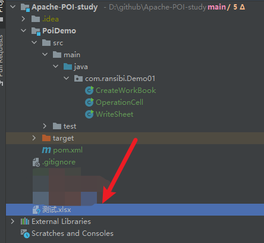
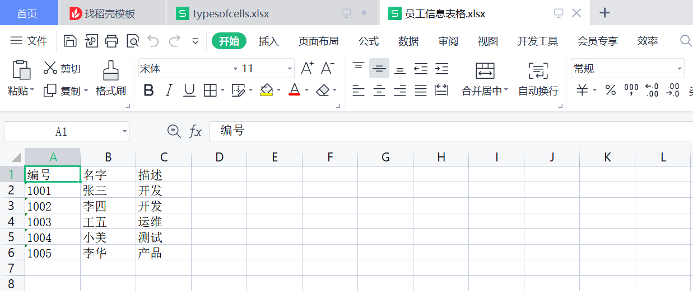
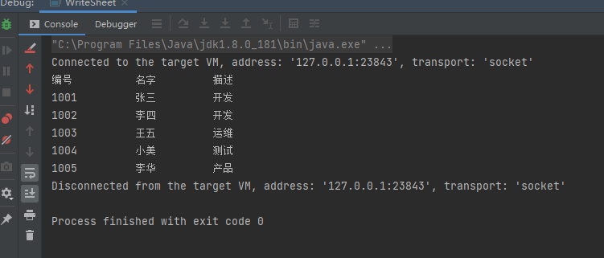

##### 版本

```xml
<dependency>
  <groupId>org.apache.poi</groupId>
  <artifactId>poi-ooxml</artifactId>
  <version>3.9</version>
</dependency>
```

##### 1、创建工作簿：

```java
//创建工作簿对象
XSSFWorkbook xssfWorkbook = new XSSFWorkbook();
//创建输出流对象，并初始化
FileOutputStream outputStream = new FileOutputStream(new File("测试.xlsx"));
//使用文件输出对象写入操作工作簿
xssfWorkbook.write(outputStream);
//关闭输出流
outputStream.close();
System.out.println("创建工作簿成功!");
```



##### 2、打开工作簿

```java
File file = new File("测试.xlsx");
FileInputStream fileInputStream = new FileInputStream(file);
//获取XLSX文件的工作簿实例
XSSFWorkbook xssfWorkbook = new XSSFWorkbook(fileInputStream);
//打开工作簿后，就可以对其执行读写操作。
if (file.isFile() && file.exists()) {
    System.out.println("打开文件成功!");
} else {
    System.out.println("打开文件失败!");
}
```

##### 3、创建电子表格

（1）写入数据

创建sheet页电子表格，并往表格中写入数据

```java
//创建工作簿对象
XSSFWorkbook xssfWorkbook = new XSSFWorkbook();

//创建工作表对象
XSSFSheet xssfSheet = xssfWorkbook.createSheet("员工信息");
//创建行对象
XSSFRow row;
//构造数据
Map<String, Object[]> employerInfoData = new TreeMap<String, Object[]>();
employerInfoData.put("1", new Object[]{"编号", "名字", "描述"});
employerInfoData.put("2", new Object[]{"1001", "张三", "开发"});
employerInfoData.put("3", new Object[]{"1002", "李四", "开发"});
employerInfoData.put("4", new Object[]{"1003", "王五", "运维"});
employerInfoData.put("5", new Object[]{"1004", "小美", "测试"});
employerInfoData.put("6", new Object[]{"1005", "李华", "产品"});

//遍历数据，并写入工作表
Set<String> keyId = employerInfoData.keySet();
int rowId = 0;
for (String key : keyId) {
    //根据工作表创建行对象
    row = xssfSheet.createRow(rowId++);
    Object[] objectArray = employerInfoData.get(key);
    int cellid = 0;
    for (Object obj : objectArray) {
        //根据行，创建单元格
        Cell cell = row.createCell(cellid++);
        //给单元格赋值
        cell.setCellValue((String) obj);
    }
}
FileOutputStream outputStream = new FileOutputStream(new File("员工信息表格.xlsx"));
xssfWorkbook.write(outputStream);
outputStream.close();
System.out.println("数据写入excel成功!");
```



(2)读取数据

```java
XSSFRow row;
FileInputStream fileInputStream = new FileInputStream(new File("员工信息表格.xlsx"));
XSSFWorkbook xssfWorkbook = new XSSFWorkbook(fileInputStream);
XSSFSheet xssfSheet = xssfWorkbook.getSheetAt(0);
Iterator<Row> rowIterator = xssfSheet.iterator();
while (rowIterator.hasNext()) {
    row = (XSSFRow) rowIterator.next();
    Iterator<Cell> cellIterator = row.cellIterator();
    while (cellIterator.hasNext()) {
        Cell cell = cellIterator.next();
        switch (cell.getCellType()) {
            case Cell.CELL_TYPE_NUMERIC:
                System.out.print(cell.getNumericCellValue() + " \t\t ");
                break;
            case Cell.CELL_TYPE_STRING:
                System.out.print(cell.getStringCellValue() + " \t\t ");
                break;
            default:
                break;
        }
    }
    System.out.println();
}
fileInputStream.close();
```


