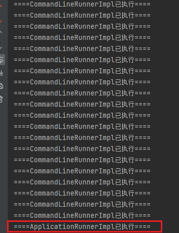

适用场景:   

​       允许开发人员在应用程序启动完成后执行一些自定义的任务，例如加载初始化数据、执行数据迁移、启动后台任务等

1.CommandLineRunner接口(可以实现多个):

​         方法签名: void run(String... args)参数类型: 

​         字符串数组，表示应用程序启动时传递的命令行参数执行时机: 在Spring上下文准备好之后，但在调用ApplicationRunner之前执行,@PostConstruct注解的方法会先于实现了CommandLineRunner接口的run方法执行

2.ApplicationRunner接口(可以实现多个)::

​          方法签名: void run(ApplicationArguments args)参数类型: 

​          ApplicationArguments对象，提供对应用程序启动参数的更高级别访问执行时机: 在CommandLineRunner之后执行。

3.使用@Order注解可以确保执行顺序

```java
package com.ransibi;

import org.springframework.boot.CommandLineRunner;
import org.springframework.core.annotation.Order;
import org.springframework.stereotype.Component;

@Component
@Order(1)
public class CommandLineRunnerImpl implements CommandLineRunner {
    @Override
    public void run(String... args) throws Exception {
        for (int i = 0; i < 20; i++) {
            System.out.println("====CommandLineRunnerImpl已执行====");
        }
    }
}
```

```java
package com.ransibi;

import org.springframework.boot.ApplicationArguments;
import org.springframework.boot.ApplicationRunner;
import org.springframework.core.annotation.Order;
import org.springframework.stereotype.Component;

@Component
@Order(2)
public class ApplicationRunnerImpl implements ApplicationRunner {
    @Override
    public void run(ApplicationArguments args) throws Exception {
        System.out.println("====ApplicationRunnerImpl已执行====");
    }
}
```


