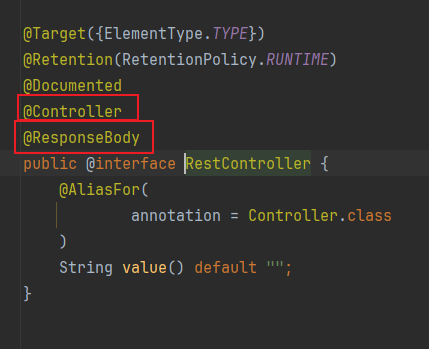

### REST开发

#### 简介

REST(Representational State Transfer),表现形式状态转换。

优点：(1)可以隐藏资源的访问行为，无法通过地址得知对资源是进行何种操作。(2)书写简化

```apl
例如:
http://ip:port/users 
http://ip:port/users/1 
```

区分方式: 按照REST风格访问资源时使用行为动作区分对资源进行何种操作

| url                    | 请求方式 | 执行的操作       |
| ---------------------- | -------- | ---------------- |
| http://ip:port/users   | GET      | 查询全部用户信息 |
| http://ip:port/users/1 | GET      | 查询指定用户信息 |
| http://ip:port/users   | POST     | 添加用户信息     |
| http://ip:port/users   | PUT      | 更新用户信息     |
| http://ip:port/users/1 | DELETE   | 删除用户信息     |

#### POST（新增/添加）

```java
    @RequestMapping(value = "/users", method = RequestMethod.POST)
    @ResponseBody
    public String save() {
        System.out.println("====save=====");
        return "{'model':'user save'}";
    }
```

#### DELETE（删除）

```java
    @RequestMapping(value = "/users/{id}", method = RequestMethod.DELETE)
    @ResponseBody
    public String delete(@PathVariable Integer id) {
        System.out.println("====delete====" + id);
        return "{'model':'user deleteById'}";
    }
```

#### PUT（更新/修改）

```java
    @RequestMapping(value = "/users", method = RequestMethod.PUT)
    @ResponseBody
    public String update(@RequestBody User user) {
        System.out.println("====user update===" + user);
        return "{'model':'user update'}";
    }
```

#### GET(查询)

```java
    @RequestMapping(value = "/users", method = RequestMethod.GET)
    @ResponseBody
    public String getUserAll() {
        System.out.println("===getUserAll===");
        return "{'model':'getUserAll'}";
    }

    @RequestMapping(value = "/users/{id}", method = RequestMethod.GET)
    @ResponseBody
    public String getUserById(@PathVariable Integer id) {
        System.out.println("===getUserById===" + id);
        return "{'model':'getUserById'}";
    }
```

#### 整体简化

```java
package com.ransibi.controller;

import com.ransibi.pojo.User;
import org.springframework.web.bind.annotation.*;


@RestController
@RequestMapping("/users")
public class RestTestController {

    @PostMapping
    public String save() {
        System.out.println("====save=====");
        return "{'model':'user save'}";
    }

    @DeleteMapping(value = "/{id}")
    public String delete(@PathVariable Integer id) {
        System.out.println("====delete====" + id);
        return "{'model':'user deleteById'}";
    }

    @PutMapping
    public String update(@RequestBody User user) {
        System.out.println("====user update===" + user);
        return "{'model':'user update'}";
    }

    @GetMapping
    public String getUserAll() {
        System.out.println("===getUserAll===");
        return "{'model':'getUserAll'}";
    }

    @GetMapping(value = "/{id}")
    public String getUserById(@PathVariable Integer id) {
        System.out.println("===getUserById===" + id);
        return "{'model':'getUserById'}";
    }
}
```

@RestController注解中包含了@Controller和@ResponseBody



#### 参数的接收

##### @RequestBody

用于接收json数据

##### @RequestParam

用于接收url地址传参或者表单传参

##### @PathVariable

用于接收路径参数，使用{参数名称}描述路径参数
