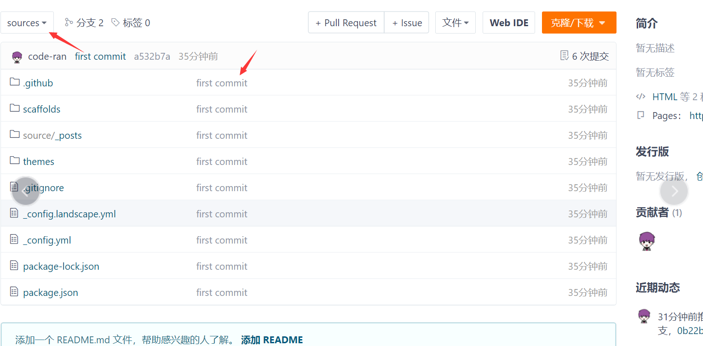

1、首先需要在gitee的master分支下再创建一个sources分支，这个sources分支用来备份我们博客的源码文件：

<!--more-->


注意：我们原始的博客文件夹是没有.git文件夹的，所以需要随便克隆一个项目，如何将其中的.git文件夹拷贝至hexo博客根目录即可。


创建.gitignore文件，如果hexo根目录有这个文件，那么就无需创建。用来在上传时候忽略一些文件，即不上传`.gitignore`中忽略的文件。

```
.DS_Store
Thumbs.db
db.json
*.log
node_modules/
public/
.deploy*/
```


---**注意，如果你之前克隆过theme中的主题文件，那么应该把主题文件中的.git文件夹删掉，因为git不能嵌套上传，最好是显示隐藏文件，检查一下有没有，否则上传的时候会出错，导致你的主题文件无法上传，这样你的配置在别的电脑上就用不了了。**


2、在hexo的根目录的命令行窗口切换到需要备份的sources分支下：

```
git checkout -b sources
```


3、然后将除了.gitinore中忽视的文件外，添加到待提交缓冲池中：

```
git add .
```

$@4J783734CMQW45HCUD.png)

4、开始进行提交：

```
git commit -m "first commit"
```


5、最后push到sources分支中：

```
git push -u origin sources
```




其中node_modules、public、db.json已经被忽视掉了，没有关系，不需要上传的，因为在别的电脑上需要重新输入命令安装。

