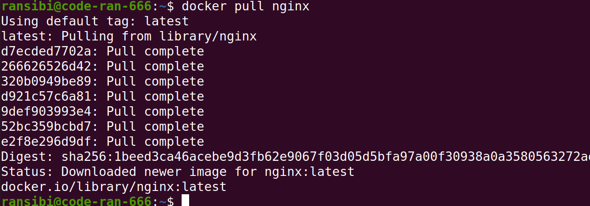
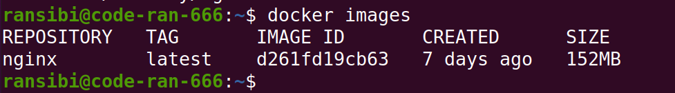
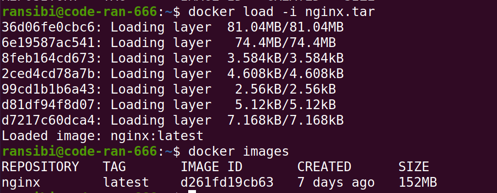
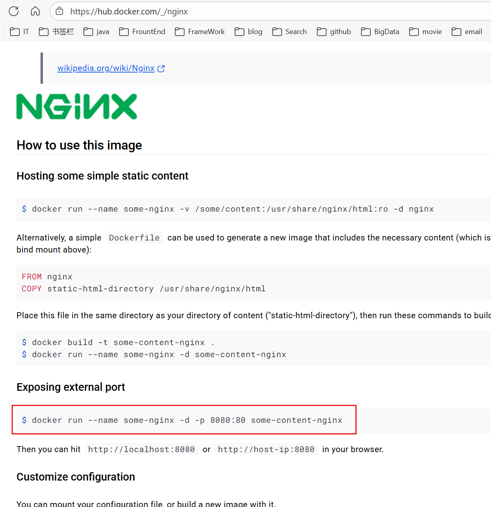
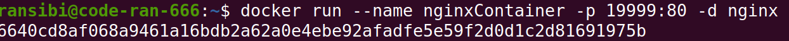
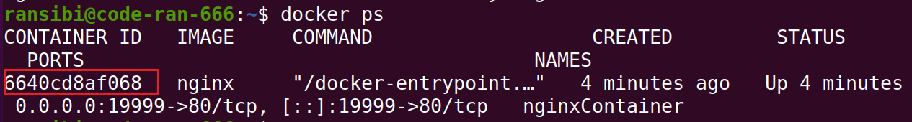
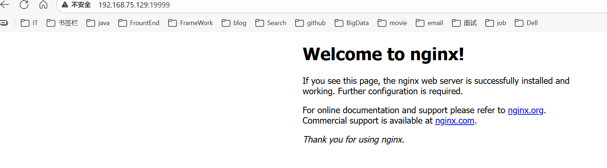
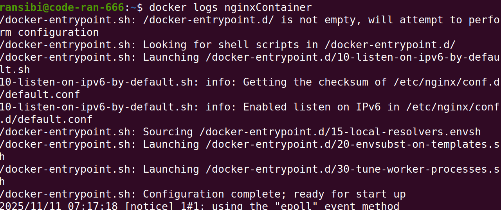
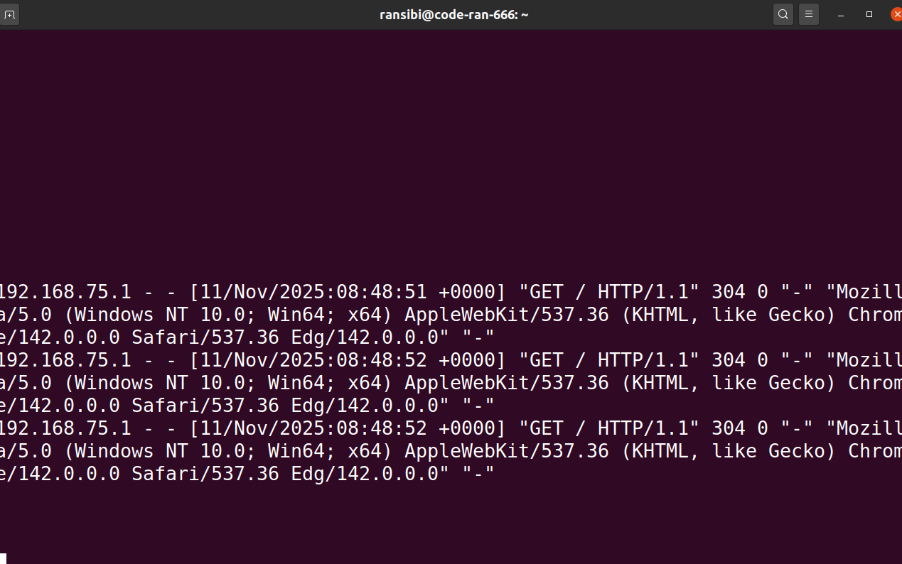

### 概述

Docker允许开发中将应用、依赖、函数库、配置一起**打包**，形成可移植镜像。并且Docker应用运行在容器中，使用沙箱机制，相互隔离。启动、移除都可以通过一行命令完成，方便快捷。

### 重要概念

#### 镜像

Docker将应用程序及其所需的依赖、函数库、环境、配置等文件打包在一起，称为镜像。

#### 容器

镜像中的应用程序运行后形成的进程就是**容器**，只是Docker会给容器进程做隔离，对外不可见。

### docker架构

Docker是一个CS架构的程序。

```
(1)客户端(client)：
   通过命令或RestAPI向Docker服务端发送指令。可以在本地或远程向服务端发送指令。
(2)服务端(server)：
   Docker守护进程，负责处理Docker指令，管理镜像、容器等。
```

### docker基本操作

#### 镜像操作

(1)镜像名称组成

```
[repository]:[tag]
```

例如: musql:8.0

没有指定tag，默认就是latest，标识最新版本镜像。

(2)查看已获取到的镜像

```
docker images
```

(3)删除镜像

```
docker rmi
```

(4)拉取镜像

```
docker pull
```

(5)推送镜像

```
docker push
```

(6)将镜像保存为一个压缩包，拷贝到其它容器

```
docker save
```

(7)将通过docker save打包的压缩包加载为可用的镜像

```
docker load
```


例子:

从dockerhub中拉取nginx镜像，并查看。

```
docker pull nginx
```





利用docker save将nginx镜像导出磁盘，然后再通过load加载回来。

```
docker save -o nginx.tar nginx:latest
```

删除安装的nginx镜像

```
docker rmi nginx:latest
```

加载压缩镜像

```
docker load -i nginx.tar
```



#### 容器操作

容器保护的三个状态

```
运行：进程正常运行
暂停：进程暂停，CPU不再运行，并不释放内存
停止：进程终止，回收进程占用的内存、CPU等资源
```

（）创建并运行一个容器，处于运行状态

```
docker run
```

(2)让一个运行的容器暂停

```
docker pause
```

(3)让一个容器从暂停状态恢复运行

```
docker unpause
```

(4)停止一个运行的容器

```
docker stop
```

(5)让一个停止的容器再次运行

```
docker start
```

(6)删除一个容器

```
docker rm
```

(7)查看所有运行的docker容器及状态

```
docker ps
```

(8)查看docker日志

```
docker logs
```


例子: 创建并运行一个nginx容器



```
docker run --name containerName -p 80:80 -d nginx
```

```
docker run ：创建并运行一个容器
--name : 给容器起一个名字，比如叫做nginxContainer
-p ：将宿主机端口与容器端口映射，冒号左侧是宿主机端口，右侧是容器端口
-d：后台运行容器
nginx：镜像名称，例如nginx
```

创建并运行容器

```
docker run --name nginxcontainer -p 19999:80 -d nginx
```



会生成容器的唯一id



访问地址：

```
http://192.168.75.129:19999/
```



查看日志

```
docker logs 容器名
```



持续监控日志

```
docker logs -f 容器名
```



#### 数据卷操作
