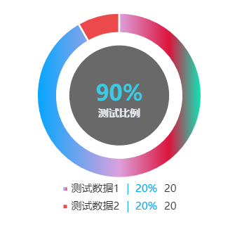
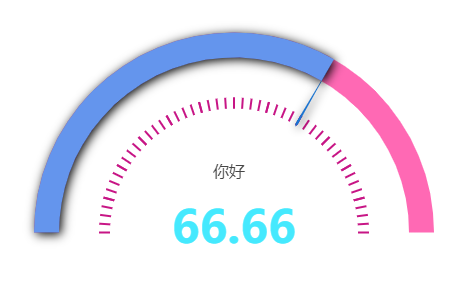
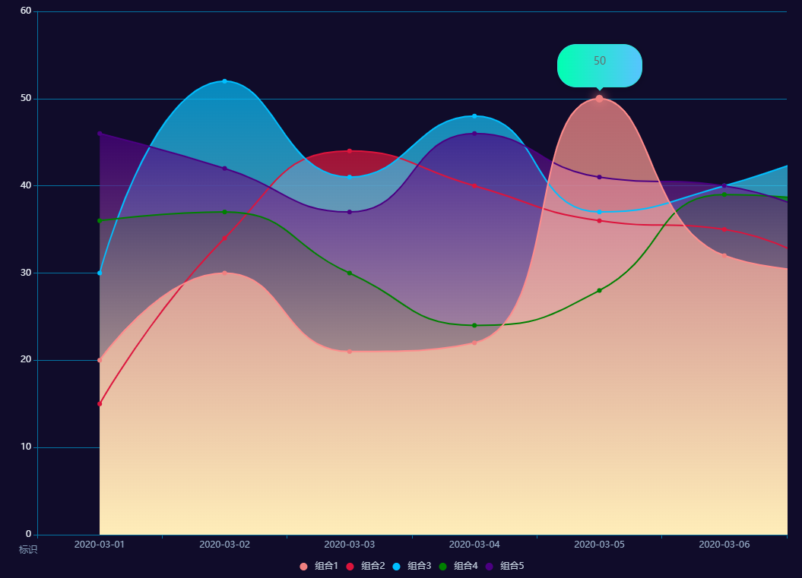
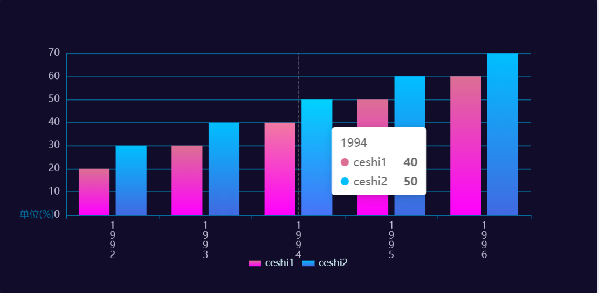
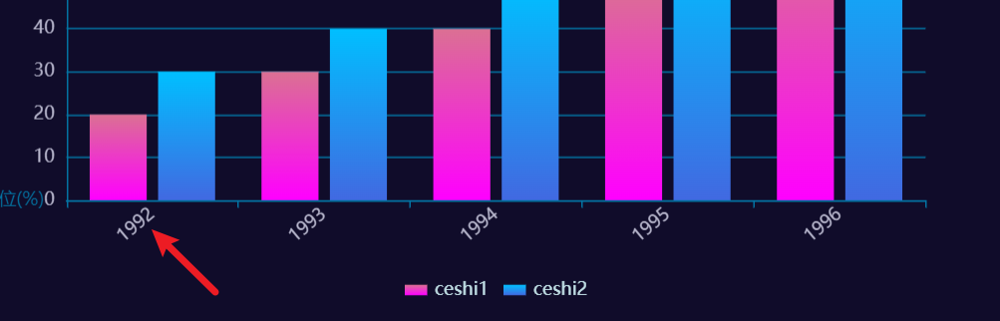

echarts官网：

**https://echarts.apache.org/zh/index.html**

echarts社区：

**https://www.makeapie.com/**     echarts的官方社区已经不在维护，

echarts社区镜像网站,与之前官方社区功能一样:

**https://www.makeapie.cn/echarts**

其它echarts相关的社区:

- https://madeapie.com/#/
- http://echarts.zhangmuchen.top/#/index
- https://www.isqqw.com/
- http://ppchart.com/#/
- http://192.144.199.210/forum.php?mod=forumdisplay&fid=2
- http://chartlib.datains.cn/echarts


##### 1、饼图嵌套:

 (1)练习图例:



(2)配置项:

```text
option = {
  tooltip: {
    trigger: 'item',
    backgroundColor: 'rgba(255, 255, 255, 0.8)'
  },
  title: [
    {
      text: '测试比例',
      left: 'center',
      top: '45%',
      textStyle: { color: '#e7ebf0', fontSize: 15 }
    },
    {
      text: '90%',
      left: 'center',
      top: '40%',
      textStyle: { color: '#3acae4', fontSize: 31 }
    }
  ],
  legend: {
    left: 'center',
    bottom: '33%',
    //控制legend的布局方向
    orient: 'vertical',
    //控制legend的布局大小
    itemWidth: 7,
    itemHeight: 7,
    //lengend数据显示配置,echarts 给formatter文字添加不同颜色
    formatter: function (value) {
      if (value.length > 5) {
        return value.substring(0, 4) + '...' + '{a|' + '|  20%' + '}' + '20';
      } else {
        return value + '{a|' + '|  20%' + '}' + '20';
      }
    },
    textStyle: {
      fontSize: 15,
      //在rich中给formatter添加个别字体颜色
      rich: {
        a: {
          color: '#03a9f4',
          padding: [0, 10],
          fontSize: 15
        }
      }
    }
  },
  cursor: 'pointer',
  series: [
    {
      name: 'stnPie',
      type: 'pie',
      radius: ['25%', '33%'],
      center: ['50%', '43%'],
      //最小的扇区角度（0 ~ 360），用于防止某个值过小导致扇区太小影响交互。
      label: {
        show: false,
        position: 'center'
      },
      labelLine: {
        show: false
      },
      itemStyle: {
        normal: {
          borderWidth: 2.5, // 间距的宽度
          borderColor: '#ffffff' //背景色
        }
      },
      data: [
        {
          value: 300,
          name: '测试数据1',
          //配置样式
          itemStyle: {
            normal: {
              //颜色渐变
              // 1, 1, 1, 0,  //(下-上 渐变)
              // 1, 1, 0, 0,  //(左上-右下 渐变)
              // 1, 0, 0, 0,  //(左-右 渐变)
              // 0, 1, 1, 0,  //(右上-左下 渐变)
              // 0, 1, 1, 1,  //(左-右 渐变)
              // 1, 0, 1, 1,  //(上-下 渐变)
              // 0, 0, 1, 0,  //(左-右 渐变)
              // 0, 0, 0, 1,  //(上-下 渐变)
              color: new echarts.graphic.LinearGradient(0, 1, 1, 1, [
                //四色渐变只能0 ~ 1之间
                { offset: 0, color: '#00a6ff' },
                {offset: 0.5, color: '#DDA0DD'},
                { offset: 0.8, color: '#DC143C' },
                { offset: 1, color: '#01f2bd' },
              ])
            }
          }
        },
        {
          value: 27,
          name: '测试数据2',
          itemStyle: { color: '#ec4a4a' }
        }
      ]
    },

    //中心圆配置
    {
      type: 'pie',
      radius: [0, '20%'],
      //与外环的圆心保持一致
      center: ['50%', '43%'],
      data: [
        {
          name: '',
          value: 1,
          //环颜色配置
          itemStyle: { color: '	#696969' },
          tooltip: {
            show: false
          },
          //是否关闭高亮状态,中心圆关闭鼠标移动上去后的放大显示效果
          emphasis: {
            disabled: true
          },
          select: {
            disabled: false
          }
        }
      ],
      label: {
        show: false
      }
    }
  ]
};
```

(3)完整页面:

```html
<!DOCTYPE html>
<html lang="zh-CN" style="height: 100%">
<head>
  <meta charset="utf-8">
</head>
<body style="height: 100%; margin: 0">
  <div id="container" style="height: 100%"></div>
  <script type="text/javascript" src="https://fastly.jsdelivr.net/npm/echarts@5.4.1/dist/echarts.min.js"></script>
  <script type="text/javascript">
    var dom = document.getElementById('container');
    var myChart = echarts.init(dom, null, {
      renderer: 'canvas',
      useDirtyRect: false
    });
    var app = {};
    var option;
    option = {
  tooltip: {
    trigger: 'item',
    backgroundColor: 'rgba(255, 255, 255, 0.8)'
  },
  title: [
    {
      text: '测试比例',
      left: 'center',
      top: '45%',
      textStyle: { color: '#e7ebf0', fontSize: 15 }
    },
    {
      text: '90%',
      left: 'center',
      top: '40%',
      textStyle: { color: '#3acae4', fontSize: 31 }
    }
  ],
  legend: {
    left: 'center',
    bottom: '33%',
    //控制legend的布局方向
    orient: 'vertical',
    //控制legend的布局大小
    itemWidth: 7,
    itemHeight: 7,
    //lengend数据显示配置,echarts 给formatter文字添加不同颜色
    formatter: function (value) {
      if (value.length > 5) {
        return value.substring(0, 4) + '...' + '{a|' + '|  20%' + '}' + '20';
      } else {
        return value + '{a|' + '|  20%' + '}' + '20';
      }
    },
    textStyle: {
      fontSize: 15,
      //在rich中给formatter添加个别字体颜色
      rich: {
        a: {
          color: '#03a9f4',
          padding: [0, 10],
          fontSize: 15
        }
      }
    }
  },
  cursor: 'pointer',
  series: [
    {
      name: 'stnPie',
      type: 'pie',
      radius: ['25%', '33%'],
      center: ['50%', '43%'],
      //最小的扇区角度（0 ~ 360），用于防止某个值过小导致扇区太小影响交互。
      label: {
        show: false,
        position: 'center'
      },
      labelLine: {
        show: false
      },
      itemStyle: {
        normal: {
          borderWidth: 2.5, // 间距的宽度
          borderColor: '#ffffff' //背景色
        }
      },
      data: [
        {
          value: 300,
          name: '测试数据1',
          //配置样式
          itemStyle: {
            normal: {
              //颜色渐变
              // 1, 1, 1, 0,  //(下-上 渐变)
              // 1, 1, 0, 0,  //(左上-右下 渐变)
              // 1, 0, 0, 0,  //(左-右 渐变)
              // 0, 1, 1, 0,  //(右上-左下 渐变)
              // 0, 1, 1, 1,  //(左-右 渐变)
              // 1, 0, 1, 1,  //(上-下 渐变)
              // 0, 0, 1, 0,  //(左-右 渐变)
              // 0, 0, 0, 1,  //(上-下 渐变)
              color: new echarts.graphic.LinearGradient(0, 1, 1, 1, [
                //四色渐变只能0 ~ 1之间
                { offset: 0, color: '#00a6ff' },
                {offset: 0.5, color: '#DDA0DD'},
                { offset: 0.8, color: '#DC143C' },
                { offset: 1, color: '#01f2bd' },
              ])
            }
          }
        },
        {
          value: 27,
          name: '测试数据2',
          itemStyle: { color: '#ec4a4a' }
        }
      ]
    },
    //中心圆配置
    {
      type: 'pie',
      radius: [0, '20%'],
      //与外环的圆心保持一致
      center: ['50%', '43%'],
      data: [
        {
          name: '',
          value: 1,
          //环颜色配置
          itemStyle: { color: '	#696969' },
          tooltip: {
            show: false
          },
          //是否关闭高亮状态,中心圆关闭鼠标移动上去后的放大显示效果
          emphasis: {
            disabled: true
          },
          select: {
            disabled: false
          }
        }
      ],
      label: {
        show: false
      }
    }
  ]
};
    if (option && typeof option === 'object') {
      myChart.setOption(option);
    }
    window.addEventListener('resize', myChart.resize);
  </script>
</body>
</html>
```

##### 仪表盘：

(1)练习图例:




(2)配置项:

```text
option = {
  series: [
    {
      type: 'gauge',
      //半径
      radius: 200,
      //控制弧长
      startAngle: 180,
      endAngle: 0,
      min: 0,
      //占比
      max: 100,
      splitNumber: 12,
      itemStyle: {
        //环颜色
        color: '#6495ED',
        shadowBlur: 10,
        shadowOffsetX: 2,
        shadowOffsetY: 2
      },
      progress: {
        //半圆环配置
        show: true,
        // roundCap: true,
        width: 25
      },
      //底层圆环配置
      axisLine: {
        // roundCap: true,
        show: true,
        // 属性lineStyle控制线条样式
        lineStyle: {
          width: 25,
          color: [[1, '#FF69B4']]
        }
      },
      //刻度样式
      axisTick: {
        show: true,
        splitNumber: 4,
        length: 11,
        //控制大小
        distance: 40,
        lineStyle: {
          width: 2,
          color: '#C71585'
        }
      },
      //分隔线样式
      splitLine: {
        show: false,
        length: 12,
        lineStyle: {
          width: 3,
          color: '#185da5'
        }
      },
      //表盘刻度配置
      axisLabel: {
        show: false,
        distance: 30,
        color: '#999',
        fontSize: 20
      },
      //指针配置
      pointer: {
        show: true,
        showAbove: false,
        offsetCenter: [0, -125],
        length: '34%',
        width: 1.2,
        itemStyle: {
          color: '#1a73d0',
          borderCap: 'butt'
        }
      },
      tooltip: {
        show: true
      },
      //标题配置相关
      title: {
        show: true,
        offsetCenter: [-5, -60]
      },
      detail: {
        // backgroundColor: '#45e9fe',
        // borderColor: '#45e9fe',
        // borderWidth: 2,
        // fontStyle: '#45e9fe',
        width: '60%',
        lineHeight: 40,
        height: 50,
        // borderRadius: 8,
        //相对于仪表盘中心的偏移位置，数组第一项是水平方向的偏移，第二项是垂直方向的偏移
        offsetCenter: [0, '2%'],
        valueAnimation: true,
        formatter: function (value) {
          return '{value|' + value.toFixed(2) + '}';
        },
        rich: {
          value: {
            fontSize: 45,
            fontWeight: 'bolder',
            //中心数字
            color: '#45e9fe'
          }
          //中心数据单位配置
          // unit: {
          //   fontSize: 20,
          //   color: '#999',
          //   padding: [0, 0, -20, 10]
          // }
        }
      },
      data: [
        {
          name: '你好',
          value: 66.66
        }
      ]
    }
  ]
};
```


(3)完整页面:

```html
<!DOCTYPE html>
<html lang="zh-CN" style="height: 100%">
<head>
  <meta charset="utf-8">
</head>
<body style="height: 100%; margin: 0">
  <div id="container" style="height: 100%"></div>
  <script type="text/javascript" src="https://fastly.jsdelivr.net/npm/echarts@5.4.1/dist/echarts.min.js"></script>
  <script type="text/javascript">
    var dom = document.getElementById('container');
    var myChart = echarts.init(dom, null, {
      renderer: 'canvas',
      useDirtyRect: false
    });
    var app = {};
    
    var option;

    option = {
  series: [
    {
      type: 'gauge',
      //半径
      radius: 200,
      //控制弧长
      startAngle: 180,
      endAngle: 0,
      min: 0,
      //占比
      max: 100,
      splitNumber: 12,
      itemStyle: {
        //环颜色
        color: '#6495ED',
        shadowBlur: 10,
        shadowOffsetX: 2,
        shadowOffsetY: 2
      },
      progress: {
        //半圆环配置
        show: true,
        // roundCap: true,
        width: 25
      },
      //底层圆环配置
      axisLine: {
        // roundCap: true,
        show: true,
        // 属性lineStyle控制线条样式
        lineStyle: {
          width: 25,
          color: [[1, '#FF69B4']]
        }
      },
      //刻度样式
      axisTick: {
        show: true,
        splitNumber: 4,
        length: 11,
        //控制大小
        distance: 40,
        lineStyle: {
          width: 2,
          color: '#C71585'
        }
      },
      //分隔线样式
      splitLine: {
        show: false,
        length: 12,
        lineStyle: {
          width: 3,
          color: '#185da5'
        }
      },
      //表盘刻度配置
      axisLabel: {
        show: false,
        distance: 30,
        color: '#999',
        fontSize: 20
      },
      //指针配置
      pointer: {
        show: true,
        showAbove: false,
        offsetCenter: [0, -125],
        length: '34%',
        width: 1.2,
        itemStyle: {
          color: '#1a73d0',
          borderCap: 'butt'
        }
      },
      tooltip: {
        show: true
      },
      //标题配置相关
      title: {
        show: true,
        offsetCenter: [-5, -60]
      },
      detail: {
        // backgroundColor: '#45e9fe',
        // borderColor: '#45e9fe',
        // borderWidth: 2,
        // fontStyle: '#45e9fe',
        width: '60%',
        lineHeight: 40,
        height: 50,
        // borderRadius: 8,
        //相对于仪表盘中心的偏移位置，数组第一项是水平方向的偏移，第二项是垂直方向的偏移
        offsetCenter: [0, '2%'],
        valueAnimation: true,
        formatter: function (value) {
          return '{value|' + value.toFixed(2) + '}';
        },
        rich: {
          value: {
            fontSize: 45,
            fontWeight: 'bolder',
            //中心数字
            color: '#45e9fe'
          }
          //中心数据单位配置
          // unit: {
          //   fontSize: 20,
          //   color: '#999',
          //   padding: [0, 0, -20, 10]
          // }
        }
      },
      data: [
        {
          name: '你好',
          value: 66.66
        }
      ]
    }
  ]
};
    if (option && typeof option === 'object') {
      myChart.setOption(option);
    }
    window.addEventListener('resize', myChart.resize);
  </script>
</body>
</html>
```

##### 曲线图：

(1)练习图例:



特点: 竖直方向的颜色渐变、原点自定义信息（位置自定义）、legend样式自定义(非默认)、tooltip样式自定义(非默认)  ......


(2)配置项:

```text
let seriesList = [];
let fakedata = {
  xdata: [
    '2020-03-01',
    '2020-03-02',
    '2020-03-03',
    '2020-03-04',
    '2020-03-05',
    '2020-03-06'
  ],
  seriesData: [
    { name: '组合1', data: [20, 30, 21, 22, 50, 32, 30] },
    { name: '组合2', data: [15, 34, 44, 40, 36, 35, 29] },
    { name: '组合3', data: [30, 52, 41, 48, 37, 40, 45] },
    { name: '组合4', data: [36, 37, 30, 24, 28, 39, 38] },
    { name: '组合5', data: [46, 42, 37, 46, 41, 40, 35] },
  ]
};
let colors = ['#F08080', '#DC143C', '#00BFFF', '#008000', '#4B0082'];
let i = 0;
if (JSON.stringify(fakedata) != '{}') {
fakedata.seriesData.forEach((item) => {
  let color = colors[i % colors.length];
  let obj = {
    name: item.name,
    data: item.data,
    type: 'line',
    smooth: true,
    symbol: 'circle', //将小圆点改成实心 不写symbol默认空心,
    symbolSize: 6, //设定实心点的大小
    showSymbol: true,
    itemStyle: {
      color: color
    },
    emphasis: {
      itemStyle: {
        //下面是拐点样式配置属性
        color: color, //这里设置的拐点颜色
        borderColor: color, //  拐点边框颜色
        borderWidth: 3.5, //  拐点边框宽度
        shadowColor: color, //  阴影颜色
        shadowBlur: 14 //  阴影渐变范围控制
      }
    },
    areaStyle: {
      normal: {
        color: new echarts.graphic.LinearGradient(
          0,
          0,
          0,
          1,
          [
            {
              offset: 0,
              color: color
            },
            {
              offset: 1,
              color: '#FFDEAD'
            }
          ],
          false
        )
      }
    }
  };
  seriesList.push(obj);
  // lengedList.push(item.name);
  i++;
});
}
var option;
option = {
  grid: {
    // 让图表占满容器
    top: '20px',
    left: '58px',
    right: '58px',
    bottom: '58px'
  },

  legend: {
    show: true,
    bottom: 5,
    icon: 'circle',
    itemWidth: 10, // 设置宽度
    itemHeight: 10, // 设置高度
    formatter: function (name) {
      return '{a|' + name + '}';
    },
    textStyle: {
      rich: {
        a: {
          align: 'left',
          color: '#BFCBDA ',
          padding: [0, 5, 0, 5]
        },
        b: {
          color: '#FFFFFF'
        }
      }
    }
  },
  tooltip: {
    show: true,
    trigger: 'item', //值为axis显示该列下所有坐标轴对应数据，值为item时只显示该点数据
    extraCssText:
      'width:90px;height:35px;text-align: center;border-radius: 25px ;background-image: linear-gradient(to right, #01ffb2 , #57c4fe);',
    formatter: '{c0}',
    position: 'top',
    backgroundColor: '#2ce0d8',
    borderColor: '#2ce0d8'
  },
  xAxis: {
    type: 'category',
    data: fakedata.xdata,
    // boundaryGap: false,
    axisLine: {
      //控制X轴线的颜色
      lineStyle: {
        color: '#0373a2',
        width: 1 //这里是为了突出显示加上的
      }
    },
    axisLabel: {
      show: true,
      textStyle: {
        color: '#99afca' //更改坐标轴文字颜色
        // fontSize: 14, //更改坐标轴文字大小
      }
    },
    splitLine: {
      //网格线
      lineStyle: {
        type: 'dashed', //设置网格线类型 dotted：虚线   solid:实线
        width: 1,
        color: '#00415f'
      },
      show: false //隐藏或显示
    }
  },
  yAxis: {
    type: 'value',
    // 分隔线
    splitLine: {
      //控制横坐标往上的横线颜色
      show: true,
      lineStyle: {
        color: ['#0373A2'],
        width: 1,
        type: 'solid'
      }
    },
    // 坐标轴轴线
    axisLine: {
      show: true,
      //控制y轴线的颜色
      lineStyle: {
        color: '#0373a2',
        width: 1 //这里是为了突出显示加上的
      }
    },
    // 坐标轴刻度
    axisTick: {
      show: true
    },
    // 刻度标签
    axisLabel: {
      show: true,
      textStyle: {
        color: '#e5ebf2' //更改坐标轴文字颜色
        // fontSize: 14, //更改坐标轴文字大小
      }
    },
    name: '标识',
    nameLocation: 'start', //将name配置在原点处下方
    nameTextStyle: {
      //控制name的字体颜色以及对齐方式
      color: '#8199b5',
      align: 'right'
    }
  },
  series: seriesList
};
```


(3)完整页面:

```html
<!DOCTYPE html>
<html lang="zh-CN" style="height: 100%">
<head>
  <meta charset="utf-8">
</head>
<body style="height: 100%; margin: 0">
  <div id="container" style="height: 100%"></div>
  <script type="text/javascript" src="https://fastly.jsdelivr.net/npm/echarts@5.4.1/dist/echarts.min.js"></script>
  <script type="text/javascript">
    var dom = document.getElementById('container');
    var myChart = echarts.init(dom, 'dark', {
      renderer: 'canvas',
      useDirtyRect: false
    });
    var app = {};
    var option;
    let seriesList = [];
let fakedata = {
  xdata: [
    '2020-03-01',
    '2020-03-02',
    '2020-03-03',
    '2020-03-04',
    '2020-03-05',
    '2020-03-06'
  ],
  seriesData: [
    { name: '组合1', data: [20, 30, 21, 22, 50, 32, 30] },
    { name: '组合2', data: [15, 34, 44, 40, 36, 35, 29] },
    { name: '组合3', data: [30, 52, 41, 48, 37, 40, 45] },
    { name: '组合4', data: [36, 37, 30, 24, 28, 39, 38] },
    { name: '组合5', data: [46, 42, 37, 46, 41, 40, 35] },
  ]
};
let colors = ['#F08080', '#DC143C', '#00BFFF', '#008000', '#4B0082'];
let i = 0;
if (JSON.stringify(fakedata) != '{}') {
fakedata.seriesData.forEach((item) => {
  let color = colors[i % colors.length];
  let obj = {
    name: item.name,
    data: item.data,
    type: 'line',
    smooth: true,
    symbol: 'circle', //将小圆点改成实心 不写symbol默认空心,
    symbolSize: 6, //设定实心点的大小
    showSymbol: true,
    itemStyle: {
      color: color
    },
    emphasis: {
      itemStyle: {
        //下面是拐点样式配置属性
        color: color, //这里设置的拐点颜色
        borderColor: color, //  拐点边框颜色
        borderWidth: 3.5, //  拐点边框宽度
        shadowColor: color, //  阴影颜色
        shadowBlur: 14 //  阴影渐变范围控制
      }
    },
    areaStyle: {
      normal: {
          //配置竖直方向颜色渐变
        color: new echarts.graphic.LinearGradient(
          0,
          0,
          0,
          1,
          [
            {
              offset: 0,
              color: color
            },
            {
              offset: 1,
              color: '#FFDEAD'
            }
          ],
          false
        )
      }
    }
  };
  seriesList.push(obj);
  i++;
});
}
var option;
option = {
  grid: {
    // 让图表占满容器
    top: '20px',
    left: '58px',
    right: '58px',
    bottom: '58px'
  },

  legend: {
    show: true,
    bottom: 5,
    icon: 'circle',
    itemWidth: 10, // 设置宽度
    itemHeight: 10, // 设置高度
    formatter: function (name) {
      return '{a|' + name + '}';
    },
    textStyle: {
      rich: {
        a: {
          align: 'left',
          color: '#BFCBDA ',
          padding: [0, 5, 0, 5]
        },
        b: {
          color: '#FFFFFF'
        }
      }
    }
  },
  tooltip: {
    show: true,
    trigger: 'item', //值为axis显示该列下所有坐标轴对应数据，值为item时只显示该点数据
    //tooltip的样式自定义
    extraCssText:
      'width:90px;height:35px;text-align: center;border-radius: 25px ;background-image: linear-gradient(to right, #01ffb2 , #57c4fe);',
    formatter: '{c0}',
    //echarts的tooltip position设置为top，默认在底部会有一个倒三角
    position: 'top',
    //让倒三角和颜色和圆角矩形颜色一样
    backgroundColor: '#2ce0d8',
    borderColor: '#2ce0d8'
  },
  xAxis: {
    type: 'category',
    data: fakedata.xdata,
    // boundaryGap: false,
    axisLine: {
      //控制X轴线的颜色
      lineStyle: {
        color: '#0373a2',
        width: 1 //这里是为了突出显示加上的
      }
    },
    axisLabel: {
      show: true,
      textStyle: {
        color: '#99afca' //更改坐标轴文字颜色
        // fontSize: 14, //更改坐标轴文字大小
      }
    },
    splitLine: {
      //网格线
      lineStyle: {
        type: 'dashed', //设置网格线类型 dotted：虚线   solid:实线
        width: 1,
        color: '#00415f'
      },
      show: false //隐藏或显示
    }
  },
  yAxis: {
    type: 'value',
    // 分隔线
    splitLine: {
      //控制横坐标往上的横线颜色
      show: true,
      lineStyle: {
        color: ['#0373A2'],
        width: 1,
        type: 'solid'
      }
    },
    // 坐标轴轴线
    axisLine: {
      show: true,
      //控制y轴线的颜色
      lineStyle: {
        color: '#0373a2',
        width: 1 //这里是为了突出显示加上的
      }
    },
    // 坐标轴刻度
    axisTick: {
      show: true
    },
    // 刻度标签
    axisLabel: {
      show: true,
      textStyle: {
        color: '#e5ebf2' //更改坐标轴文字颜色
        // fontSize: 14, //更改坐标轴文字大小
      }
    },
    name: '标识',
    nameLocation: 'start', //将name配置在原点处下方
    nameTextStyle: {
      //控制name的字体颜色以及对齐方式
      color: '#8199b5',
      align: 'right'
    }
  },
  series: seriesList
};
    if (option && typeof option === 'object') {
      myChart.setOption(option);
    }
    window.addEventListener('resize', myChart.resize);
  </script>
</body>
</html>
```

##### 柱状图：

（1）练习图例：



（2）配置项:

```text
let fakedata = {
  xData: ['1992', '1993', '1994', '1995', '1996'],
  ceshi1Data: [20, 30, 40, 50, 60],
  ceshi2Data: [30, 40, 50, 60, 70]
};
option = {
  title: {
    // text: 'Rainfall vs Evaporation',
    // subtext: 'Fake Data',
  },
  grid: {
    height: 200
  },
  tooltip: {
    trigger: 'axis'
  },
  legend: {
    data: ['ceshi1', 'ceshi2'],
    // bottom: 1,
    orient: 'horizontal', //垂直对齐
    icon: 'rect', //rect矩形，circle圆形
    // right: 10, //控制legsend居右对齐
    // right: 20,
    // top: 150,
    bottom: 20,
    textStyle: {
      //控制legend的字体颜色和大小
      color: '#C2E1E7',
      fontSize: 12
    },
    itemWidth: 15,
    itemHeight: 7
  },
  toolbox: {
    show: false
  },
  xAxis: [
    {
      type: 'category',
      data: fakedata.xData,
      //默认坐标横向显示，这里格式化成竖直方向显示
      axisLabel: {
        // rotate: 40,//旋转角度
        interval: 0,
        formatter: function (value) {
          return value.split('').join('\n');
        }
      },
      axisLine: {
        //控制X轴线的颜色
        lineStyle: {
          color: '#0373A2',
          width: 1 //这里是为了突出显示加上的
        }
      },
      name: '单位(%)',
      nameLocation: 'start', //将name配置在原点处下方
      nameTextStyle: {
        //控制name的字体颜色以及对齐方式
        color: '#0373A2',
        align: 'right'
      }
    }
  ],
  yAxis: [
    {
      type: 'value',
      splitLine: {
        //控制横坐标往上的横线颜色
        show: true,
        lineStyle: {
          color: ['#0373A2'],
          width: 1,
          type: 'solid'
        }
      },
      // 坐标轴轴线
      axisLine: {
        show: true,
        //控制y轴线的颜色
        lineStyle: {
          color: '#0373a2',
          width: 1 //这里是为了突出显示加上的
        }
      }
    }
  ],
  series: [
    {
      name: 'ceshi1',
      type: 'bar',
      data: fakedata.ceshi1Data,
      itemStyle: {
        normal: {
          color: new echarts.graphic.LinearGradient(0, 0, 0, 1, [
            { offset: 0, color: '#DB7093' },
            { offset: 1, color: '#FF00FF' }
          ])
        }
      }
    },
    {
      name: 'ceshi2',
      type: 'bar',
      data: fakedata.ceshi2Data,
      itemStyle: {
        normal: {
          color: new echarts.graphic.LinearGradient(0, 0, 0, 1, [
            { offset: 0, color: '#00BFFF' },
            { offset: 1, color: '#4169E1' }
          ])
        }
      }
    }
  ]
};
```


  (3)   完整页面:

```html
<!DOCTYPE html>
<html lang="zh-CN" style="height: 100%">
<head>
  <meta charset="utf-8">
</head>
<body style="height: 100%; margin: 0">
  <div id="container" style="height: 100%"></div>

  
  <script type="text/javascript" src="https://fastly.jsdelivr.net/npm/echarts@5.4.1/dist/echarts.min.js"></script>
  <script type="text/javascript">
    var dom = document.getElementById('container');
    var myChart = echarts.init(dom, 'dark', {
      renderer: 'canvas',
      useDirtyRect: false
    });
    var app = {};
    var option;
    let fakedata = {
  xData: ['1992', '1993', '1994', '1995', '1996'],
  ceshi1Data: [20, 30, 40, 50, 60],
  ceshi2Data: [30, 40, 50, 60, 70]
};
option = {
  title: {
    // text: 'Rainfall vs Evaporation',
    // subtext: 'Fake Data',
  },
  grid: {
    height: 200
  },
  tooltip: {
    trigger: 'axis'
  },
  legend: {
    data: ['ceshi1', 'ceshi2'],
    // bottom: 1,
    orient: 'horizontal', //垂直对齐
    icon: 'rect', //rect矩形，circle圆形
    // right: 10, //控制legsend居右对齐
    // right: 20,
    // top: 150,
    bottom: 20,
    textStyle: {
      //控制legend的字体颜色和大小
      color: '#C2E1E7',
      fontSize: 12
    },
    itemWidth: 15,
    itemHeight: 7
  },
  toolbox: {
    show: false
  },
  xAxis: [
    {
      type: 'category',
      data: fakedata.xData,
      //默认坐标横向显示，这里格式化成竖直方向显示
      axisLabel: {
        rotate: 40,//旋转角度
        interval: 0,
        // formatter: function (value) {
        //   return value.split('').join('\n');
        // }
      },
      axisLine: {
        //控制X轴线的颜色
        lineStyle: {
          color: '#0373A2',
          width: 1 //这里是为了突出显示加上的
        }
      },
      name: '单位(%)',
      nameLocation: 'start', //将name配置在原点处下方
      nameTextStyle: {
        //控制name的字体颜色以及对齐方式
        color: '#0373A2',
        align: 'right'
      }
    }
  ],
  yAxis: [
    {
      type: 'value',
      splitLine: {
        //控制横坐标往上的横线颜色
        show: true,
        lineStyle: {
          color: ['#0373A2'],
          width: 1,
          type: 'solid'
        }
      },
      // 坐标轴轴线
      axisLine: {
        show: true,
        //控制y轴线的颜色
        lineStyle: {
          color: '#0373a2',
          width: 1 //这里是为了突出显示加上的
        }
      }
    }
  ],
  series: [
    {
      name: 'ceshi1',
      type: 'bar',
      data: fakedata.ceshi1Data,
      itemStyle: {
        normal: {
          color: new echarts.graphic.LinearGradient(0, 0, 0, 1, [
            { offset: 0, color: '#DB7093' },
            { offset: 1, color: '#FF00FF' }
          ])
        }
      }
    },
    {
      name: 'ceshi2',
      type: 'bar',
      data: fakedata.ceshi2Data,
      itemStyle: {
        normal: {
          color: new echarts.graphic.LinearGradient(0, 0, 0, 1, [
            { offset: 0, color: '#00BFFF' },
            { offset: 1, color: '#4169E1' }
          ])
        }
      }
    }
  ]
};
    if (option && typeof option === 'object') {
      myChart.setOption(option);
    }
    window.addEventListener('resize', myChart.resize);
  </script>
</body>
</html>
```

技巧：横坐标倾斜显示。



在x轴的配置项中进行配置:

```xml
      axisLabel: {
        rotate: 40,//旋转角度
        interval: 0,
      },
```

