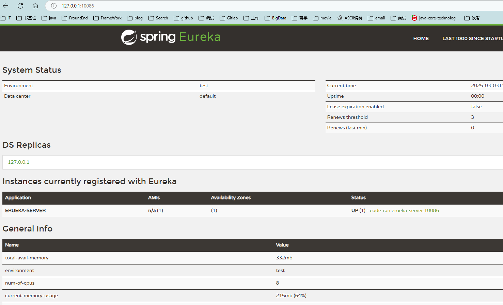
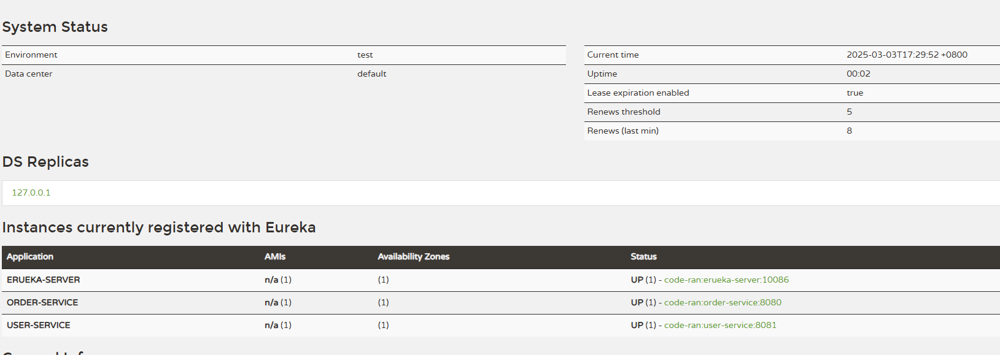
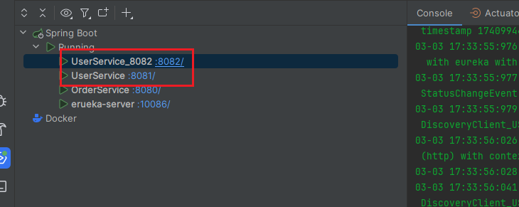
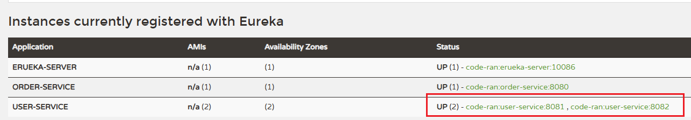

#### Eureka注册中心

##### 核心功能

1. 服务注册：服务(EurekaClient)启动时，会向 Eureka 服务器(EurekaServer)注册自己的信息，如 IP 地址和端口。
2. 服务发现：服务消费者(EurekaClient)通过 Eureka(EurekaServer) 查找所需服务的实例信息。
3. 健康检查：Eureka (EurekaServer)定期检查服务实例(EurekaClient)的健康状态，移除不健康的实例。
4. 负载均衡：结合 Ribbon 等工具，Eureka 支持客户端负载均衡。

```
Eureka Server：提供服务注册与发现功能。

Eureka Client：嵌入在服务中，负责与 Eureka Server 通信。
```

##### Eureka服务端实现

pom.xml

```xml
<?xml version="1.0" encoding="UTF-8"?>
<project xmlns="http://maven.apache.org/POM/4.0.0"
         xmlns:xsi="http://www.w3.org/2001/XMLSchema-instance"
         xsi:schemaLocation="http://maven.apache.org/POM/4.0.0 http://maven.apache.org/xsd/maven-4.0.0.xsd">
    <modelVersion>4.0.0</modelVersion>

    <parent>
        <groupId>org.springframework.boot</groupId>
        <artifactId>spring-boot-starter-parent</artifactId>
        <version>2.3.9.RELEASE</version>
    </parent>

    <groupId>com.ransibi</groupId>
    <artifactId>eureka_server</artifactId>
    <version>1.0-SNAPSHOT</version>

    <properties>
        <maven.compiler.source>8</maven.compiler.source>
        <maven.compiler.target>8</maven.compiler.target>
        <project.build.sourceEncoding>UTF-8</project.build.sourceEncoding>
        <project.reporting.outputEncoding>UTF-8</project.reporting.outputEncoding>
        <java.version>1.8</java.version>
    </properties>


    <dependencyManagement>
        <dependencies>
            <dependency>
                <groupId>org.springframework.cloud</groupId>
                <artifactId>spring-cloud-dependencies</artifactId>
                <version>Hoxton.SR12</version>
                <type>pom</type>
                <scope>import</scope>
            </dependency>
        </dependencies>
    </dependencyManagement>

    <dependencies>
        <dependency>
            <groupId>org.springframework.cloud</groupId>
            <artifactId>spring-cloud-starter-netflix-eureka-server</artifactId>
        </dependency>
    </dependencies>

</project>
```

启动类

```java
@SpringBootApplication
@EnableEurekaServer
public class Main {
    public static void main(String[] args) {
        SpringApplication.run(Main.class);
    }
}
```

配置信息

```yaml
server:
  port: 10086

spring:
  application:
    # erueka的服务名称
    name: erueka-server
eureka:
  client:
    service-url:
      # erueka的地址信息，如果是集群则是多个
      defaultZone: http://127.0.0.1:10086/eureka
```

启动后访问



##### 使用erueka客户端实现服务注册

pom引入

```
        <dependency>
            <groupId>org.springframework.cloud</groupId>
            <artifactId>spring-cloud-starter-netflix-eureka-client</artifactId>
        </dependency>
```

修改配置

```yaml
server:
  port: 8081
spring:
  application:
    name: user-service
  datasource:
    url: jdbc:mysql://localhost:3306/cloud_user?useSSL=false
    username: root
#    password: mysql0925
    password: 123456rsb
    driver-class-name: com.mysql.jdbc.Driver

eureka:
  client:
    service-url:
      defaultZone: http://127.0.0.1:10086/eureka


mybatis:
  type-aliases-package: com.ransibi.user.pojo
  configuration:
    map-underscore-to-camel-case: true

logging:
  level:
    cn.itcast: debug
  pattern:
    dateformat: MM-dd HH:mm:ss:SSS
```


##### 使用erueka客户端实现服务发现

pom引入

```
        <dependency>
            <groupId>org.springframework.cloud</groupId>
            <artifactId>spring-cloud-starter-netflix-eureka-client</artifactId>
        </dependency>
```

```yaml
server:
  port: 8080
spring:
  application:
    name: order-service
  datasource:
    url: jdbc:mysql://localhost:3306/cloud_order?useSSL=false
    username: root
#    password: mysql0925
    password: 123456rsb
    driver-class-name: com.mysql.jdbc.Driver

eureka:
  client:
    service-url:
      defaultZone: http://127.0.0.1:10086/eureka
      

mybatis:
  type-aliases-package: com.ransibi.user.pojo
  configuration:
    map-underscore-to-camel-case: true
logging:
  level:
    cn.itcast: debug
  pattern:
    dateformat: MM-dd HH:mm:ss:SSS
```

启动order-service和user-service服务



启动两个user-service模拟集群注册





修改order-service远程调用的代码，通过服务发现去拉取注册中心的user-service服务

```java
@Service
public class OrderService {

    @Autowired
    private OrderMapper orderMapper;

    @Autowired
    private RestTemplate restTemplate;

    public Order queryOrderById(Long orderId) {
        Order order = orderMapper.findById(orderId);

        Long userId = order.getUserId();
        String port = "8081";
//        String url = "http://127.0.0.1:" + port + "/user/" + userId;
        //从注册中心里拿
        String url ="http://user-service/user/"+userId;
        //开始远程调用
        User resultUser = restTemplate.getForObject(url, User.class);
        order.setUser(resultUser);

        return order;
    }
}
```

启动类加载RestTemplate的地方使用负载均衡的注解

```java
    @Bean
    @LoadBalanced
    public RestTemplate restTemplate() {
        return new RestTemplate();
    }
```

这样就实现了服务的发现功能。

#### Ribbon负载均衡

SpringCloud底层使用了一个名为Ribbon的组件，来实现负载均衡功能的。

| **内置负载均衡规则类**    | **规则描述**                                                 |
| ------------------------- | ------------------------------------------------------------ |
| RoundRobinRule            | 简单轮询服务列表来选择服务器。它是Ribbon默认的负载均衡规则。 |
| AvailabilityFilteringRule | 对以下两种服务器进行忽略：   （1）在默认情况下，这台服务器如果3次连接失败，这台服务器就会被设置为“短路”状态。短路状态将持续30秒，如果再次连接失败，短路的持续时间就会几何级地增加。  （2）并发数过高的服务器。如果一个服务器的并发连接数过高，配置了AvailabilityFilteringRule规则的客户端也会将其忽略。并发连接数的上限，可以由客户端的<clientName>.<clientConfigNameSpace>.ActiveConnectionsLimit属性进行配置。 |
| WeightedResponseTimeRule  | 为每一个服务器赋予一个权重值。服务器响应时间越长，这个服务器的权重就越小。这个规则会随机选择服务器，这个权重值会影响服务器的选择。 |
| **ZoneAvoidanceRule**     | 以区域可用的服务器为基础进行服务器的选择。使用Zone对服务器进行分类，这个Zone可以理解为一个机房、一个机架等。而后再对Zone内的多个服务做轮询。 |
| BestAvailableRule         | 忽略那些短路的服务器，并选择并发数较低的服务器。             |
| RandomRule                | 随机选择一个可用的服务器。                                   |
| RetryRule                 | 重试机制的选择逻辑                                           |

默认的实现就是ZoneAvoidanceRule，是一种轮询方案。

Ribbon默认是采用懒加载，即第一次访问时才会去创建LoadBalanceClient，请求时间会很长。

而饥饿加载则会在项目启动时创建，降低第一次访问的耗时，通过下面配置开启饥饿加载：

```yaml
ribbon:
  eager-load:
    enabled: true
    clients: userservice
```

