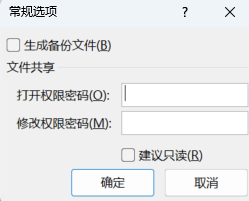

### Excel应用场景

1. 记录整理
2. 数据计算
3. 数据分析
4. 数据展现

### Excel自定义功能区

在功能区进行右键，选择自定义功能区。

选择新建选项卡，添加自定义的组，将常用命令添加到自定义的组当中，就可以在功能区显示新增的自定义功能区内容。

### Excel保存设置密码

工具 ----> 常规选项

(1)设置了打开权限密码，没有密码则无法打开。

(2)设置了修改权限密码，无法对源文件进行修改操作。

### Excel版本概述

目前Excel有两个大的版本: Excel2003和Excel2007及以上的版本

| 格式                        | 扩展名 | 特征                          | 结构                           | 单sheet最大数据量     |
| --------------------------- | ------ | ----------------------------- | ------------------------------ | --------------------- |
| Excel 97 - Excel 2003工作簿 | xls    | 存储容量有限                  | 二进制格式，核心是复合文档结构 | 行: 65535 列: 256     |
| Excel 工作簿                | xlsx   | 基于xml压缩、占有率小，效率高 | xml类型结构                    | 行: 1048576 列: 16384 |

### Excel快速填充

在B1输入jack之后，使用快捷键**ctrl+e**或者在开始中选择填充-快速填充功能。

