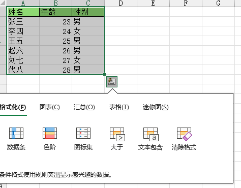

### Excel应用场景

1. 记录整理
2. 数据计算
3. 数据分析
4. 数据展现

### Excel自定义功能区

在功能区进行右键，选择自定义功能区。


选择新建选项卡，添加自定义的组，将常用命令添加到自定义的组当中，就可以在功能区显示新增的自定义功能区内容。


### Excel保存设置密码

工具 ----> 常规选项


(1)设置了打开权限密码，没有密码则无法打开。

(2)设置了修改权限密码，无法对源文件进行修改操作。

### Excel版本概述

目前Excel有两个大的版本: Excel2003和Excel2007及以上的版本

| 格式                        | 扩展名 | 特征                          | 结构                           | 单sheet最大数据量     |
| --------------------------- | ------ | ----------------------------- | ------------------------------ | --------------------- |
| Excel 97 - Excel 2003工作簿 | xls    | 存储容量有限                  | 二进制格式，核心是复合文档结构 | 行: 65535 列: 256     |
| Excel 工作簿                | xlsx   | 基于xml压缩、占有率小，效率高 | xml类型结构                    | 行: 1048576 列: 16384 |

### Excel快速填充


在B1输入jack之后，使用快捷键**ctrl+e**或者在开始中选择填充-快速填充功能。


### Excel快速分析

选中需要分析的表格区域，右下角会出现快速分析的图标，点击之后可进行操作。



```
数据条: 可以快速看出数据的最大值与最小值，以及数据之间的可视化对比。
```


格式化中的快速分析操作，可以在开始---->条件格式中找到。


### Excel数据录入的正确方式

按行录入，tab跳到下一个单元格,enter跳到下一行。(减少鼠标的点击)

#### 特殊内容录入

（1）日期、时间:  excel中可以识别以' **-** '或者' **/** '分割的日期，以' **:** '分割的时间

快速获取当前的日期快捷键: **ctrl + ;**

快速获取当前的时间快捷键: **ctrl + shift + ;**


快速获取当前的日期+时间,使用now函数单元格键入:  **=now()**回车即可

(2)分数

正常输入1/5会显示1月5日的日期。需要**输入0然后空格再输入对应的分数**

(3)过长数据

比如身份证一般是18位的，但是**excel的数据精度只有15位**，超出15位会以科学计数法的格式进行数据显示。

解决方案为:

```
(1)将单元格格式调整为文本格式(此时单元格左上角会出现绿色的小三角)
注意: 调整单元格格式为文本格式之后无法进行计算的操作。
(2)在过长的数字数据开头输入英文的单引号即可: '
```

（4）原位填充

**ctrl+enter**


