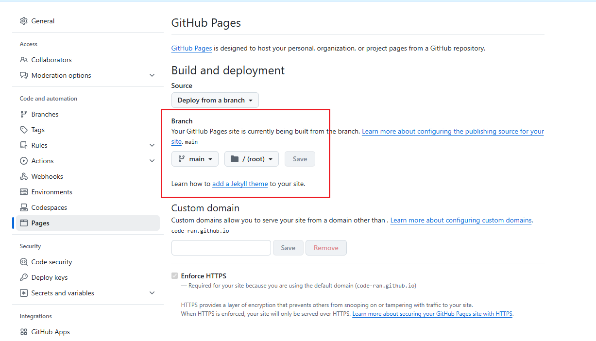

   1、环境搭建：

​           git   node.js      hexo

<!--more-->

具体可参考之前的hexo博客搭建过程：

​    1、克隆我们备份的博客源码到本地：


然后在博客根目录下执行：

```
npm install hexo-cli
npm install
npm install hexo-deployer-git

```

在此无需执行hexo init，因为不是从零开始搭建起新博客：

```
hexo clean
hexo g
hexo s
hexo d
```


如果将博客仓库从public改成了private那么github pages就会挂掉。如果想要恢复，需要在setting里将私有改成共有，并在github pages页的部署分支进行切换。


