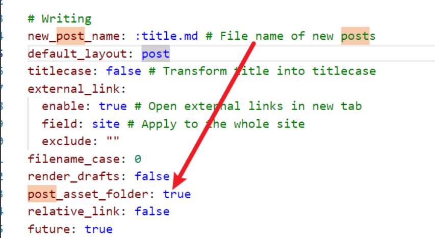
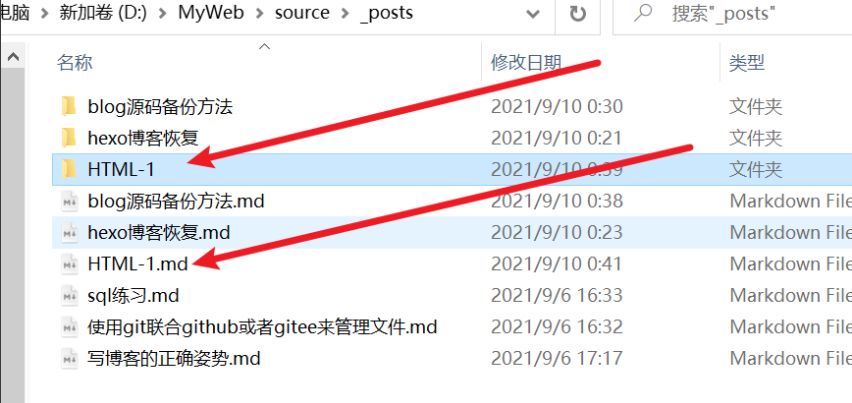
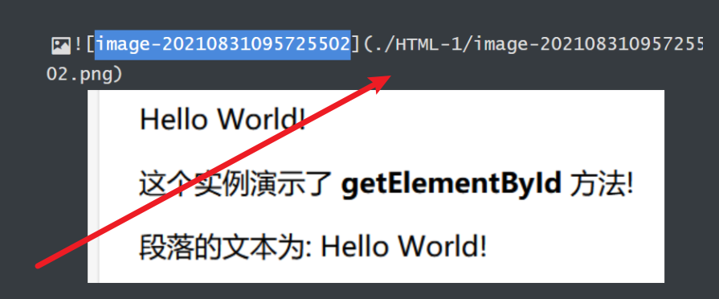

1、修改根目录的配置文件：_config.yml

​       将post_asset_folder的值该为true

<!--more-->



2、安装图片插件：

```
npm install https://github.com/CodeFalling/hexo-asset-image
```

如何报错让你remove说明你之前安装过，remove后重新安装一下即可：

```
npm remove hexo-asset-image
```

3、创建文章：hexo n  HTML-1

之后会在sources文件夹中新建一个文件夹用来存放图片



只需在添加图片时使用相对路径即可。



之后编译之后即可正常展示。注意必须使用: hexo n 文章名称 的方式进行创建，不然图片还是依然无法显示。
