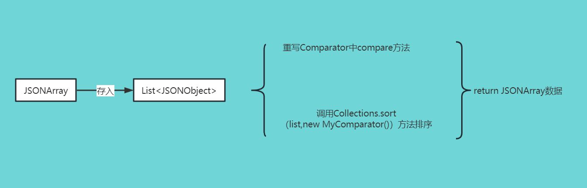

java中对JSONArray按照其中的某一属性进行排序

(1)思路: 



(2)方法：

```java
/**
 * 适用于比较的的值是整数的情况
 */
public class MyComparator implements Comparator<JSONObject> {
    @Override
    public int compare(JSONObject o1, JSONObject o2) {
        String key1 = o1.getString("age");
        String key2 = o2.getString("age");
        int a = Integer.parseInt(key1);
        int b = Integer.parseInt(key2);
        //b-a：降序，a-b：升序
        return b-a;
    }
}
```

(3)使用:

```java
public class Demo {
    public static void main(String[] args) {
        List<JSONObject> assembleList = new ArrayList<JSONObject>();
        JSONObject jsonObj;
        JSONArray mockjsonArr = new JSONArray();
        //构造fakedata
        for (int i = 0; i < 6; i++) {
            JSONObject jsonObject = new JSONObject();
            jsonObject.put("name","小明"+i);
            jsonObject.put("age","2"+i);
            jsonObject.put("height","180");
            jsonObject.put("hex","男");
            mockjsonArr.add(jsonObject);
        }
        //jsonArray数据存assembleList中
        for (Object obj : mockjsonArr) {
            jsonObj = (JSONObject) obj;
            assembleList.add(jsonObj);
        }
        //排序: age属性进行排序
        Collections.sort(assembleList,new MyComparator());
        mockjsonArr.clear();
        for (JSONObject obj : assembleList) {
            jsonObj = obj;
            mockjsonArr.add(jsonObj);
        }
        System.out.println("按age属性排序好的mockjsonArr"+mockjsonArr);
    }
}
```

按age属性排序好的mockjsonArr:

```json
[{"name":"小明5","hex":"男","age":"25","height":"180"},
 {"name":"小明4","hex":"男","age":"24","height":"180"},
 {"name":"小明3","hex":"男","age":"23","height":"180"},
 {"name":"小明2","hex":"男","age":"22","height":"180"},
 {"name":"小明1","hex":"男","age":"21","height":"180"},
 {"name":"小明0","hex":"男","age":"20","height":"180"}]
```

