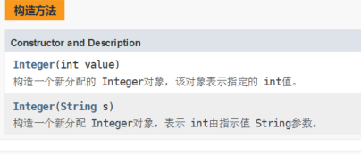
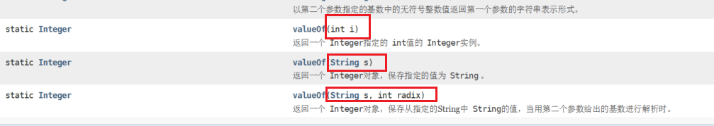
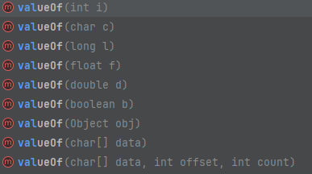

###  java常用API学习

#### Math类的使用

Math类包含执行基本数字运算的方法，我们可以使用Math类完成基本的数学运算

常用方法：

```java
public static int abs(int a)                // 返回参数的绝对值
public static double ceil(double a)          // 返回大于或等于参数的最小整数
public static double floor(double a)          // 返回小于或等于参数的最大整数
public static int round(float a)             // 按照四舍五入返回最接近参数的int类型的值
public static int max(int a,int b)           // 获取两个int值中的较大值
public static int min(int a,int b)           // 获取两个int值中的较小值
public static double pow (double a,double b)    // 计算a的b次幂的值
public static double random()               // 返回一个[0.0,1.0)的随机值
```

```java
//求绝对值
int a = -1;
int abs = Math.abs(a);
//1
System.out.println(abs);

//向上取整
double b = 1.1;
double ceil = Math.ceil(b);
//2.0
System.out.println(ceil);

//向下取整
double c = 1.8;
double floor = Math.floor(c);
//1.0
System.out.println(floor);

//四舍五入，返回类型是int
float d = 3.499f;
int round = Math.round(d);
//3
System.out.println(round);

//获取两个int值中的较大值
int e = 3;
int f = 9;
int max = Math.max(e, f);
//9
System.out.println(max);

//获取两个int值中的较小值
int min = Math.min(e, f);
//3
System.out.println(min);

//计算a的b次幂的值
double pow = Math.pow(f, e);
//729.0
System.out.println(pow);

//返回一个[0.0,1.0)的随机值
double random = Math.random();
//0.6244503376371364
System.out.println(random);
```

#### System类的使用

System包含了系统操作的一些常用的方法。比如获取当前时间所对应的毫秒值，再比如终止当前JVM等等

常用方法

```java
public static long currentTimeMillis()			// 获取当前时间所对应的毫秒值（当前时间为0时区所对应的时间即就是英国格林尼治天文台旧址所在位置）
public static void exit(int status)				// 终止当前正在运行的Java虚拟机，0表示正常退出，非零表示异常退出
public static native void arraycopy(Object src,  int  srcPos, Object dest, int destPos, int length); // 进行数值元素copy
```

计算机的时间原点: 1970年1月1日 00:00:00  (汤普逊-贝尔实验室-c语言-重写unix)

中国在东八区: 1970年1月1日 08:00:00

```java
        //从时间原点开始，到代码运行的时间点，一共过了多少毫秒
        System.out.println(System.currentTimeMillis());

        //0-正常停止，1-异常停止
//        System.exit(1);
//        System.out.println("hhhh");

        // src:      源数组
        // srcPos：  源数值的开始位置
        // dest：    目标数组
        // destPos： 目标数组开始位置
        // length:   要复制的元素个数
        // 定义源数组
        int[] srcArray = {23, 45, 67, 89, 14, 56};

        // 定义目标数组
        int[] desArray = new int[10];

        // 进行数组元素的copy: 把srcArray数组中从0索引开始的3个元素，从desArray数组中的1索引开始复制过去
        System.arraycopy(srcArray, 0, desArray, 1, 3);
```

#### Runtime类的使用

Runtime表示Java中运行时对象，可以获取到程序运行时设计到的一些信息

常用方法

```java
public static Runtime getRuntime()		//当前系统的运行环境对象
public void exit(int status)			//停止虚拟机
public int availableProcessors()		//获得CPU的线程数
public long maxMemory()				    //JVM能从系统中获取总内存大小（单位byte）
public long totalMemory()				//JVM已经从系统中获取总内存大小（单位byte）
public long freeMemory()				//JVM剩余内存大小（单位byte）
public Process exec(String command) 	//运行cmd命令
```

#### Object类的使用

所有类都直接或者间接的继承自该类。

常用方法

```java
public String toString()				//返回该对象的字符串表示形式(可以看做是对象的内存地址值)
public boolean equals(Object obj)		//比较两个对象地址值是否相等；true表示相同，false表示不相同
protected Object clone()    			//对象克隆,默认浅克隆，使用hutool实现深克隆，或者自定义
```

```java
package com.ransibi.apis;
import java.util.Objects;
public class Student implements Cloneable {
    private String name;
    private Integer age;

    public Student() {
    }

    public Student(String name, Integer age) {
        this.name = name;
        this.age = age;
    }

    public String getName() {
        return name;
    }

    public void setName(String name) {
        this.name = name;
    }

    public Integer getAge() {
        return age;
    }

    public void setAge(Integer age) {
        this.age = age;
    }

    @Override
    public String toString() {
        return "Student{" +
                "name='" + name + '\'' +
                ", age=" + age +
                '}';
    }

    /**
     * 重写之后的equals方法比较的就是对象内部的属性值
     *
     * @param o
     * @return
     */
    @Override
    public boolean equals(Object o) {
        if (this == o) return true;
        if (o == null || getClass() != o.getClass()) return false;
        Student student = (Student) o;
        return Objects.equals(name, student.name) && Objects.equals(age, student.age);
    }

    @Override
    public int hashCode() {
        return Objects.hash(name, age);
    }

    @Override
    protected Object clone() throws CloneNotSupportedException {
        return super.clone();
    }
}
```

```java
Object o = new Object();
//getClass().getName() + "@" + Integer.toHexString(hashCode())
//固定格式: @左边是哪个包下的哪个类，右边是地址值
//java.lang.Object@77468bd9
System.out.println(o.toString());
//一般直接打印对象是地址值，如果需要看到属性值，需要重写toString方法，拼接属性值
Student student = new Student("张三",20);
System.out.println(student);


Student student1 = new Student("张三",20);
//没有重写Student类时，使用的是Object父类里的equals方法，比较的是地址值(this == obj),
//如果想比较对象中的属性是否相等，需要重写对象中的equals方法
boolean result = student.equals(student1);
//没重写前: false  重写后:true
System.out.println(result);

//Student需要重写clone方法并添加Cloneable的实现标记
 Student stu2 = (Student) student1.clone();
//Student{name='张三', age=20}
 System.out.println(student1);
//Student{name='张三', age=20}
 System.out.println(stu2);
```

```
(1)浅拷贝: 基本数据类型拷贝值，引用数据类型拷贝地址值。
(2)深拷贝: 基本数据类型拷贝值，引用数据类型会重新创建一个对象将数据拷贝过去(如果是String类型并且不是通过new创建的首先会去常量池中找)，源对象与克隆后的对象地址值不一样。
```

```java
package com.ransibi.apis;


import java.io.Serializable;
import java.util.Arrays;
import java.util.Objects;

public class Student implements Serializable {
    private String name;
    private Integer age;
    private int[] data;

    public Student() {
    }

    public Student(String name, Integer age, int[] data) {
        this.name = name;
        this.age = age;
        this.data = data;
    }

    public String getName() {
        return name;
    }

    public void setName(String name) {
        this.name = name;
    }

    public Integer getAge() {
        return age;
    }

    public void setAge(Integer age) {
        this.age = age;
    }

    public int[] getData() {
        return data;
    }

    public void setData(int[] data) {
        this.data = data;
    }

    @Override
    public String toString() {
        return "Student{" +
                "name='" + name + '\'' +
                ", age=" + age +
                ", data=" + Arrays.toString(data) +
                '}';
    }

    /**
     * 重写之后的equals方法比较的就是对象内部的属性值
     *
     * @param o
     * @return
     */
    @Override
    public boolean equals(Object o) {
        if (this == o) return true;
        if (o == null || getClass() != o.getClass()) return false;
        Student student = (Student) o;
        return Objects.equals(name, student.name) && Objects.equals(age, student.age) && Arrays.equals(data, student.data);
    }

    @Override
    public int hashCode() {
        int result = Objects.hash(name, age);
        result = 31 * result + Arrays.hashCode(data);
        return result;
    }
}
```

```java
Student student1 = new Student("张三",20,array1);
//使用hutool的深拷贝,Student类需实现Serializable
Student student2 = ObjectUtil.cloneByStream(student1);
//深拷贝是直接创建新的对象，就算源对象被改变，克隆后的对象也不变
int[] data = student1.getData();
data[0] = 999;
//Student{name='张三', age=20, data=[999, 2, 3, 4, 5, 6]}
System.out.println(student1);
//Student{name='张三', age=20, data=[1, 2, 3, 4, 5, 6]}
System.out.println(student2);
```

#### Objects工具类

在java.util包下。

常用方法

```java
public static String toString(Object o) 					// 获取对象的字符串表现形式
public static boolean equals(Object a, Object b)			// 比较两个对象是否相等
public static boolean isNull(Object obj)					// 判断对象是否为null
public static boolean nonNull(Object obj)					// 判断对象是否不为null
```


#### BigDecimal类

浮点型(float、double)运算的时候直接进行 +  * / 可能会出现数据失真（精度问题）。
BigDecimal可以解决浮点型运算数据失真的问题。

```java
        BigDecimal bd1 = new BigDecimal("0.9");
        BigDecimal bd2 = new BigDecimal("1.0");
        System.out.println("b1:" + bd1);
        System.out.println("b2:" + bd2);

        //减法：subtract
        BigDecimal r1 = bd2.subtract(bd1);
        System.out.println("b2-b1:" + r1);

        //加法：add
        BigDecimal r2 = bd2.add(bd1);
        System.out.println("b2+b1:" + r2);

        //乘法：multiply
        BigDecimal r3 = bd2.multiply(bd1);
        System.out.println("b2*b1:" + r3);

        /**
         特殊：除法：divide 如果不能整除会报错 必须指明保留几位小数
         */
        //除法: divide
        //指定小数部分的取舍模式，通常采用四舍五入的模式
        //取值为BigDecimal.ROUND_HALF_UP
        //保留两位小数，且用四舍五入的方法
        BigDecimal r4 = bd1.divide(bd2, 2, RoundingMode.HALF_UP);
        System.out.println("b1/b2保留两位小数:" + r4);
```

```
b1:0.9
b2:1.0
b2-b1:0.1
b2+b1:1.9
b2*b1:0.90
b1/b2保留两位小数:0.90
```

#### 包装类的使用

想要我们的基本类型像对象一样操作，就可以使用基本类型对应的包装类。

| 基本类型 | 对应的包装类（位于java.lang包中） |
| -------- | --------------------------------- |
| byte     | Byte                              |
| short    | Short                             |
| int      | **Integer**                       |
| long     | Long                              |
| float    | Float                             |
| double   | Double                            |
| char     | **Character**                     |
| boolean  | Boolean                           |

创建Integer对象的方式有两种:

(1)通过构造方法创建，支持int和String



(2)通过valueOf()方法创建,支持int和String和进制



```java
//通过构造方法创建
Integer i1 = new Integer(1299);
Integer i2 = new Integer("44");
//1299
System.out.println("i1:" + i1);
//44
System.out.println("i2:" + i2);

//通过valueOf()静态方法创建
Integer i3 = Integer.valueOf(12);
Integer i4 = Integer.valueOf("12");
Integer i5 = Integer.valueOf("123", 8);

//12
System.out.println("i3:" + i3);
//12
System.out.println("i4:" + i4);
//83
System.out.println("i5:" + i5);
```

jdk5以前需要手动的进行装箱和拆箱，jdk5之后自动进行装箱和拆箱的操作

jdk5以前----手动装、拆箱

```java
int i6 = 10;
//手动装箱
Integer integer = new Integer(i6);
//10
System.out.println(integer);
//手动拆箱
int i7 = integer.intValue();
//10
System.out.println(i7);
```

jdk5以后----自动装、拆箱

```java
int i8 = 16;
//自动装箱
Integer integer1 = i8;
//16
System.out.println(integer1);
Integer integer2 = new Integer(100);
//自动拆箱
int i9 = integer2;
//100
System.out.println(i9);
```

基本类型与字符串之间的转换

(1)基本类型转String方式

```
1.直接拼接空字符串
2.通过String类的valueOf()静态方法转换,支持int、char、long等
```



```java
int i10 = 77;
String str = i10 + "";
String str1 = String.valueOf(i10);
```

(2)String转基本类型

```
基本类型的包装类处理Character包装类以外，其它包装类都提供了parse基本类型(String s)的静态方法，可以将字符串转成基本类型
```

```java
String string = "66";
int ix = Integer.parseInt(string);
float floatx = Float.parseFloat(string);
//66.0
System.out.println(floatx);
long longx = Long.parseLong(string);
//66
System.out.println(longx);
double doublex = Double.parseDouble(string);
//66.0
System.out.println(doublex);
//true
boolean aTrue = Boolean.parseBoolean("true");
System.out.println(aTrue);
```

#### String类

```java
String str = new String(" Hello World ");
System.out.println("str:"+str);

//返回字符串的长度
System.out.println("str长度为:"+str.length());

//根据下标获取字符
System.out.println("str第四个字符为:"+ str.charAt(4));

//判断当前字符串是否包含字符
System.out.println("str是否包含e:"+ str.contains("e"));

//将字符串转换成数组
char[] a = str.toCharArray();
System.out.println("=========转换成字符数组后==========");
for (char c : a) {
    System.out.println(c);
}

//查找str首次出现的下标，存在，则返回该下标，不存在则返回-1
int index = str.indexOf("l");
System.out.println("l首次出现的下标为:"+index);

//查找字符串在当前字符串中最后一次出现的下标索引。
System.out.println("l最后一次出现的下标为:"+str.lastIndexOf("l"));
//去掉字符串前、后的空格
System.out.println("str去掉空格后为:"+str.trim());
//将小写转成大写
System.out.println("转成大写:"+str.toUpperCase());
//将大写转成小写
System.out.println("转成小写:"+str.toLowerCase());
//判断字符串的结尾
System.out.println("str结尾是否是空格:"+str.endsWith(" "));
//判断字符串的开头
System.out.println("str开头是否是空格:"+str.startsWith(" "));
//字符串替换
System.out.println("str中lo替换成s:"+str.replace("lo","s"));
//拆分字符串
String [] b = str.split("l");
System.out.println("==============使用l字符串进行拆分后==========");
for (String s : b) {
    System.out.println(s);
}

//不区分大小写比较字符串
String newStr = " hello world ";
boolean comStr = newStr.equalsIgnoreCase(str);
System.out.println(comStr);
```

#### StringBuffer与StringBuilder

StringBuffer: 可变长字符串，JDK1.0提供，运行效率慢、线程安全；StringBuilder: 可变长字符串，JDK5.0提供，运行效率快、线程不安全。

```java
StringBuffer sb = new StringBuffer();
//在字符串末尾追加字符串
sb.append(str);
System.out.println(sb);

//在index位置添加str
sb.insert(0,"测试");
System.out.println(sb);

//替换索引之间的字符串
sb.replace(11,15,"替换了");
System.out.println(sb);

//删除索引之间的字符串
sb.delete(11,15);
System.out.println(sb);
```
