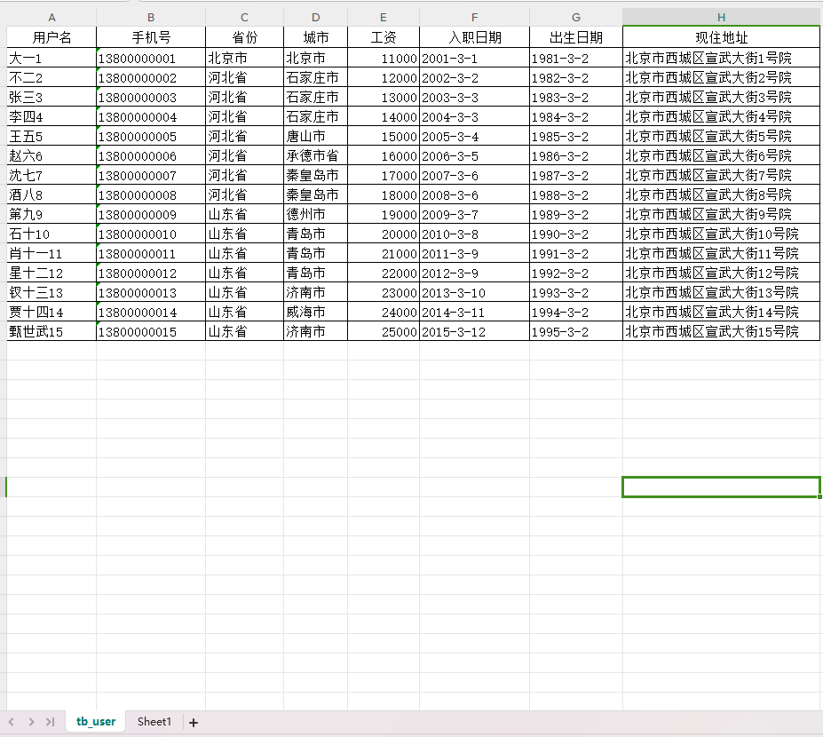
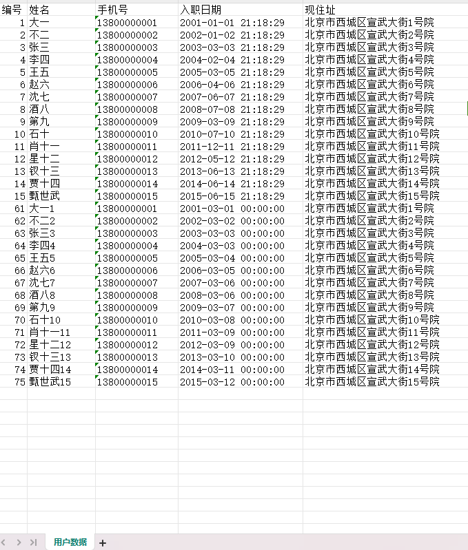
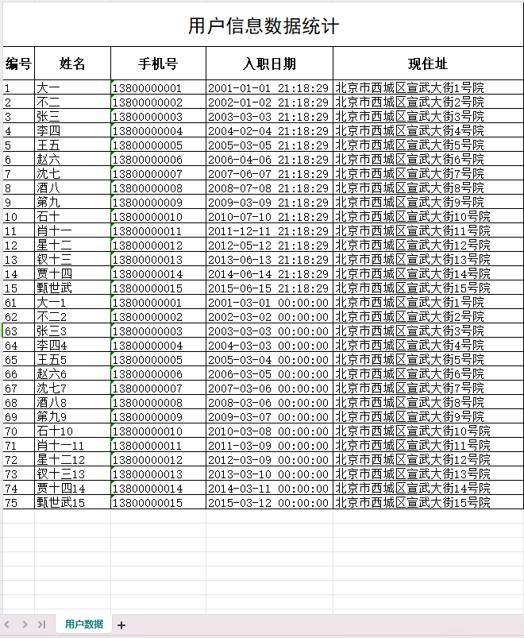
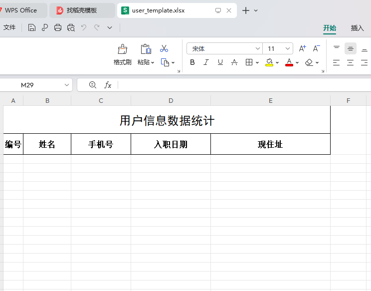
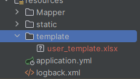
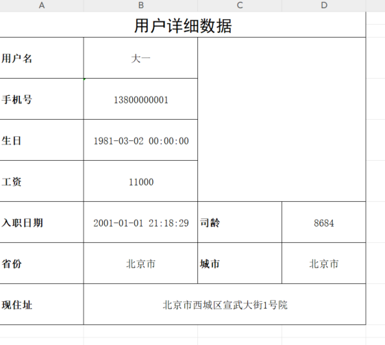
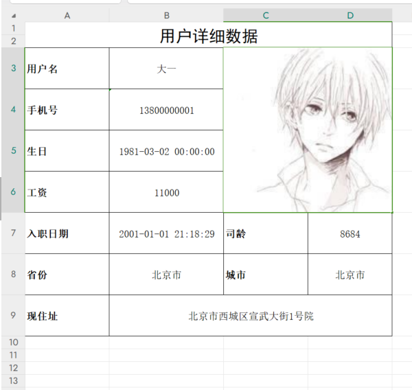

## 报表技术

### Excel版本概述

```
目前excel有两个大的版本:Excel2003和Excel2007及以上的版本
```

|                           | Excel2003                      | Excel2007                     |
| ------------------------- | ------------------------------ | ----------------------------- |
| 后缀                      | xls                            | xlsx                          |
| 结构                      | 二进制格式，核心是复合文档结构 | xml类型结构                   |
| 单sheet数据量（最多支持） | 行:65535，列: 256              | 行:1048576，列:16384          |
| 特征                      | 存储容量有限                   | 基于xml压缩，占用率小，效率高 |

### 常见Excel操作工具

#### Apache POI

官网: https://poi.apache.org/index.html

javadocs: https://poi.apache.org/apidocs/index.html

```
Apache POI是Apache软件基金会的开放源码函式库，POI提供API给Java程序对Microsoft Office格式档案读和写的功能。POI就是对业务数据，可以导入导出，形成报表等的一个工具。
```

api对象介绍

|              | 工作簿       | 工作表    | 行      | 单元格   | 单元格样式    |
| ------------ | ------------ | --------- | ------- | -------- | ------------- |
|              | WorkBook     | Sheet     | Row     | Cell     | CellStyle     |
| 03版本       | HSSFWorkBook | HSSFSheet | HSSFRow | HSSFCell | HSSFCellStyle |
| 07版本及以上 | XSSFWorkBook | XSSFSheet | XSSFRow | XSSFCell | XSSFCellStyle |

##### poi操作excel所需依赖

```xml
<!-- https://mvnrepository.com/artifact/org.apache.poi/poi -->
<dependency>
    <groupId>org.apache.poi</groupId>
    <artifactId>poi</artifactId>
    <version>5.3.0</version>
</dependency>

<!-- https://mvnrepository.com/artifact/org.apache.poi/poi-ooxml -->
<dependency>
    <groupId>org.apache.poi</groupId>
    <artifactId>poi-ooxml</artifactId>
    <version>5.3.0</version>
</dependency>

<!-- https://mvnrepository.com/artifact/org.apache.poi/poi-ooxml-schemas -->
<dependency>
    <groupId>org.apache.poi</groupId>
    <artifactId>poi-ooxml-schemas</artifactId>
    <version>4.1.2</version>
</dependency>

```

##### POI操作Excel实现导入

(1)测试excel数据



```java
    @PostMapping("/uploadExcel")
    public String uploadExcel(MultipartFile file) throws Exception {
        return iUserService.uploadExcelInfo(file);
    }
```

```java
@Data
public class User {
    private Long id;
    /**
     * 员工名
     */
    private String userName;
    /**
     * 手机号
     */
    private String phone;
    /**
     * 省份名
     */
    private String province;
    /**
     * 城市名
     */
    private String city;
    /**
     * 工资
     */
    private Integer salary;
    /**
     * 入职日期
     */
    @JsonFormat(pattern = "yyyy-MM-dd")
    private Date hireDate;

    private String hireDateFormat;
    /**
     * 部门id
     */
    private Integer deptId;
    /**
     * 出生日期
     */
    private Date birthday;
    private String birthdayFormat;
    /**
     * 一寸照片
     */
    private String photo;
    /**
     * 现在居住地址
     */
    private String address;
    /**
     * 办公用品
     */
    private List<Resource> resourceList;

}
```

```java
public interface IUserService {
    String uploadExcelInfo(MultipartFile file) throws Exception;
}
```

```java
    @Override
    public String uploadExcelInfo(MultipartFile file) throws Exception {
        Workbook workbook = new XSSFWorkbook(file.getInputStream());
        //获取第一个sheet
        //Sheet sheet = workbook.getSheet("sheet名称");
        Sheet sheet = workbook.getSheetAt(0);
        //获取最后一行索引
        int lastRowIndex = sheet.getLastRowNum();
        Row row = null;
        List<User> userList = new ArrayList<>();
        //从第二行开始读
        for (int i = 1; i <= lastRowIndex; i++) {
            //获取行数据
            row = sheet.getRow(i);
            String userName = row.getCell(0).getStringCellValue();
            String phone = null;
            try {
                phone = row.getCell(1).getStringCellValue();
            } catch (Exception e) {
                phone = row.getCell(1).getNumericCellValue() + "";
            }
            String province = row.getCell(2).getStringCellValue();
            String city = row.getCell(3).getStringCellValue();
            //工资是数值类型使用getNumericCellValue()方法获取
            Integer salary = ((Double) row.getCell(4).getNumericCellValue()).intValue();
            String hireDate = row.getCell(5).getStringCellValue();
            String birthDay = row.getCell(6).getStringCellValue();
            String address = row.getCell(7).getStringCellValue();
            User user = new User();
            user.setUserName(userName);
            user.setPhone(phone);
            user.setProvince(province);
            user.setCity(city);
            user.setSalary(salary);
            user.setHireDateFormat(hireDate);
            user.setBirthdayFormat(birthDay);
            user.setAddress(address);
            user.setDeptId(4);
            userList.add(user);
        }
        if (CollectionUtils.isNotEmpty(userList)) {
            userMapper.insertUser(userList);
        }
        return "导入成功";
    }
```

##### POI操作Excel实现导出

导出需求



```java
    @GetMapping("/downLoadXlsxByPoi")
    public void downLoadXlsxByPoi(HttpServletResponse response) throws Exception{
        iUserService.downLoadXlsxByPoi(response);
    }
```

```java
public interface IUserService {
    void downLoadXlsxByPoi(HttpServletResponse response) throws Exception;
}
```

```java
   @Override
    public void downLoadXlsxByPoi(HttpServletResponse response) throws Exception {
        /*导出用户数据基本思路：
        1、创建一个全新的工作薄
        2、创建全新的工作表
        3、处理固定的标题  编号 姓名  手机号 入职日期 现住址
        4、从第二行开始循环遍历 向单元格中放入数据*/
        // 1、创建一个全新的工作薄
        Workbook workbook = new XSSFWorkbook();
        //2、创建全新的工作表
        Sheet sheet = workbook.createSheet("用户数据");
        // 设置列宽
        // 1代表的是一个标准字母宽度的256分之一
        sheet.setColumnWidth(0, 5 * 256);
        sheet.setColumnWidth(1, 8 * 256);
        sheet.setColumnWidth(2, 15 * 256);
        sheet.setColumnWidth(3, 15 * 256);
        sheet.setColumnWidth(4, 30 * 256);

        // 3、处理固定的标题: 编号、姓名 、手机号、入职日期、现住址
        String[] titles = new String[]{"编号", "姓名", "手机号", "入职日期", "现住址"};
        Row titleRow = sheet.createRow(0);
        Cell cell = null;
        for (int i = 0; i < 5; i++) {
            //创建单元格
            cell = titleRow.createCell(i);
            //填充数据
            cell.setCellValue(titles[i]);
        }
        // 4、从第二行开始循环遍历 向单元格中放入数据
        List<User> userList = userMapper.selectUserInfo();
        int rowIndex = 1;
        Row row = null;
        for (User user : userList) {
            row = sheet.createRow(rowIndex);
            // 编号 姓名  手机号 入职日期 现住址
            cell = row.createCell(0);
            cell.setCellValue(user.getId());
            cell = row.createCell(1);
            cell.setCellValue(user.getUserName());
            cell = row.createCell(2);
            cell.setCellValue(user.getPhone());
            cell = row.createCell(3);
            cell.setCellValue(user.getHireDateFormat());
            cell = row.createCell(4);
            cell.setCellValue(user.getAddress());
            rowIndex++;
        }
        String filename = "员工数据.xlsx";
        response.setHeader("content-disposition", "attachment;filename=" + new String(filename.getBytes(), "ISO8859-1"));
        response.setContentType("application/vnd.openxmlformats-officedocument.spreadsheetml.sheet");
        workbook.write(response.getOutputStream());
    }
```

##### POI导出样式设置

###### 边框线

```java
        CellStyle bigTitleRowCellStyle = workbook.createCellStyle();
        //下边框  BorderStyle.THIN 细线
        bigTitleRowCellStyle.setBorderBottom(BorderStyle.THIN);
        //左边框
        bigTitleRowCellStyle.setBorderLeft(BorderStyle.THIN);
        //右边框
        bigTitleRowCellStyle.setBorderRight(BorderStyle.THIN);
        //上边框
        bigTitleRowCellStyle.setBorderTop(BorderStyle.THIN);
```

合并单元格

```java
        //合并单元格: int firstRow 起始行, int lastRow 结束行, int firstCol 开始列, int lastCol 结束列
        sheet.addMergedRegion(new CellRangeAddress(0, 0, 0, 4));
```

###### 行高列宽

```java
        Row bigTitleRow = sheet.createRow(0);
        //设置行高
        bigTitleRow.setHeightInPoints(42); 
        //列宽
        sheet.setColumnWidth(0, 5 * 256);
        sheet.setColumnWidth(1, 12 * 256);
        sheet.setColumnWidth(2, 10 * 256);
        sheet.setColumnWidth(3, 20 * 256);
        sheet.setColumnWidth(4, 30 * 256);
```

###### 对齐方式

```java
        //对齐方式： 水平对齐  垂直对齐
        //水平居中对齐
        bigTitleRowCellStyle.setAlignment(HorizontalAlignment.CENTER); 
        // 垂直居中对齐
        bigTitleRowCellStyle.setVerticalAlignment(VerticalAlignment.CENTER); 
```

###### 字体

```java
        //创建字体
        Font font = workbook.createFont();
        font.setFontName("黑体");
        font.setFontHeightInPoints((short) 18);
        //把字体放入到样式中
        bigTitleRowCellStyle.setFont(font);
```

完整code

```java
    @Override
    public void downLoadXlsxByPoiWithCellStyle(HttpServletResponse response) throws Exception {
        Workbook workbook = new XSSFWorkbook();
        Sheet sheet = workbook.createSheet("用户数据");
        //设置大标题
        Row bigTitleRow = sheet.createRow(0);
        //设置行高
        bigTitleRow.setHeightInPoints(42);
        CellStyle bigTitleRowCellStyle = bigTitleRowCellStyle(workbook);
        //第一行数据填充
        for (int i = 0; i < 5; i++) {
            Cell cell = bigTitleRow.createCell(i);
            cell.setCellStyle(bigTitleRowCellStyle);
        }
        //合并单元格: int firstRow 起始行, int lastRow 结束行, int firstCol 开始列, int lastCol 结束列
        sheet.addMergedRegion(new CellRangeAddress(0, 0, 0, 4));
        //向单元格中放入一句话
        sheet.getRow(0).getCell(0).setCellValue("用户信息数据统计");
        //设置小标题
        //编号	姓名	手机号	入职日期	现住址
        Row titleRow = sheet.createRow(1);
        titleRow.setHeightInPoints(31.5F);
        String[] titles = new String[]{"编号", "姓名", "手机号", "入职日期", "现住址"};
        CellStyle littleTitleRowCellStyle = littleTitleRowCellStyle(workbook);
        for (int i = 0; i < 5; i++) {
            Cell cell = titleRow.createCell(i);
            cell.setCellValue(titles[i]);
            cell.setCellStyle(littleTitleRowCellStyle);
        }
        //数据填充
        List<User> userList = userMapper.selectUserInfo();
        int rowIndex = 2;
        Row row = null;
        Cell cell = null;
        CellStyle contentRowCellStyle = contentRowCellStyle(workbook);
        for (User user : userList) {
            row = sheet.createRow(rowIndex);
            cell = row.createCell(0);
            cell.setCellStyle(contentRowCellStyle);
            cell.setCellValue(user.getId());

            cell = row.createCell(1);
            cell.setCellStyle(contentRowCellStyle);
            cell.setCellValue(user.getUserName());

            cell = row.createCell(2);
            cell.setCellStyle(contentRowCellStyle);
            cell.setCellValue(user.getPhone());

            cell = row.createCell(3);
            cell.setCellStyle(contentRowCellStyle);
            cell.setCellValue(user.getHireDateFormat());

            cell = row.createCell(4);
            cell.setCellStyle(contentRowCellStyle);
            cell.setCellValue(user.getAddress());

            rowIndex++;
        }
        sheet.setColumnWidth(0, 5 * 256);
        sheet.setColumnWidth(1, 12 * 256);
        sheet.setColumnWidth(2, 15 * 256);
        sheet.setColumnWidth(3, 20 * 256);
        sheet.setColumnWidth(4, 30 * 256);
        String filename = "员工数据.xlsx";
        response.setHeader("content-disposition", "attachment;filename=" + new String(filename.getBytes(), "ISO8859-1"));
        response.setContentType("application/vnd.openxmlformats-officedocument.spreadsheetml.sheet");
        workbook.write(response.getOutputStream());
    }


    /**
     * 公共样式
     * @param workbook
     * @return
     */
    private static CellStyle commonStyle(Workbook workbook){
        CellStyle cellStyle = workbook.createCellStyle();
        //下边框  BorderStyle.THIN 细线
        cellStyle.setBorderBottom(BorderStyle.THIN);
        //左边框
        cellStyle.setBorderLeft(BorderStyle.THIN);
        //右边框
        cellStyle.setBorderRight(BorderStyle.THIN);
        //上边框
        cellStyle.setBorderTop(BorderStyle.THIN);
        //对齐方式： 水平对齐  垂直对齐
        //水平居中对齐
        cellStyle.setAlignment(HorizontalAlignment.CENTER);
        // 垂直居中对齐
        cellStyle.setVerticalAlignment(VerticalAlignment.CENTER);
        return cellStyle;
    }
    /**
     * 大标题样式设置
     * @param workbook
     * @return
     */
    private static CellStyle bigTitleRowCellStyle(Workbook workbook){
        CellStyle cellStyle = commonStyle(workbook);
        //创建字体
        Font font = workbook.createFont();
        font.setFontName("黑体");
        font.setFontHeightInPoints((short) 18);
        //把字体放入到样式中
        cellStyle.setFont(font);
        return cellStyle;
    }

    /**
     * 小标题样式设置
     * @param workbook
     * @throws Exception
     */
    private static CellStyle littleTitleRowCellStyle(Workbook workbook){
        CellStyle cellStyle = commonStyle(workbook);
        //创建字体  宋体12号字加粗
        Font littleFont = workbook.createFont();
        littleFont.setFontName("宋体");
        littleFont.setFontHeightInPoints((short) 12);
        littleFont.setBold(true);
        //把字体放入到样式中
        cellStyle.setFont(littleFont);
        return cellStyle;
    }

    /**
     * 内容样式设置
     * @param workbook
     * @return
     */
    private static CellStyle contentRowCellStyle(Workbook workbook){
        //内容的样式
        CellStyle cellStyle = workbook.createCellStyle();
        //样式的克隆
        cellStyle.cloneStyleFrom(littleTitleRowCellStyle(workbook));
        cellStyle.setAlignment(HorizontalAlignment.LEFT);
        //创建字体  宋体12号字加粗
        Font contentFont = workbook.createFont();
        contentFont.setFontName("宋体");
        contentFont.setFontHeightInPoints((short) 11);
        contentFont.setBold(false);
        //把字体放入到样式中
        cellStyle.setFont(contentFont);
        return cellStyle;
    }
```




##### 基于模版导出Excel

模版:user_template.xlsx





```java
   @Override
    public void downLoadXlsxWithTemplate(HttpServletResponse response) throws Exception {
        //获取模板的路径
        String templatePath = Class.class.getClass().getResource("/").getPath()+ "template/user_template.xlsx";
        //读取模板文件产生workbook对象,这个workbook是一个有内容的工作薄
        Workbook workbook  = new XSSFWorkbook(new File(templatePath));
        //读取工作薄的第一个工作表，向工作表中放数据
        Sheet sheet = workbook.getSheetAt(0);
        //数据填充
        List<User> userList = userMapper.selectUserInfo();
        int rowIndex = 2;
        Row row = null;
        Cell cell = null;
        CellStyle contentRowCellStyle = contentRowCellStyle(workbook);
        for (User user : userList) {
            row = sheet.createRow(rowIndex);
            cell = row.createCell(0);
            cell.setCellStyle(contentRowCellStyle);
            cell.setCellValue(user.getId());

            cell = row.createCell(1);
            cell.setCellStyle(contentRowCellStyle);
            cell.setCellValue(user.getUserName());

            cell = row.createCell(2);
            cell.setCellStyle(contentRowCellStyle);
            cell.setCellValue(user.getPhone());

            cell = row.createCell(3);
            cell.setCellStyle(contentRowCellStyle);
            cell.setCellValue(user.getHireDateFormat());

            cell = row.createCell(4);
            cell.setCellStyle(contentRowCellStyle);
            cell.setCellValue(user.getAddress());

            rowIndex++;
        }
        sheet.setColumnWidth(0, 5 * 256);
        sheet.setColumnWidth(1, 12 * 256);
        sheet.setColumnWidth(2, 15 * 256);
        sheet.setColumnWidth(3, 20 * 256);
        sheet.setColumnWidth(4, 30 * 256);
        //导出的文件名称
        String filename="用户列表数据.xlsx";
        //设置文件的打开方式和mime类型
        ServletOutputStream outputStream = response.getOutputStream();
        response.setHeader( "Content-Disposition", "attachment;filename="  + new String(filename.getBytes(),"ISO8859-1"));
        response.setContentType("application/vnd.openxmlformats-officedocument.spreadsheetml.sheet");
        workbook.write(outputStream);
    }
     /**
     * 小标题样式设置
     * @param workbook
     * @throws Exception
     */
    private static CellStyle littleTitleRowCellStyle(Workbook workbook){
        CellStyle cellStyle = commonStyle(workbook);
        //创建字体  宋体12号字加粗
        Font littleFont = workbook.createFont();
        littleFont.setFontName("宋体");
        littleFont.setFontHeightInPoints((short) 12);
        littleFont.setBold(true);
        //把字体放入到样式中
        cellStyle.setFont(littleFont);
        return cellStyle;
    }
    /**
     * 内容样式设置
     * @param workbook
     * @return
     */
    private static CellStyle contentRowCellStyle(Workbook workbook){
        //内容的样式
        CellStyle cellStyle = workbook.createCellStyle();
        //样式的克隆
        cellStyle.cloneStyleFrom(littleTitleRowCellStyle(workbook));
        cellStyle.setAlignment(HorizontalAlignment.LEFT);
        //创建字体  宋体12号字加粗
        Font contentFont = workbook.createFont();
        contentFont.setFontName("宋体");
        contentFont.setFontHeightInPoints((short) 11);
        contentFont.setBold(false);
        //把字体放入到样式中
        cellStyle.setFont(contentFont);
        return cellStyle;
    }
```

##### 基于模版导出复杂Excel带图片

(1)导出复杂Excel

```java
    @Override
    public void downLoadFileInfo(Long id, HttpServletResponse response) throws Exception{
        String templatePath = Class.class.getClass().getResource("/").getPath() + "template/user_info_template.xlsx";
        Workbook workbook = new XSSFWorkbook(new File(templatePath));
        Sheet sheetAt = workbook.getSheetAt(0);
        User user = userMapper.selectByPrimaryKey(id);
        //用户名
        Cell cell = sheetAt.getRow(2).getCell(1);
        cell.setCellValue(user.getUserName());
        //手机号
        sheetAt.getRow(3).getCell(1).setCellValue(user.getPhone());
        //生日
        sheetAt.getRow(4).getCell(1).setCellValue(user.getBirthdayFormat());
        //工资
        sheetAt.getRow(5).getCell(1).setCellValue(user.getSalary());
        //入职日期、司龄
        sheetAt.getRow(6).getCell(1).setCellValue(user.getHireDateFormat());
        Date date = new Date();
        SimpleDateFormat simpleDateFormat = new SimpleDateFormat("yyyy-MM-dd HH:mm:ss");
        Date parse = simpleDateFormat.parse(user.getHireDateFormat());
        long between = DateUtil.between(parse, date, DateUnit.DAY);
        sheetAt.getRow(6).getCell(3).setCellValue(between);
        //省份、城市
        sheetAt.getRow(7).getCell(1).setCellValue(user.getProvince());
        sheetAt.getRow(7).getCell(3).setCellValue(user.getCity());
        //现住址
        sheetAt.getRow(8).getCell(1).setCellValue(user.getAddress());
        //导出的文件名称
        String filename = "用户数据.xlsx";
        //设置文件的打开方式和mime类型
        ServletOutputStream outputStream = response.getOutputStream();
        response.setHeader("Content-Disposition", "attachment;filename=" + new String(filename.getBytes(), "ISO8859-1"));
        response.setContentType("application/vnd.openxmlformats-officedocument.spreadsheetml.sheet");
        workbook.write(outputStream);
    }
```



(2)导出带图片

POI主要提供了两个类来处理照片:

Patriarch: 负责在表中创建图片

ClientAnchor: 负责设置图片的大小位置

```
dx1 - the x coordinate within the first cell.//定义了图片在第一个cell内的偏移x坐标，既左上角所在cell的偏移x坐标，一般可设0
dy1 - the y coordinate within the first cell.//定义了图片在第一个cell的偏移y坐标，既左上角所在cell的偏移y坐标，一般可设0
dx2 - the x coordinate within the second cell.//定义了图片在第二个cell的偏移x坐标，既右下角所在cell的偏移x坐标，一般可设0
dy2 - the y coordinate within the second cell.//定义了图片在第二个cell的偏移y坐标，既右下角所在cell的偏移y坐标，一般可设0

col1 - the column (0 based) of the first cell.//第一个cell所在列，既图片左上角所在列
row1 - the row (0 based) of the first cell.//图片左上角所在行
col2 - the column (0 based) of the second cell.//图片右下角所在列
row2 - the row (0 based) of the second cell.//图片右下角所在行
```


```java
    @Override
    public void downLoadFileInfo(Long id, HttpServletResponse response) throws Exception {
        String templatePath = Class.class.getClass().getResource("/").getPath() + "template/user_info_template.xlsx";
        Workbook workbook = new XSSFWorkbook(new File(templatePath));
        Sheet sheetAt = workbook.getSheetAt(0);
        User user = userMapper.selectByPrimaryKey(id);
        //用户名
        Cell cell = sheetAt.getRow(2).getCell(1);
        cell.setCellValue(user.getUserName());
        //手机号
        sheetAt.getRow(3).getCell(1).setCellValue(user.getPhone());
        //生日
        sheetAt.getRow(4).getCell(1).setCellValue(user.getBirthdayFormat());
        //工资
        sheetAt.getRow(5).getCell(1).setCellValue(user.getSalary());
        //入职日期、司龄
        sheetAt.getRow(6).getCell(1).setCellValue(user.getHireDateFormat());
        Date date = new Date();
        SimpleDateFormat simpleDateFormat = new SimpleDateFormat("yyyy-MM-dd HH:mm:ss");
        Date parse = simpleDateFormat.parse(user.getHireDateFormat());
        long between = DateUtil.between(parse, date, DateUnit.DAY);
        sheetAt.getRow(6).getCell(3).setCellValue(between);
        //省份、城市
        sheetAt.getRow(7).getCell(1).setCellValue(user.getProvince());
        sheetAt.getRow(7).getCell(3).setCellValue(user.getCity());
        //现住址
        sheetAt.getRow(8).getCell(1).setCellValue(user.getAddress());

        //输出图片
        File rootPath = new File(ResourceUtils.getURL("classpath:").getPath());
        String photoPath = rootPath + user.getPhoto();
        // 先创建一个字节输出流
        ByteArrayOutputStream byteArrayOut = new ByteArrayOutputStream();
        // BufferedImage是一个带缓冲区图像类,主要作用是将一幅图片加载到内存中
        BufferedImage bufferImg = ImageIO.read(new File(photoPath));
        // 把读取到图像放入到输出流中
        ImageIO.write(bufferImg, "jpg", byteArrayOut);
        // 创建一个绘图控制类，负责画图
        Drawing patriarch = sheetAt.createDrawingPatriarch();
        // 指定把图片放到哪个位置
//        ClientAnchor anchor = new XSSFClientAnchor(0, 0, 0, 0, 2, 2, 3, 5);
        //填充图片结束行结束列+1
        ClientAnchor anchor = new XSSFClientAnchor(0, 0, 0, 0, 2, 2, 4, 6);
        // 开始把图片写入到sheet指定的位置
        patriarch.createPicture(anchor, workbook.addPicture(byteArrayOut.toByteArray(), Workbook.PICTURE_TYPE_JPEG));

        //导出的文件名称
        String filename = "用户数据.xlsx";
        //设置文件的打开方式和mime类型
        ServletOutputStream outputStream = response.getOutputStream();
        response.setHeader("Content-Disposition", "attachment;filename=" + new String(filename.getBytes(), "ISO8859-1"));
        response.setContentType("application/vnd.openxmlformats-officedocument.spreadsheetml.sheet");
        workbook.write(outputStream);
    }
```



##### 自定义导出模版引擎

