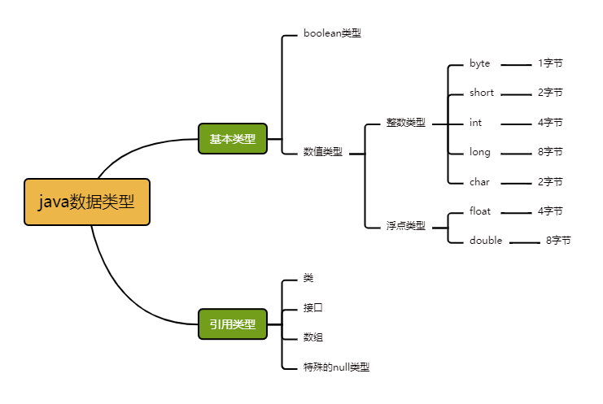
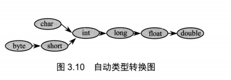

java支持的类型分为两类：

（1）基本类型（2）引用类型

 

<div style = "color: pink">char代表字符型，实际上字符型也是一种整数类型，相当于无符号整数类型.</div>

```
注意:空类型(null type)就是null值的类型，这种类型没有名称。null是null类型变量唯一的值。
```

<div style="color:red">空引用(null)只能被转换成引用类型，不能转换成基本类型，所以不要把一个null值赋值给基本数据类型的变量</div>

1byte = 8 bit    (-2^7  ~  2^7 - 1)

4byte = 32 bit (-2^31   ~ 2^31 - 1)

##### 1. 简单数据类型之间的转换



低级变量可以直接转换为高级变量。

```java
  byte b;
  int i=b;
  long l=i;
  float f=l;
  double d=f;
```

如果低级类型为char型，向高级类型（整型）转换时，会转换为对应ASCII码值

```java
char c='c';
int i=c;
System.out.println("output:" i);
输出：output:99;
```

注意：对于byte,short,char三种类型而言，他们是平级的，因此不能相互自动转换，可以使用强制类型转换。

```java
short i=99; 
char c=(char)i;
System.out.println("output:" c);
输出：output:c;
```

将高级变量转换为低级变量时，情况会复杂一些，你可以使用强制类型转换。即你必须采用下面这种语句格式:

```java
//这种转换会导致溢出或精度的下降-不推荐
int i=99;
byte b=(byte)i;
char c=(char)i;
float f=(float)i;
```

###### （1）float转double型

```java
float f1=100.00f;
Float F1=new Float(f1);
double d1=F1.doubleValue();
```

###### （2）int转double

```java
int i1=200;
double d1=i1;
```

###### （3）double转int

```java
double d1=100.00;
Double D1=new Double(d1);
int i1=D1.intValue();
```

##### 2.字符串与其他数据类型的转换

###### (1)其它类型向字符串的转换

```
①调用类的串转换方法:X.toString();
②自动转换:X+“”;
③使用String的方法:String.volueOf(X);
```

###### ⑵字符串作为值,向其它类型的转换

```java
①先转换成相应的封装器实例,再调用对应的方法转换成其它类型
例如，字符中“32.1”转换double型的值的格式为**:new Float(“32.1”).doubleValue()**。
​ 也可以用:Double.valueOf(“32.1”).doubleValue()
②静态parseXXX方法
String s = "1";
byte b = Byte.parseByte( s );
short t = Short.parseShort( s );
int i = Integer.parseInt( s );
long l = Long.parseLong( s );
Float f = Float.parseFloat( s );
Double d = Double.parseDouble( s );
```

