1、首先我们需要去官网上下载JDK对应的版本，以我现在要下载的1.8为例。

  （1）官网链接：https://www.oracle.com/cn/index.html

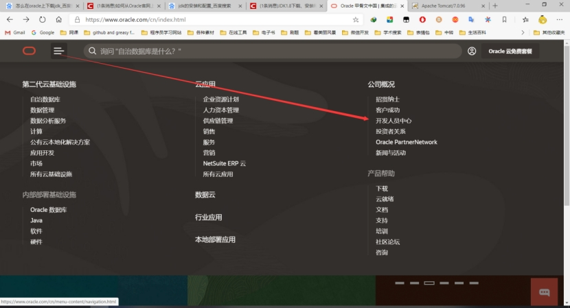 

 

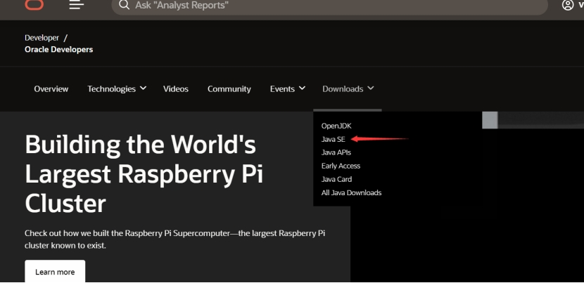 

 

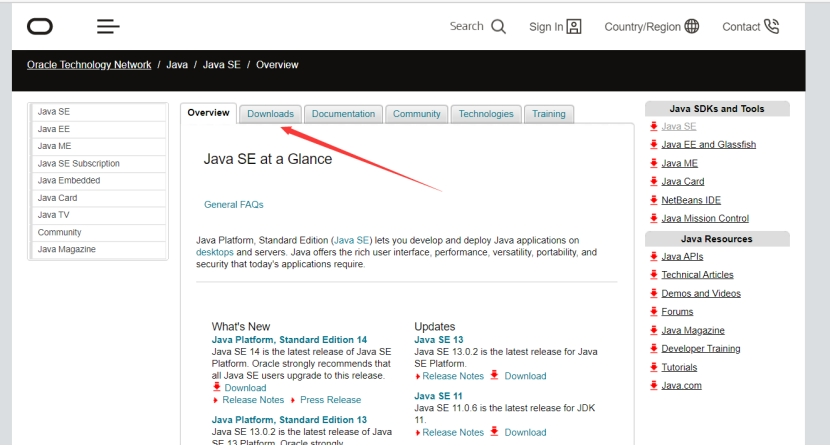 

 

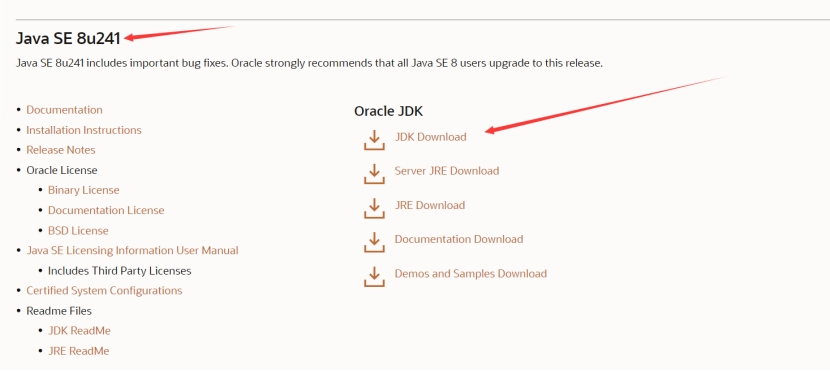 

 

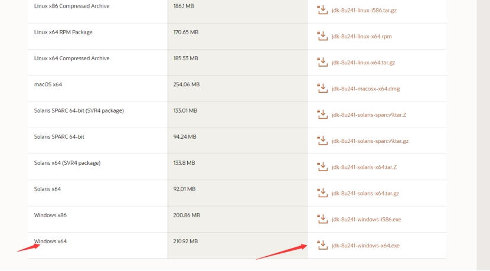 

然后下载即可，我下载好了放在了我的C盘的Program  Files /java下

然后安装也是安装在这个路径下。安装JDK的同时也会自动安装JRE。

（2）配置JDK的环境

​        右键我的电脑，属性，高级系统设置，环境变量，

然后在系统变量里新建变量名为：JAVA_HOME然后点击浏览目录，选择JDK安装的路径

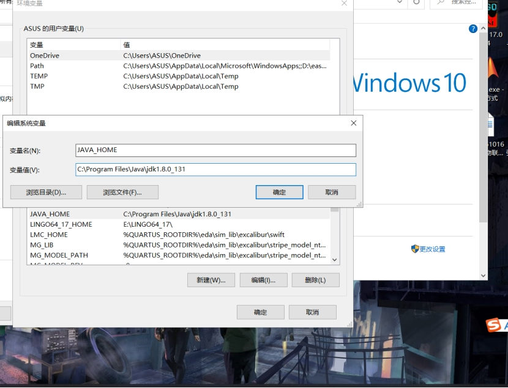 

 

 

 

然后新建变量名：CLASSPATH ，变量值： .;%JAVA_HOME%\lib\dt.jar;%JAVA_HOME%\lib\tools.jar

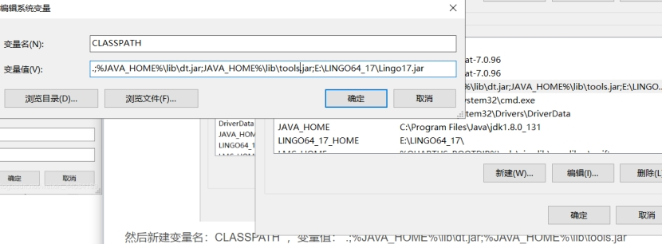 

之后找到系统变量的path,然后双击，然后点击新建，添加：%JAVA_HOME%\bin并将其移到最顶端。然后逐一确定。

（3）检查我们是否配置成功

 

  win+R,输入cmd

  然后在输入java，他会弹出一串东西。

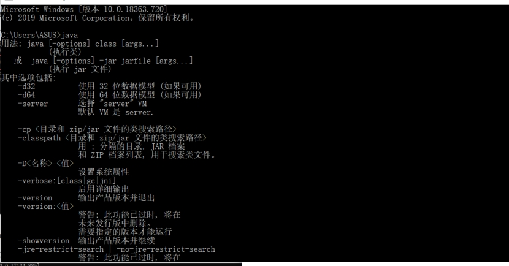 

  然后再输入：java -version

  会有如下提示说明我们安装成功了。

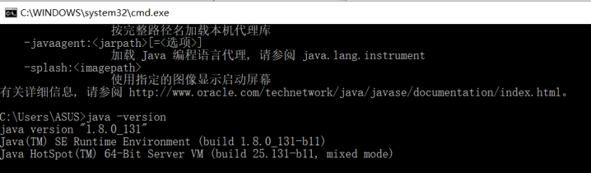 

 

 

2、然后我们去官网下载Tomcat，这里以我自己下载的Tomcat7为例。

​        Tomcat官网：http://tomcat.apache.org/

点击官网的archives下载需要的版本；

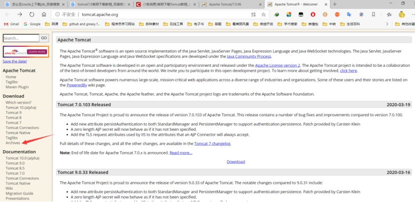 

选择我要下载的Tomcat7

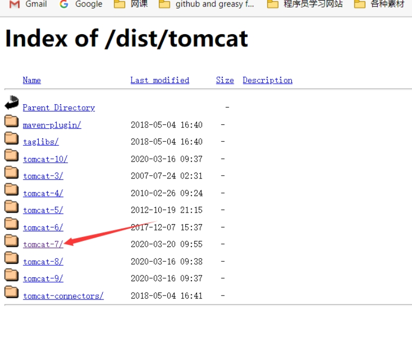 

选择我要下载的tomcat7的版本

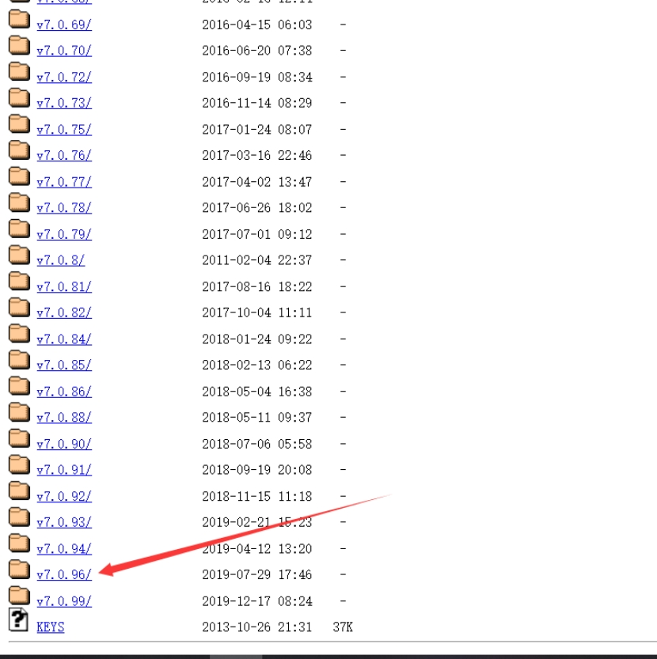 

选择bin文件夹

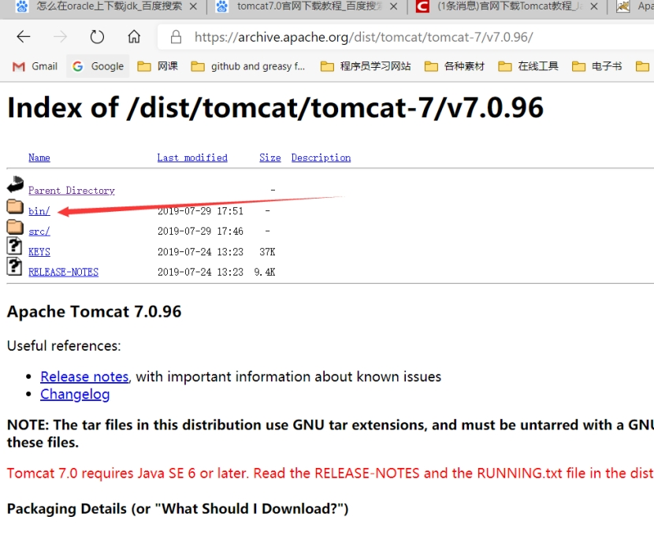 

选择对应的版本和需要的种类免解压版或者压缩版进行下载。

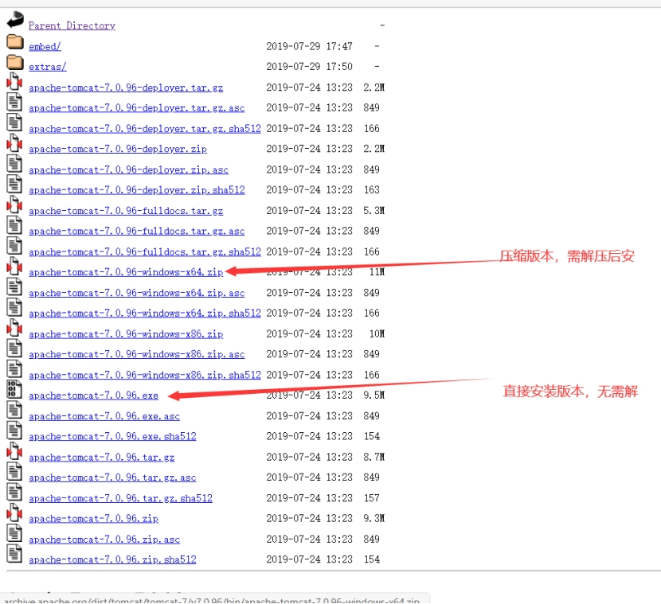 

接下来我们需要配置环境变量

在系统变量里新建：CATALINA_HOME，然后点击浏览目录，选择我们解压安装的Tomcat路径

我的是在c盘的根目录下。然后点击确定。

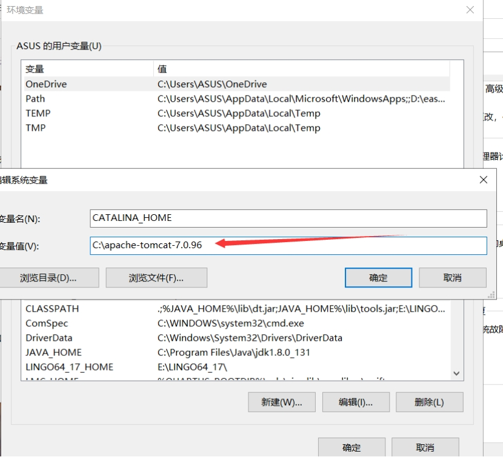 

然后添加%CATALINA_HOME%\bin    然后点击确定。

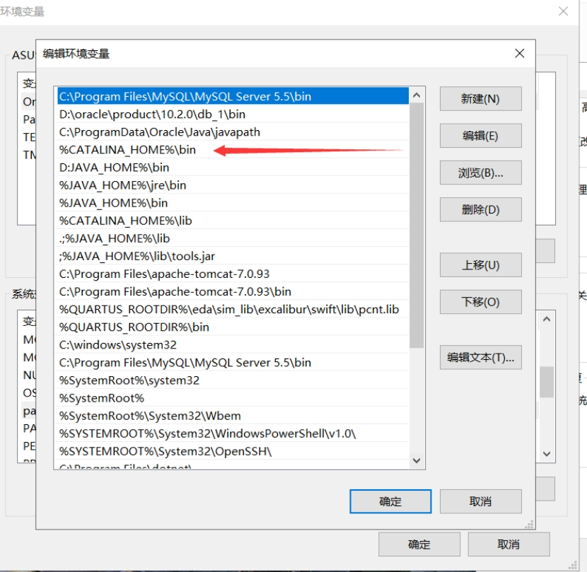 

然后我们要去到Tomcat的安装路径下找到conf路径下的登录页面记事本。

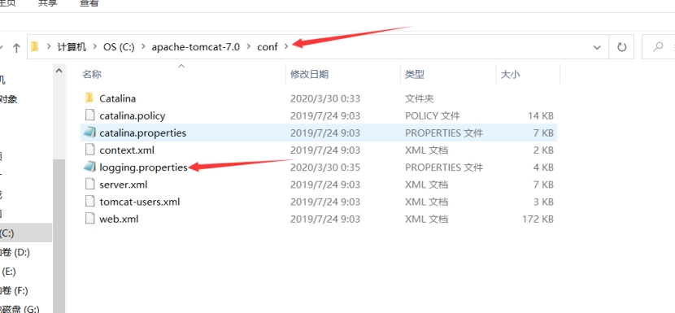 

打开之后将该处的utf-8该成GBk  然后保存即可。

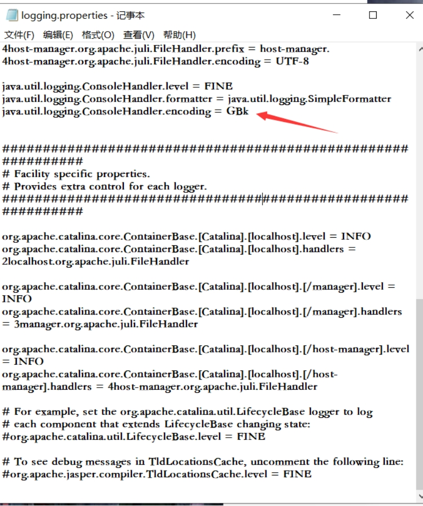 

然后最后我们要测试Tomcat是否配置成功；

win+R,cmd，然后输入：startup.bat

如果出现如下界面即可认为配置成功：

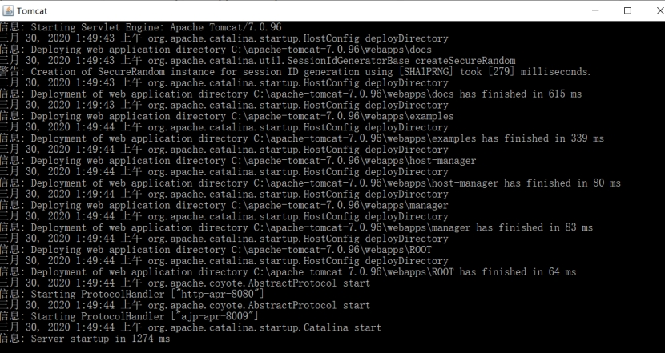 

 

**如果默认端口号8080被占用修改端口号的方法为：**

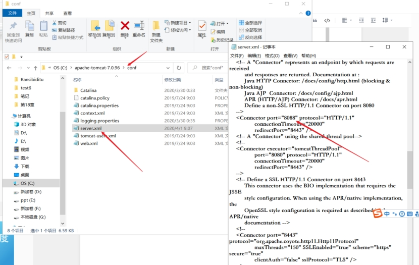 

 
