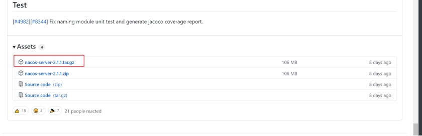
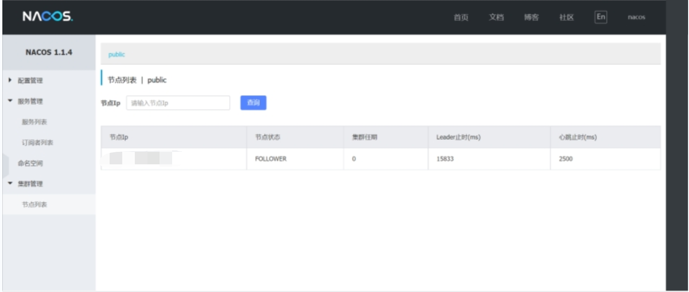

### ***\*Linux安装部署nacos\****

#### *1、下载安装nacos:*

(1)官网下载地址：https://github.com/alibaba/nacos/releases/tag/2.1.1

 

 

（2）将nacos放到你想要安装的目录，然后执行解压命令：

tar -zxvf nacos-server-2.1.1.tar.gz

 (3)进入到nacos的安装目录的bin目录下，执行启动命令：

sh startup.sh -m standalone

（4）访问

http://ip:8848/nacos/index.html

 

 

注意：用户名和密码都是 nacos
