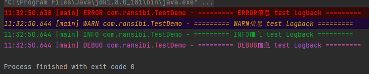
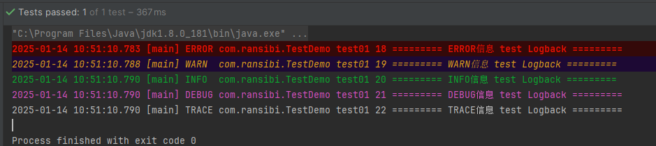
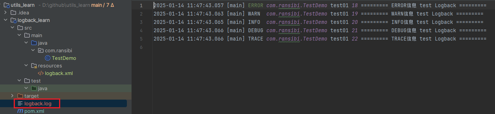
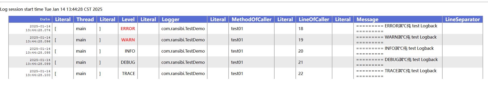
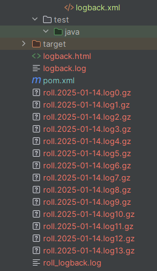

### 日志接口

日志接口规范有JCL和SLF4J

### 日志框架

JUL框架实现了JCL接口

Log4j实现了SLF4J接口

Logbcak实现了SLF4J接口

其它实现

### Logback学习

#### 官网

```
https://logback.qos.ch/
```

#### 概述

目前，logback 分为 分为三个模块，logback-core、logback-classic 和 logback-access 访问。logback-core 模块为其他两个模块奠定了基础 模块。logback-classic 模块可以同化为 Log4j 1.x 的显著改进版本。此外 logback-classic 原生实现了 [SLF4J API](http://www.slf4j.org/)，因此您可以轻松地 在 Logback 和其他日志记录框架之间来回切换 例如 log4j 1.x 或 java.util.logging （JUL）。logback-access 模块与 Servlet 容器集成， 如 Tomcat 和 Jetty，以提供 HTTP 访问日志 功能性。请注意，您可以轻松构建自己的模块 在 logback-core 之上。


#### 前提条件

想使用Logback日志框架，至少需要在项目中整合如下三个模块：

1. slf4j-api 日志接口
2. logback-core
3. logback-classic

#### 框架整合

引入依赖

```xml
    <dependencies>
        <dependency>
            <groupId>junit</groupId>
            <artifactId>junit</artifactId>
            <version>4.13.2</version>
        </dependency>

        <!--slf4j日志门面 核心依赖-->
        <dependency>
            <groupId>org.slf4j</groupId>
            <artifactId>slf4j-api</artifactId>
            <version>1.7.32</version>
        </dependency>

        <!--
           logback-core是logback-classic的基础模块
           logback-classic已经涵盖了 logback-core，
           Maven有依赖传递性，会自动依赖logback-core
        -->
        <dependency>
            <groupId>ch.qos.logback</groupId>
            <artifactId>logback-classic</artifactId>
            <version>1.2.10</version>
        </dependency>
    </dependencies>
```

设置jdk版本

```xml
    <build>
        <!--设置jdk的版本 -->
        <plugins>
            <plugin>
                <groupId>org.apache.maven.plugins</groupId>
                <artifactId>maven-compiler-plugin</artifactId>
                <version>3.8.1</version>
                <configuration>
                    <source>1.8</source> <!-- 设置源代码的编译版本 -->
                    <target>1.8</target> <!-- 设置生成的字节码版本 -->
                    <encoding>UTF-8</encoding>
                </configuration>
            </plugin>
        </plugins>
    </build>
```

#### 标识符及占位符

| 标识符及占位符              | 描述                       |
| --------------------------- | -------------------------- |
| %-10level                   | 级别，设置10个这符，左对齐 |
| %d{yyyy-MM-dd HH:mm:ss.SSS} | 日期时间                   |
| %c                          | 当前类全限定名             |
| %M                          | 当前执行日志的方法         |
| %L                          | 行号                       |
| %thread                     | 线程名称                   |
| %m或者%msg                  | 输出的日志信息             |
| %n                          | 换行                       |


#### 日志级别

trace < debug < info < warn < error，默认debug

```java
public class TestDemo {
    @Test
    public void test01() {

        Logger logger = LoggerFactory.getLogger(TestDemo.class);
        logger.error("========= ERROR信息 test Logback =========");
        logger.warn("========= WARN信息 test Logback =========");
        logger.info("========= INFO信息 test Logback =========");
        logger.debug("========= DEBUG信息 test Logback =========");
        logger.trace("========= TRACE信息 test Logback =========");
    }
}
```


​     通过控制台信息，可以看到默认级别是debug。 trace级别的信息没有输出



#### logback配置文件

- logback.groovy 
- logback-test.xml
- logback.xml

推荐使用logback.xml,如果文件都不存在，则使用默认的配置。

```xml
<?xml version="1.0" encoding="UTF-8" ?>
<configuration>
    <!--
        <property name="" value=""></property>
        配置文件通用属性,通过${name}的形式取值
    -->
    <property name="pattern" value="%d{yyyy-MM-dd HH:mm:ss.SSS} [%thread] %-5level %c %M %L %m%n"></property>
    <!-- 控制台Appender -->
    <appender name="console" class="ch.qos.logback.core.ConsoleAppender">
        <!--
            输出目标的配置，
            System.out：以黑色字体（默认）
            System.err：红色字体
        -->
        <target>
            System.err
        </target>
        <!-- 日志输出格式 -->
        <encoder class="ch.qos.logback.classic.encoder.PatternLayoutEncoder">
            <pattern>${pattern}</pattern>
        </encoder>
    </appender>
    <!--
        日志记录器配置，可以配置多个Appender，进行多方向的日志输出
        root => rootLogger
        level:  表示日志级别
    -->
    <root level="ALL">
        <appender-ref ref="console"/>
    </root>

</configuration>
```

再次运行test01程序，可以发现，trace的日志被打印了，因为在logack中设置的日志级别是ALL，并且按照了指定的格式对日志进行了输出



##### 日志输出到文件

（1）定义通用路径配置

```xml
<property name="logDir" value="D://github//utils_learn//logback_learn"></property>
```

（2）编写文件的appender

```xml
<!--配置文件的appender -->
<appender name="fileAppender" class="ch.qos.logback.core.FileAppender">
    <file>${logDir}/logback.log</file>
    <!-- 日志输出格式 -->
    <encoder class="ch.qos.logback.classic.encoder.PatternLayoutEncoder">
        <pattern>${pattern}</pattern>
    </encoder>
</appender>
```

（3）引用文件appender

```xml
<root level="ALL">
    <appender-ref ref="fileAppender"/>
</root>
```

(4)完整logback.xml

```xml
<?xml version="1.0" encoding="UTF-8" ?>
<configuration>
    <!--
        <property name="" value=""></property>
        配置文件通用属性,通过${name}的形式取值
    -->
    <property name="pattern" value="%d{yyyy-MM-dd HH:mm:ss.SSS} [%thread] %-5level %c %M %L %m%n"></property>

    <property name="logDir" value="D://github//utils_learn//logback_learn"></property>

    <!-- 控制台Appender -->
    <appender name="console" class="ch.qos.logback.core.ConsoleAppender">
        <!--
            输出目标的配置，
            System.out：以黑色字体（默认）
            System.err：红色字体
        -->
        <target>
            System.err
        </target>
        <!-- 日志输出格式 -->
        <encoder class="ch.qos.logback.classic.encoder.PatternLayoutEncoder">
            <pattern>${pattern}</pattern>
        </encoder>
    </appender>

    <!--配置文件的appender -->
    <appender name="fileAppender" class="ch.qos.logback.core.FileAppender">
        <file>${logDir}/logback.log</file>
        <!-- 日志输出格式 -->
        <encoder class="ch.qos.logback.classic.encoder.PatternLayoutEncoder">
            <pattern>${pattern}</pattern>
        </encoder>
    </appender>

    <!--
        日志记录器配置，可以配置多个Appender，进行多方向的日志输出
        root => rootLogger
        level:  表示日志级别
    -->
    <root level="ALL">
        <appender-ref ref="fileAppender"/>
    </root>

</configuration>
```

运行之后将日志输出到了指定路径的文件中



(5)可以配置多个appender，做日志的多方向输出。

```xml
<root level="ALL">
    <appender-ref ref="fileAppender"/>
    <appender-ref ref="console"/>
</root>
```

这样控制台和文件中都有了。

##### 日志输出成HTML

```xml
    <!--配置html文件的appender -->
    <appender name="htmlFileAppender" class="ch.qos.logback.core.FileAppender">
        <file>${logDir}/logback.html</file>
        <encoder class="ch.qos.logback.core.encoder.LayoutWrappingEncoder">
            <layout class="ch.qos.logback.classic.html.HTMLLayout">
                <pattern>${pattern}</pattern>
            </layout>
        </encoder>
    </appender>
```

```xml
    <root level="ALL">
        <appender-ref ref="fileAppender"/>
        <appender-ref ref="console"/>
        <appender-ref ref="htmlFileAppender"/>
    </root>
```

打开生成的html文件



##### 拆分归档日志文件

```xml
<!-- 可拆分、归档的文件-->
<appender name="roll" class="ch.qos.logback.core.rolling.RollingFileAppender">
    <file>${logDir}/roll_logback.log</file>
    <!-- 日志输出格式 -->
    <encoder class="ch.qos.logback.classic.encoder.PatternLayoutEncoder">
        <pattern>${pattern}</pattern>
    </encoder>
    <!--指定拆分的规则 -->
    <rollingPolicy class="ch.qos.logback.core.rolling.SizeAndTimeBasedRollingPolicy">
        <!--按照时间和压缩格式声明文件名,gz -->
        <fileNamePattern>${logDir}/roll.%d{yyyy-MM-dd}.log%i.gz</fileNamePattern>
        <!--按照文件大小进行拆分 -->
        <maxFileSize>1KB</maxFileSize>
    </rollingPolicy>
</appender>
```

```xml
<root level="ALL">
    <appender-ref ref="fileAppender"/>
    <appender-ref ref="console"/>
    <appender-ref ref="htmlFileAppender"/>
    <appender-ref ref="roll"/>
</root>
```

```java
@Test
public void test02(){
     Logger logger = LoggerFactory.getLogger(TestDemo.class);
    for (int i = 0; i < 1000; i++) {
        logger.error("========= ERROR信息 test Logback =========");
        logger.warn("========= WARN信息 test Logback =========");
        logger.info("========= INFO信息 test Logback =========");
        logger.debug("========= DEBUG信息 test Logback =========");
        logger.trace("========= TRACE信息 test Logback =========");
    }
}
```



##### 使用过滤器

可以在appender中添加过滤器，实现对日志更细粒度的打印

```xml
<!-- 配置控制台的Appender 使用过滤器-->
<appender name="consoleFilter" class="ch.qos.logback.core.ConsoleAppender">
    <target>
        System.err
    </target>
    <!-- 日志输出格式 -->
    <encoder class="ch.qos.logback.classic.encoder.PatternLayoutEncoder">
        <pattern>${pattern}</pattern>
    </encoder>
    <!--配置过滤器 -->
    <filter class="ch.qos.logback.classic.filter.LevelFilter">
        <!--设置日志的输出级别 -->
        <level>ERROR</level>
        <!--高于level中设置的日志级别，则打印日志 -->
        <onMatch>ACCEPT</onMatch>
        <!--低于level中设置的级别，则屏蔽显示 -->
        <onMismatch>DENY</onMismatch>
    </filter>
</appender>
```

```xml
    <root level="ALL">
        <appender-ref ref="consoleFilter"/>
    </root>
```

程序运行后只打印了error级别的日志

```
2025-01-14 15:31:58.526 [main] ERROR com.ransibi.TestDemo test01 20 ========= ERROR信息 test Logback =========

Process finished with exit code 0
```

##### 异步输出日志

对于普通使用logback记录日志的操作，整个程序是同步执行的。

配置异步输出日志:

```xml
    <property name="pattern" value="%d{yyyy-MM-dd HH:mm:ss.SSS} [%thread] %-5level %c %M %L %m%n"></property>

    <property name="logDir" value="D://github//utils_learn//logback_learn"></property>
   <!-- 控制台Appender -->
    <appender name="console" class="ch.qos.logback.core.ConsoleAppender">
        <!--
            输出目标的配置，
            System.out：以黑色字体（默认）
            System.err：红色字体
        -->
        <target>
            System.err
        </target>
        <!-- 日志输出格式 -->
        <encoder class="ch.qos.logback.classic.encoder.PatternLayoutEncoder">
            <pattern>${pattern}</pattern>
        </encoder>
    </appender>
    <appender name="asyncAppender" class="ch.qos.logback.classic.AsyncAppender">
        <appender-ref ref="console"></appender-ref>
    </appender>
```

```xml
    <root level="ALL">
<!--        <appender-ref ref="fileAppender"/>-->
<!--        <appender-ref ref="console"/>-->
<!--        <appender-ref ref="htmlFileAppender"/>-->
<!--        <appender-ref ref="roll"/>-->
<!--        <appender-ref ref="consoleFilter"/>-->
        <appender-ref ref="asyncAppender"/>
    </root>
```

异步日志的原理是：

```
系统会为日志操作单独的分配出来一个线程，主线程会继续向下执行
线程1：系统业务代码执行
线程2：打印日志
两个线程争夺CPU的使用权
在实际项目开发中，越大的项目对于日志的记录就越庞大，为了保证系统的执行效率，异步日志是不错的选择
```

##### 自定义logger

```xml
<appender name="console" class="ch.qos.logback.core.ConsoleAppender">
    <target>
        System.err
    </target>
    <!-- 日志输出格式 -->
    <encoder class="ch.qos.logback.classic.encoder.PatternLayoutEncoder">
        <pattern>${pattern}</pattern>
    </encoder>
</appender>
```

```xml
<logger name="com.ransibi" level="info" additivity="false">
    <appender-ref ref="console"></appender-ref>
</logger>
```
