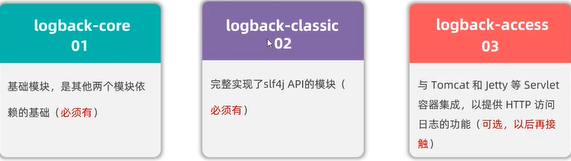
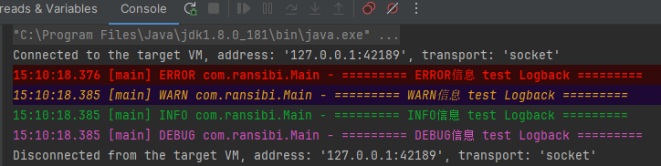

### 日志接口

日志接口规范有JCL和SLF4J

### 日志框架

JUL框架实现了JCL接口

Log4j实现了SLF4J接口

Logbcak实现了SLF4J接口

其它实现

### Logback学习

#### 官网

```
https://logback.qos.ch/
```

#### 概述

目前，logback 分为 分为三个模块，logback-core、logback-classic 和 logback-access 访问。logback-core 模块为其他两个模块奠定了基础 模块。logback-classic 模块可以同化为 Log4j 1.x 的显著改进版本。此外 logback-classic 原生实现了 [SLF4J API](http://www.slf4j.org/)，因此您可以轻松地 在 Logback 和其他日志记录框架之间来回切换 例如 log4j 1.x 或 java.util.logging （JUL）。logback-access 模块与 Servlet 容器集成， 如 Tomcat 和 Jetty，以提供 HTTP 访问日志 功能性。请注意，您可以轻松构建自己的模块 在 logback-core 之上。



#### 前提条件

想使用Logback日志框架，至少需要在项目中整合如下三个模块：

1. slf4j-api 日志接口
2. logback-core
3. logback-classic

#### 框架整合

引入依赖

```xml
<dependencies>
    <!--slf4j日志门面 核心依赖-->
    <dependency>
        <groupId>org.slf4j</groupId>
        <artifactId>slf4j-api</artifactId>
        <version>1.7.32</version>
    </dependency>
    <!--
       logback-core是logback-classic的基础模块
       logback-classic已经涵盖了 logback-core，
       Maven有依赖传递性，会自动依赖logback-core
    -->
    <dependency>
        <groupId>ch.qos.logback</groupId>
        <artifactId>logback-classic</artifactId>
        <version>1.2.10</version>
    </dependency>
</dependencies>
```

#### 日志级别

trace < debug < info < warn < error，默认debug

```java
public static void main(String[] args) {
    Logger logger = LoggerFactory.getLogger(Main.class);
    logger.error("========= ERROR信息 test Logback =========");
    logger.warn("========= WARN信息 test Logback =========");
    logger.info("========= INFO信息 test Logback =========");
    logger.debug("========= DEBUG信息 test Logback =========");
    logger.trace("========= TRACE信息 test Logback =========");
}
```




#### logback配置文件

- logback.groovy 
- logback-test.xml
- logback.xml

推荐使用logback.xml,如果文件都不存在，则使用默认的配置。

#### 标识符及占位符

| 标识符及占位符              | 描述                       |
| --------------------------- | -------------------------- |
| %-10level                   | 级别，设置10个这符，左对齐 |
| %d{yyyy-MM-dd HH:mm:ss.SSS} | 日期时间                   |
| %c                          | 当前类全限定名             |
| %M                          | 当前执行日志的方法         |
| %L                          | 行号                       |
| %thread                     | 线程名称                   |
| %m或者%msg                  | 输出的日志信息             |
| %n                          | 换行                       |

