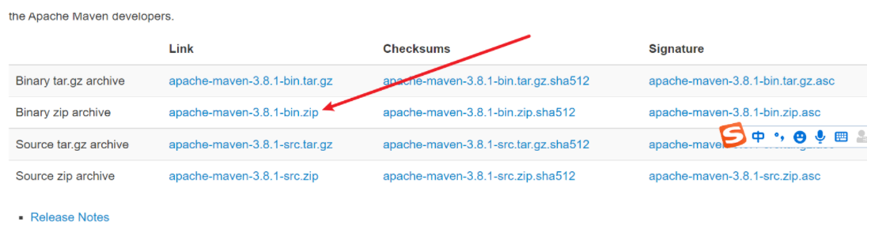
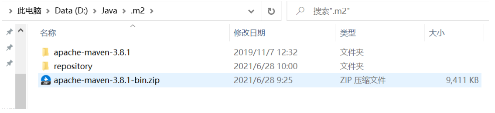
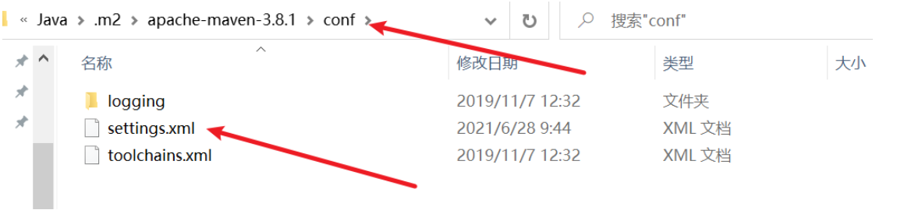
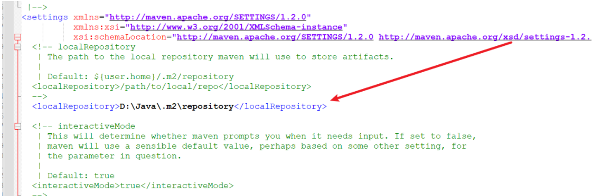
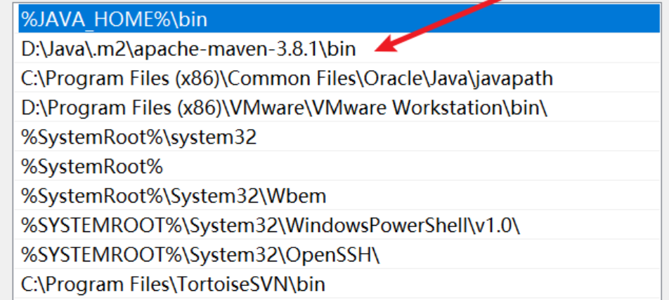
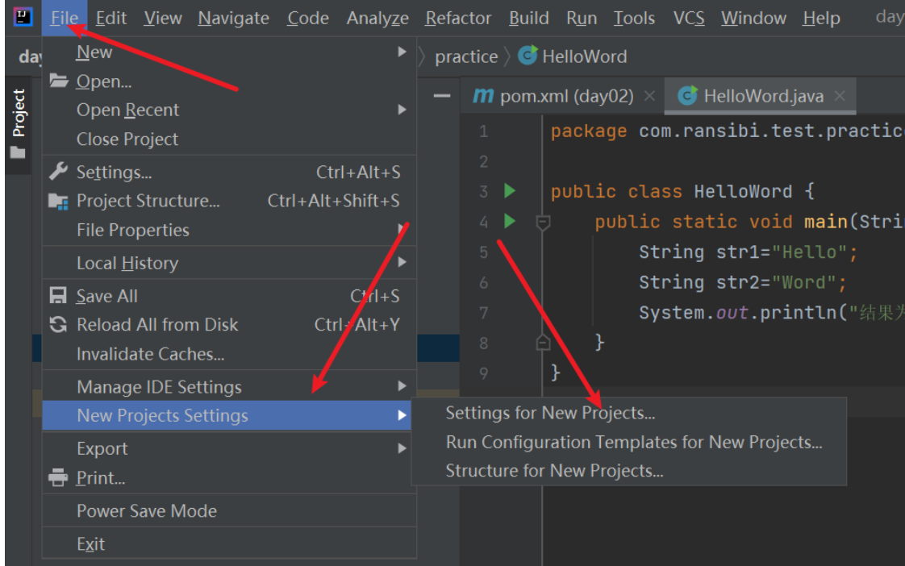
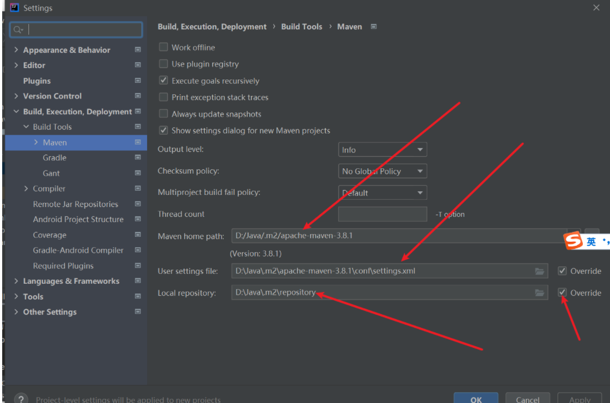

###                                               Maven的安装与配置——并集成到IDEA中：

#### 1、首先去Maven的官网去下载maven的压缩文件：

http://maven.apache.org/download.cgi#



<!--more --> 

#### 2、然后解压，新建一个本地仓库reporsitory



#### 3、配置maven的仓库路径：





#### 4、更改为阿里云镜像：

```xml
 <mirror><id>nexus-aliyun</id>
	<mirrorOf>central</mirrorOf>
	<name>Nexus aliyun</name>
	<url>http://maven.aliyun.com/nexus/content/groups/public</url>
	</mirror>
```

#### 5、配置maven的环境变量：

就是将maven解压的bin路径添加至path环境变量中。



#### 5、将Maven集成到IDEA中：





然后apply一下；至此maven就配置成功了。
