### 聚合

聚合用于快速构建maven工程，一次性构建多个项目/模块。

创建三个模块分别为maven_dao、maven_service、maven_parent

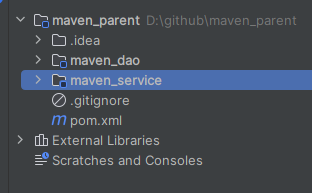

maven_parent:  pom.xml

```xml
    <!--打包类型为pom -->
    <packaging>pom</packaging>
     <!--parent 模块包含另外两个模块 -->
    <modules>
        <module>maven_dao</module>
        <module>maven_service</module>
    </modules>
```

对maven_parent进行生命周期的clean、compile、package、install其它两个模块也跟着一起做同样的操作。

### 继承

通过继承可以实现在子工程中沿用父工程中的配置。

(1)父工程对依赖进行管理

```xml
<!--  声明此处进行依赖管理 -->
    <dependencyManagement>
<!--  具体的依赖-->
        <dependencies>
            <dependency>
                <groupId>org.projectlombok</groupId>
                <artifactId>lombok</artifactId>
                <version>1.18.20</version>
                <scope>provided</scope>
            </dependency>
        </dependencies>
    </dependencyManagement>
```

(2)在子工程中声明其父工程对应的坐标

maven_dao、maven_service

```xml
    <parent>
        <groupId>org.ransibi</groupId>
        <artifactId>maven_parent</artifactId>
        <version>1.0-SNAPSHOT</version>
    </parent>
```

添加lombok依赖，去掉版本号,父工程使用什么版本，子工程继承的就是什么版本

```xml
    <dependencies>
        <dependency>
            <groupId>org.projectlombok</groupId>
            <artifactId>lombok</artifactId>
            <scope>provided</scope>
        </dependency>
    </dependencies>
```

### 属性

#### 自定义属性

```xml
    <properties>
        <lombok.version>1.18.20</lombok.version>
    </properties>
```

调用格式${}

```xml
            <dependency>
                <groupId>org.projectlombok</groupId>
                <artifactId>lombok</artifactId>
                <version>${lombok.version}</version>
                <scope>provided</scope>
            </dependency>
```

#### 内置属性

```
${basedir}
${version}
```

#### Setting属性

使用maven配置文件setting.xml中的标签属性，用于动态配置

```
${settings.localRepository}
```

#### Java系统属性

```
${user.home}
```

查询方式: mvn help:system

cmd窗口输入

```
mvn help:system
```

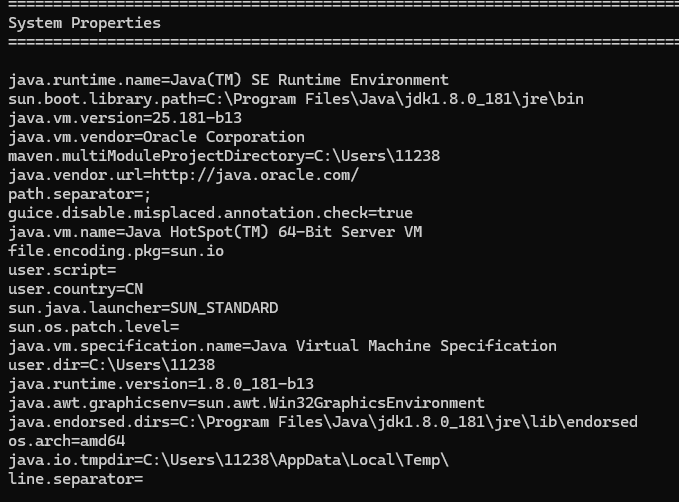

#### 环境变量属性

```
${env.JAVA_HOME}
```

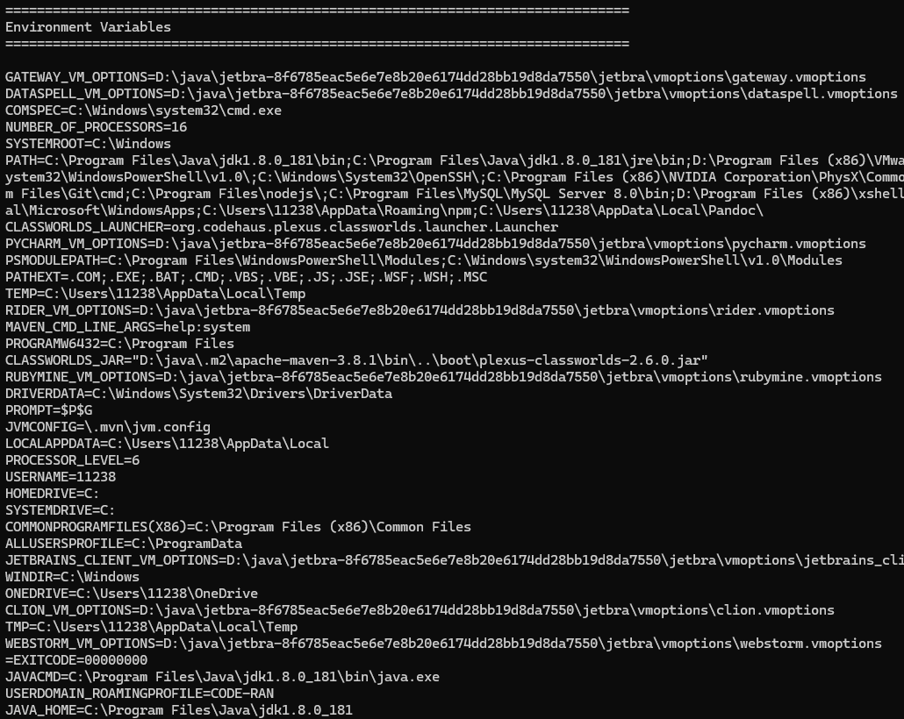

### 版本管理

#### SNAPSHOT(快照版本)

◆项目开发过程中，为方便团队成员合作，解决模块间相互依赖和时时更新的问题，开发者对每
个模块进行构建的时候，输出的临时性版本叫快照版本（测试阶段版本）
◆快照版本会随着开发的进展不断更新

#### RELEASE(发布版本)

◆项目开发到进入阶段里程碑后，向团队外部发布较为稳定的版本，这种版本所对应的构件文件
是稳定的，即便进行功能的后续开发，也不会改变当前发布版本内容，这种版本称为发布版本

### 私服

Nexus是Sonatype公司的一款maven私服产品

官网:  https://help.sonatype.com/en/download.html

进入bin目录，执行

```
nexus /run nexus
```

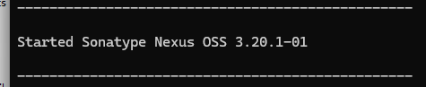

启动成功后访问

localhos:8081

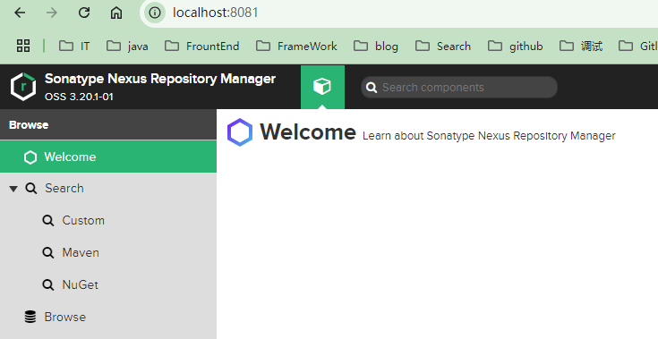

创建仓库

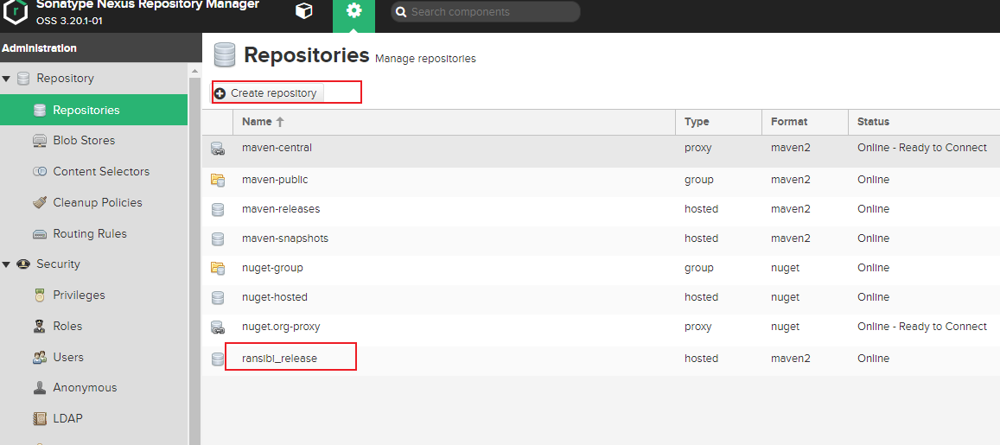

添加到public中

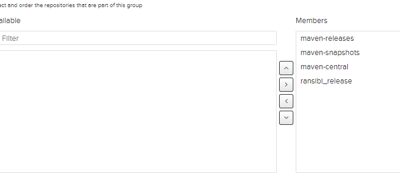

手动上传依赖

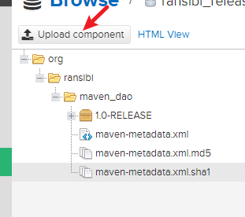

#### idea访问私服与组件上传

创建两个仓库,并都加到public中

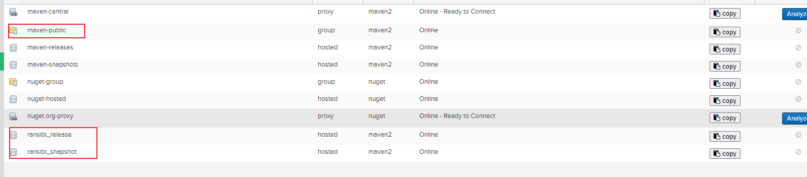

修改maven的setting配置文件，增加配置

```xml
      <server>
      <id>ransibi_release</id>
      <username>admin</username>
      <password>123456rsb</password>
      </server>
	  <server>
      <id>ransibi_snapshot</id>
      <username>admin</username>
      <password>123456rsb</password>
      </server>
      
      	<!-- 个人私服 -->
		<mirror>
			<id>nexus_ransibi</id>
			<mirrorOf>*</mirrorOf>
			<url>http://localhost:8081/repository/maven-public/</url>
		</mirror>
```

pom中配置发布私服的地址

```xml
    <distributionManagement>
        <repository>
            <id>ransibi_release</id>
            <url>http://localhost:8081/repository/ransibi_release/</url>
        </repository>
        <snapshotRepository>
            <id>ransibi_snapshot</id>
            <url>http://localhost:8081/repository/ransibi_snapshot/</url>
        </snapshotRepository>
    </distributionManagement>
```

部署之后会进行上传下载

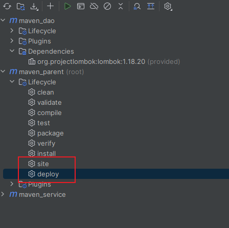

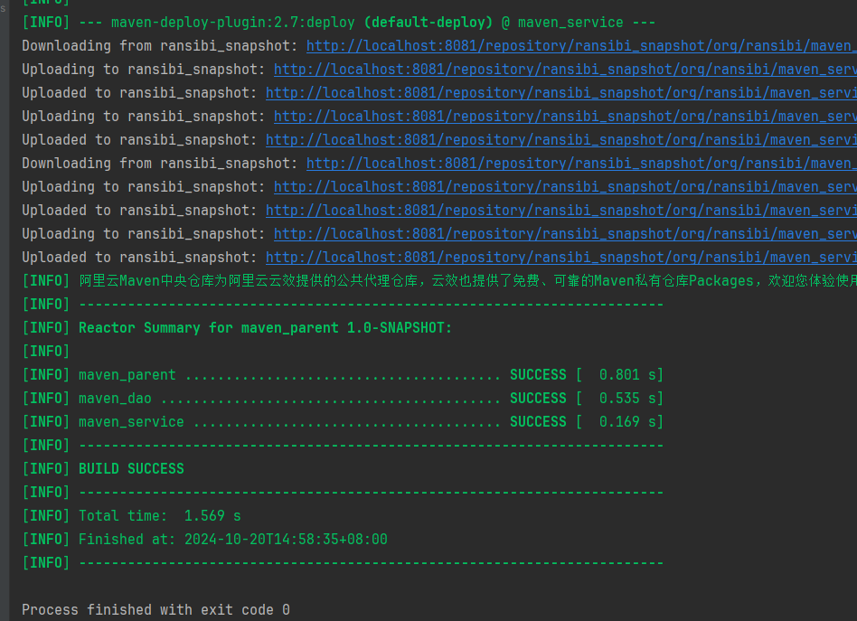
