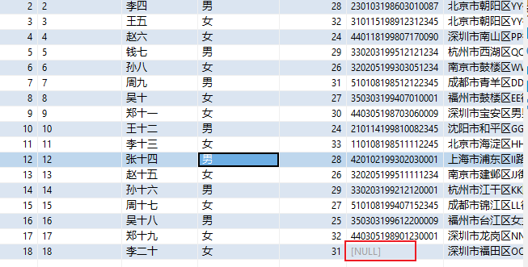
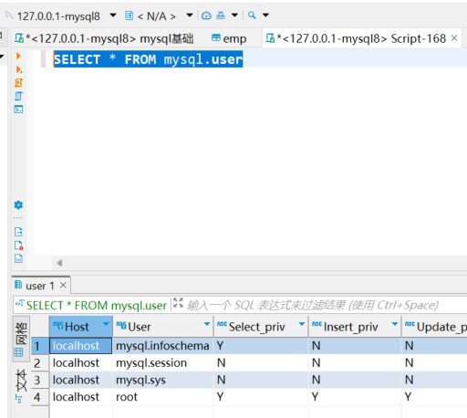

## MySQL基础

### 概述

| 名称           | 简称                              | 描述                                   |
| -------------- | --------------------------------- | -------------------------------------- |
| 数据库         | DataBase（DB）                    | 存储数据的仓库，数据是有组织的进行存储 |
| 数据库管理系统 | DataBase Management System (DBMS) | 操纵和管理数据库的大型软件             |
| SQL            | Structured Query Language (SQL)   | 操作关系型数据库的编程语言             |

### 软件版本

Mysql 8.0.26社区版

### 数据模型

（1）关系型数据库：建立在关系模型基础上，由多张相互连接的二维表组成的数据库。

基于二维表存储数据的数据库就称为关系型数据库，不是基于二维表存储数据的数据库，就是非关系型数据库。

（2）MySQL是关系型数据库，是基于二维表进行数据存储的。

### 结构化查询语言(SQL)

#### SQL通用语法

（1）SQL语句可以单行或多行书写，以分号结尾。

（2）SQL语句可以使用空格/缩进来增强语句的可读性。

（3）MySQL数据库的SQL语句不区分大小写，关键字建议使用大写。

（4）注释相关: 

```
单行注释: --  或者 #
多行注释: /*   */
```

#### SQL分类

##### DDL(数据定义语言)

作用：用来定义数据库对象(数据库，表，字段等信息)。

###### 1.数据库操作

(1)查询所有数据库

```sql
SHOW DATABASES;
```

(2)使用指定的数据库

```sql
USE 数据库名;
```

(3)查询当前数据库

```sql
SELECT DATABASE();
```

(4)创建数据库

```sql
CREATE DATABASE [ IF NOT EXISTS ] 数据库名 [ DEFAULT CHARSET 字符集] [COLLATE 排序规则 ];
#例如
CREATE DATABASE if not exists test default charset utf8mb4;
```

(5)删除数据库

```sql
DROP DATABASE [ IF EXISTS ] 数据库名;
#例如
DROP DATABASE if exists test;
```

###### 2.表操作

(1)查询当前数据库所有表

```sql
SHOW TABLES;
```

(2)查询表结构

```sql
DESC 表名;
```

(3)查询指定表的建表语句

```sql
SHOW CREATE TABLE 表名;
```

(4)创建表

```sql
CREATE TABLE 表名(
	字段1 字段1类型 [COMMENT 字段1注释],
	字段2 字段2类型 [COMMENT 字段2注释],
	字段3 字段3类型 [COMMENT 字段3注释],
	...
	字段n 字段n类型 [COMMENT 字段n注释]
)[ COMMENT 表注释 ];

#例子
CREATE TABLE employee(
    id INT(10) COMMENT '序号',
	name VARCHAR(256) COMMENT '名字',
	sex TINYINT UNSIGNED COMMENT '性别',
	age INT COMMENT '年龄'
) COMMENT '员工信息表';
```

(5)添加字段

```sql
ALTER TABLE 表名 ADD 字段名 类型(长度) [COMMENT 注释] [约束];
#例子
ALTER TABLE employee ADD testname VARCHAR(256);
```

(6)修改数据类型

```sql
ALTER TABLE 表名 MODIFY 字段名 新数据类型(长度);
#例子
ALTER TABLE employee MODIFY testname int(10);
```

(7)修改字段名和字段类型

```sql
ALTER TABLE 表名 CHANGE 旧字段名 新字段名 类型(长度) [COMMENT 注释] [约束];
#例子
ALTER TABLE employee CHANGE testname practicekey varchar(256);
```

(8)删除字段

```sql
ALTER TABLE 表名 DROP 字段名;
#例子
ALTER TABLE employee drop practicekey;
```

(9)修改表名

```sql
ALTER TABLE 表名 RENAME TO 新表名
#例子
ALTER TABLE employee RENAME TO emp;
```

(10)删除表

```sql
DROP TABLE [IF EXISTS] 表名;
#例子
DROP TABLE emp;
```

(11)删除表，并重新创建该表

```sql
TRUNCATE TABLE 表名;
#例子
TRUNCATE TABLE emp;
```


##### DML(数据操作语言)

作用：用来对数据库表中的数据进行增删改操作。

###### 添加数据

**注意:** 字符串和日期类型数据应该包含在引号中,插入的数据大小应该在字段的规定范围内。

```sql
#添加指定字段
INSERT INTO 表名 (字段名1, 字段名2, ...) VALUES (值1, 值2, ...);
#例子
INSERT INTO emp ( id, NAME, sex, age )
VALUES(1,'张三',1,25);
```

```sql
#添加全部字段
INSERT INTO 表名 VALUES (值1, 值2, ...);
#例子
INSERT INTO emp VALUES(3,'王五','1',27);
```

```sql
#批量添加数据
INSERT INTO 表名 (字段名1, 字段名2, ...) VALUES (值1, 值2, ...), (值1, 值2, ...), (值1, 值2, ...);
#例子
INSERT INTO emp ( id, NAME, sex, age )
VALUES(1,'张三',1,25),(2,'李四',0,26);
```

###### 修改数据

```sql
UPDATE 表名 SET 字段名1 = 值1, 字段名2 = 值2, ... [ WHERE 条件 ];
#例子
UPDATE emp SET id = 3,name = '小美',sex = 1, age = 18 where id = 3;
```

###### 删除数据

```sql
DELETE FROM 表名 [ WHERE 条件 ];
#例子
DELETE from emp WHERE id = 3;
```


##### DQL(数据查询语言)

作用：用来查询数据库中表的记录。

语法格式

```sql
SELECT
	字段列表
FROM
	表名字段
WHERE
	条件列表
GROUP BY
	分组字段列表
HAVING
	分组后的条件列表
ORDER BY
	排序字段列表
LIMIT
	分页参数
```

数据准备:

1.创建测试表: emp

```sql
CREATE TABLE emp (
  id int COMMENT '编号',
	workno VARCHAR(10) COMMENT '工号',
	name VARCHAR(10) COMMENT '姓名',
	gender char(1) COMMENT '性别',
	age TINYINT UNSIGNED COMMENT '年龄',
	idcard CHAR(18) COMMENT '身份证号',
	workaddress VARCHAR(50) COMMENT '工作地址',
	entrydate date COMMENT '入职时间'
) COMMENT '员工信息表';
```

2.插入测试数据

```sql
INSERT INTO emp (id, workno, name, gender, age, idcard, workaddress, entrydate)
VALUES 
    (2, '2', '李四', '男', 28, '230103198603010087', '北京市朝阳区YY街22号', '2020-12-15'),
    (3, '3', '王五', '女', 32, '310115198912312345', '北京市朝阳区YY街22号', '2022-01-10'),
    (4, '4', '赵六', '女', 24, '440118199807170090', '深圳市南山区PP街66号', '2021-05-08'),
    (5, '5', '钱七', '男', 29, '330203199512121234', '杭州市西湖区QQ路123号', '2022-02-21'),
    (6, '6', '孙八', '女', 26, '320205199303051234', '南京市鼓楼区WW街9号', '2021-09-01'),
    (7, '7', '周九', '男', 31, '510108198512122345', '成都市青羊区DD路3号', '2022-03-15'),
    (8, '8', '吴十', '女', 27, '350303199407010001', '福州市鼓楼区EE街21号', '2021-11-11'),
    (9, '9', '郑十一', '女', 30, '440305198703060009', '深圳市宝安区男男路22号', '2022-01-02'),
    (10, '10', '王十二', '男', 24, '210114199810082345', '沈阳市和平区GG路6号', '2021-06-30'),
    (11, '11', '李十三', '女', 33, '110108198511112245', '北京市海淀区HH街88号', '2022-03-20'),
    (12, '12', '张十四', '男', 28, '420102199302030001', '上海市浦东区II路55号', '2021-12-25'),
    (13, '13', '赵十五', '女', 26, '320205199511111234', '南京市建邺区JJ街66号', '2022-02-14'),
    (14, '14', '孙十六', '男', 29, '330203199212120001', '杭州市江干区KK路77号', '2021-09-18'),
    (15, '15', '周十七', '女', 27, '510108199407152345', '成都市锦江区LL街4号', '2022-04-01'),
    (16, '16', '吴十八', '男', 25, '350303199612200009', '福州市台江区女女路99号', '2021-11-30'),
    (17, '17', '郑十九', '女', 32, '440305198901230001', '深圳市龙岗区NN路33号', '2022-03-05'),
    (18, '18', '李二十', '女', 31, NULL, '深圳市福田区OO路11号', '2021-08-02')
```

###### 基础查询

(1)查询表中指定字段信息

```sql
#格式
SELECT 字段1, 字段2, 字段3, ... FROM 表名;

#例子
SELECT id, name,workno,age FROM emp;
```

(2)给查询的字段设置别名

```sql
#格式
SELECT 字段1 [ AS 别名1 ], 字段2 [ AS 别名2 ], 字段3 [ AS 别名3 ], ... FROM 表名;

#例子
SELECT workaddress as address from emp;
```

(3)对查询到的表记录数据去重

```sql
#格式
SELECT DISTINCT 字段列表 FROM 表名;

#例子
SELECT DISTINCT workaddress  from emp;
```

(4)查询所有字段返回

```sql
#格式
SELECT * FROM 表名;

#例子
SELECT * FROM emp
```

**注意:** 

```
虽然使用 SELECT * 可以返回表中的所有列，但是它可能会导致一些问题，比如：
(1)性能问题：SELECT * 会返回表中的所有列，即使应用程序只需要其中的一部分数据。这增加了数据传输和处理的负担，并且可能会导致查询速度变慢。
(2)冗余数据：如果表结构发生变化，或者新的列被添加到表中，SELECT * 的结果也会随之改变。这可能会破坏应用程序的逻辑和功能。
(3)安全问题：使用 SELECT * 可能会泄露敏感信息。比如一个包含密码的列可能被无意间SELECT出来并显示在用户界面上。
因此，为了提高查询性能、减少冗余数据、保护敏感信息，我们应该尽量避免使用 SELECT *，而是明确指定需要查询的列。
```

###### 条件查询

语法格式

```sql
SELECT 字段列表 FROM 表名 WHERE 条件列表;

```

运算符相关

| 比较运算符      | 功能                                       |
| --------------- | ------------------------------------------ |
| >               | 大于                                       |
| >=              | 大于等于                                   |
| <               | 小于                                       |
| <=              | 小于等于                                   |
| =               | 等于                                       |
| <> 或 !=        | 不等于                                     |
| BETWEEN … AND … | 在某个范围内（含最小、最大值）             |
| IN(…)           | 在in之后的列表中的值，多选一               |
| LIKE 占位符     | 模糊匹配（_匹配单个字符，%匹配任意个字符） |
| IS NULL         | 是NULL                                     |

| 逻辑运算符 | 功能                         |
| ---------- | ---------------------------- |
| AND 或 &&  | 并且（多个条件同时成立）     |
| OR 或 \|\| | 或者（多个条件任意一个成立） |
| NOT 或 !   | 非，不是                     |

例子：

```sql
-- 查询没有身份证号的员工信息
SELECT * FROM emp WHERE idcard IS NULL

-- 查询有身份证号的员工信息
SELECT * FROM emp WHERE idcard IS NOT NULL

-- 查询年龄为26,27,28的员工的信息
SELECT * FROM emp WHERE age = 26 OR age = 27 OR age = 28
或者
SELECT * FROM emp WHERE age in (26,27,28)

-- 查询姓名为两个字的员工信息，一个下划线代表一个字符
SELECT * FROM emp WHERE name LIKE '__'

-- 查询身份证号最后一位是x的员工信息
SELECT * FROM emp WHERE idcard LIKE '%x'

-- 查询idcard不为空的数据
SELECT * FROM emp WHERE NOT idcard IS NULL

-- 查询idcard为空的数据
SELECT * FROM emp WHERE  idcard IS NULL
```


###### 聚合查询

常见聚合函数

**注意: null值不参与所有聚合函数的运算**



| 函数  | 功能     |
| ----- | -------- |
| count | 统计数量 |
| max   | 最大值   |
| min   | 最小值   |
| avg   | 平均值   |
| sum   | 求和     |

例子:

```sql
-- 统计该企业员工数量
SELECT COUNT(*) FROM emp

注意：null值不参与所有聚合函数的运算

-- 统计该企业员工的平均年龄
SELECT AVG(age) FROM emp

-- 统计该企业员工的最大年龄
SELECT MAX(age) FROM emp

-- 统计该企业员工的最小年龄
SELECT MIN(age) FROM emp

-- 统计杭州地区的员工年龄之和
SELECT SUM(age) FROM emp WHERE workaddress LIKE '杭州市%'
```


###### 分组查询

语法格式:

```sql
SELECT 字段列表 FROM 表名 [ WHERE 条件 ] GROUP BY 分组字段名 [ HAVING 分组后的过滤条件 ];
```

**where 和 having 的区别：**

- 执行时机不同：where是分组之前进行过滤，不满足where条件不参与分组；having是分组后对结果进行过滤。
- 判断条件不同：where不能对聚合函数进行判断，而having可以。

例子：

```sql
-- 根据性别分组，统计男性和女性数量（只显示分组数量，不显示哪个是男哪个是女）
select count(*) from emp group by gender;
-- 根据性别分组，统计男性和女性数量(显示哪个是男哪个是女)
select gender, count(*) from emp group by gender;
-- 根据性别分组，统计男性和女性的平均年龄
select gender, avg(age) from emp group by gender;
-- 年龄小于45的员工数量，并根据工作地址分组
select workaddress, count(*) from emp where age < 45 group by workaddress;
-- 年龄小于45的员工数量，并根据工作地址分组，获取员工数量大于等于2的工作地址
select workaddress, count(*) address_count from emp where age < 45 group by workaddress having address_count >= 2;
```

注意:

```
执行顺序：where > 聚合函数 > having
分组之后，查询的字段一般为聚合函数和分组字段，查询其他字段无任何意义
```

###### 排序查询

语法格式

```sql
SELECT 字段列表 FROM 表名 ORDER BY 字段1 排序方式1, 字段2 排序方式2;
```

排序方式

```
ASC: 升序（默认）
DESC: 降序
```

例子：

```sql
-- 根据年龄对公司的员工进行升序排序
SELECT * FROM emp ORDER BY age 

-- 根据入职时间，对员工进行降序排序
SELECT * FROM emp ORDER BY entrydate DESC

-- 根据年龄对公司的员工进行升序排序，年龄相同，再按照入职时间进行降序排序

SELECT * FROM emp ORDER BY age ASC,entrydate DESC
```

**注意:** 如果是多字段排序，当第一个字段值相同时，才会根据第二个字段进行排序。

###### 分页查询

语法格式

```sql
SELECT 字段列表 FROM 表名 LIMIT 起始索引, 查询记录数;
```

例子:

```sql
-- 查询第一页数据，展示10条
SELECT * FROM employee LIMIT 0, 10;
-- 查询第二页
SELECT * FROM employee LIMIT 10, 10;
```

**注意:** 

- 起始索引从0开始，起始索引 = （查询页码 - 1） * 每页显示记录数
- 分页查询是数据库的方言，不同数据库有不同实现，MySQL是LIMIT
- 如果查询的是第一页数据，起始索引可以省略，直接简写 LIMIT 10

###### DQL中的执行顺序

```sql
FROM → JOIN → WHERE → GROUP BY → HAVING → SELECT → DISTINCT → ORDER BY → LIMIT
```

###### 练习

```sql
-- 查询年龄为20,21,22,23岁的员工信息。
SELECT * FROM emp WHERE age IN (20,21,22,23)

-- 查询性别为 男 ，并且年龄在 20-40 岁(含)以内的姓名为三个字的员工。
SELECT * FROM emp WHERE gender = '男' AND age >= 20 AND age <= 40 AND name LIKE '___'

-- 统计员工表中, 年龄小于60岁的 , 男性员工和女性员工的人数。
SELECT count(*),gender  FROM emp where age < 60 GROUP BY gender  

-- 查询所有年龄小于等于35岁员工的姓名和年龄，并对查询结果按年龄升序排序，如果年龄相同按入职时间降序排序。
SELECT name,age  FROM emp WHERE age <= 35 ORDER BY age, entrydate DESC 

-- 查询性别为男，且年龄在20-40 岁(含)以内的前5个员工信息，对查询的结果按年龄升序排序，年龄相同按入职时间升序排序。
SELECT * FROM emp WHERE gender = '男' AND age >= 20 AND age <= 40 ORDER BY age ,entrydate LIMIT 5
```


##### DCL(数据控制语言)

作用：用来创建数据库用户、控制数据库的访问权限

###### 管理用户

(1)查询用户

```sql
SELECT * FROM mysql.user
```



Host代表当前用户访问的主机, 如果为localhost, 仅代表只能够在当前本机访问，是不可以远程访问的。 User代表的是访问该数据库的用户名。在MySQL中需要通过Host和User来唯一标识一个用户。

(2)创建用户

```sql
CREATE USER '用户名'@'主机名' IDENTIFIED BY '密码';
```

(3)修改用户密码

```sql
ALTER USER '用户名'@'主机名' IDENTIFIED WITH mysql_native_password BY '新密码' ;
```

(4)删除用户

```sql
DROP USER '用户名'@'主机名' ;
```

**注意: **

在MySQL中需要通过用户名@主机名的方式，来唯一标识一个用户。

主机名可以使用 % 通配。

例子:

创建用户ransibi, 只能够在当前主机localhost访问, 密码123456;

```sql
CREATE USER 'ransibi'@'localhost' identified BY '123456'
```

创建用户ransibi_test, 可以在任意主机访问该数据库, 密码123456;

```sql
CREATE USER 'ransibi_test'@'%' identified BY '123456'
```

修改用户ransibi的访问密码为1234rsb;

```
ALTER USER 'ransibi'@'localhost' identified WITH mysql_native_password BY '1234rsb'
```

删除 ransibi@localhost 用户

```sql
DROP USER 'ransibi'@'localhost';
```


###### 权限控制

MySQL中常用权限:

| 权限列表            | 说明               |
| ------------------- | ------------------ |
| ALL, ALL PRIVILEGES | 所有权限           |
| SELECT              | 查询数据           |
| INSERT              | 插入数据           |
| UPDATE              | 修改数据           |
| DELETE              | 删除数据           |
| ALTER               | 修改表             |
| DROP                | 删除数据库/表/视图 |
| CREATE              | 创建数据库/表      |

(1)查询权限

```sql
SHOW GRANTS FOR '用户名'@'主机名' ;
```

(2)授予权限

```sql
GRANT 权限列表 ON 数据库名.表名 TO '用户名'@'主机名';
```

(3)撤销权限

```sql
REVOKE 权限列表 ON 数据库名.表名 FROM '用户名'@'主机名';
```

多个权限之间，使用逗号分隔； 授权时， 数据库名和表名可以使用 * 进行通配，代表所有。


### 函数

#### 字符串函数

常用字符串函数:

| 函数                             | 功能                                                      |
| -------------------------------- | --------------------------------------------------------- |
| CONCAT(s1, s2, …, sn)            | 字符串拼接，将s1, s2, …, sn拼接成一个字符串               |
| LOWER(str)                       | 将字符串全部转为小写                                      |
| UPPER(str)                       | 将字符串全部转为大写                                      |
| LPAD(str, n, pad)                | 左填充，用字符串pad对str的左边进行填充，达到n个字符串长度 |
| RPAD(str, n, pad)                | 右填充，用字符串pad对str的右边进行填充，达到n个字符串长度 |
| TRIM(str)                        | 去掉字符串头部和尾部的空格                                |
| SUBSTRING(str, start, len)       | 返回从字符串str从start位置起的len个长度的字符串           |
| REPLACE(column, source, replace) | 替换字符串                                                |

例子：

```sql
-- 拼接名字和年龄
SELECT concat(name,age)  FROM emp;

-- 全部转小写
select lower('Hello');

-- 全部转大写
select upper('Hello');

-- 用地址workaddress对名字的左边进行数据填充，直到达到五个字符串的长度
SELECT lpad(name,5,workaddress) FROM emp

-- 对workno不足五位的，左边补0
UPDATE emp SET  workno = lpad(workno,5,'0')

-- 用地址workaddress对名字的右边进行数据填充，直到达到五个字符串的长度
SELECT rpad(name,5,workaddress) FROM emp

-- 去除空格
select trim(' Hello MySQL ');

-- 截取子字符串,截取地址workaddress字段的前五个字符串
SELECT substring(workaddress,1,5) FROM emp
```


#### 数值函数

常用数值函数：

| 函数        | 功能                             |
| ----------- | -------------------------------- |
| CEIL(x)     | 向上取整                         |
| FLOOR(x)    | 向下取整                         |
| MOD(x, y)   | 返回x/y的模                      |
| RAND()      | 返回0~1内的随机数                |
| ROUND(x, y) | 求参数x的四舍五入值，保留y位小数 |

#### 日期函数

常用日期函数:

| 函数                               | 功能                                              |
| ---------------------------------- | ------------------------------------------------- |
| CURDATE()                          | 返回当前日期                                      |
| CURTIME()                          | 返回当前时间                                      |
| NOW()                              | 返回当前日期和时间                                |
| YEAR(date)                         | 获取指定date的年份                                |
| MONTH(date)                        | 获取指定date的月份                                |
| DAY(date)                          | 获取指定date的日期                                |
| DATE_ADD(date, INTERVAL expr type) | 返回一个日期/时间值加上一个时间间隔expr后的时间值 |
| DATEDIFF(date1, date2)             | 返回起始时间date1和结束时间date2之间的天数        |

#### 流程函数

可以在SQL语句中实现条件筛选，从而提高语句的效率。

| 函数                                                         | 功能                                                    |
| ------------------------------------------------------------ | ------------------------------------------------------- |
| IF(value, t, f)                                              | 如果value为true，则返回t，否则返回f                     |
| IFNULL(value1, value2)                                       | 如果value1不为空，返回value1，否则返回value2            |
| CASE WHEN [ val1 ] THEN [ res1 ] … ELSE [ default ] END      | 如果val1为true，返回res1，… 否则返回default默认值       |
| CASE [ expr ] WHEN [ val1 ] THEN [ res1 ] … ELSE [ default ] END | 如果expr的值等于val1，返回res1，… 否则返回default默认值 |

例子: 查询emp表的员工姓名和工作地址 (北京/上海 ----> 一线城市 , 其他 ----> 二线城市)

```sql
SELECT
	name,
	( CASE
		workaddress WHEN '北京' THEN '一线城市'
		WHEN '上海' THEN '一线城市'
		ELSE
'二线城市'
	END ) AS '工作地址'
FROM
	emp;
```

```sql
CREATE TABLE score(
id int comment 'ID',
name varchar(20) comment '姓名',
math int comment '数学',
english int comment '英语',
chinese int comment '语文'
) comment '学员成绩表';


insert into score(id, name, math, english, chinese) VALUES (1, 'Tom', 67, 88, 95
), (2, 'Rose' , 23, 66, 90),(3, 'Jack', 56, 98, 76);


-- 根据科目分数，划分等级
SELECT
	id,
	name,
	(CASE
		WHEN math >= 85 THEN '优秀'
		WHEN math >= 60 THEN '及格'
		ELSE '不及格'
	END ) '数学',
	(CASE
		WHEN english >= 85 THEN '优秀'
		WHEN english >= 60 THEN '及格'
		ELSE '不及格'
	END ) '英语',
	(CASE
		WHEN chinese >= 85 THEN '优秀'
		WHEN chinese >= 60 THEN '及格'
		ELSE '不及格'
	END ) '语文'
FROM
	score;
```

### 约束

约束是作用于表中字段上的规则，用于限制存储在表中的数据。

作用：保证数据库中数据的正确性、有效性和完整性。

#### 约束分类

##### 非空约束(NOT NULL)

限制该字段的数据不能为null

##### 唯一约束(UNIQUE)

保证该字段的所有数据都是唯一、不重复的

##### 主键约束(PRIMARY KEY)

主键是一行数据的唯一标识，要求非空且唯一

##### 默认约束(DEFAULT)

保存数据时，如果未指定该字段的值，则采用默认值

##### 检查约束(CHECK)

保证字段值满足某一个条件((8.0.16版本之后)

例子:

**AUTO_INCREMENT(自动增长)**

```sql
CREATE TABLE tb_user(
id int AUTO_INCREMENT PRIMARY KEY  comment 'ID唯一标识',
name varchar(10) NOT NULL UNIQUE comment '姓名',
age int check(age >0 AND age <= 120) comment '年龄',
status char(1) DEFAULT 1 comment '状态',
gender char(1) comment '性别'
) comment '员工信息表';
```

##### 外键约束(FOREIGN KEY)

用来让两张表的数据之间建立连接，保证数据的一致性和完整性。

(1)语法:

**主表与从表的区分**: 

- **从表**是定义外键的表，外键字段指向另一个表的主键。
- **主表**是被外键引用的表，包含被引用的主键或唯一键。

```sql
CREATE TABLE 从表名(
字段名 数据类型,
...
[CONSTRAINT] [外键名称] FOREIGN KEY (外键字段名) REFERENCES 主表 (主表列名)
);
```

```sql
ALTER TABLE 从表名 ADD CONSTRAINT 外键名称(自定) FOREIGN KEY (外键字段名) REFERENCES 主表 (主表列名) ;
```

删除外键

```sql
ALTER TABLE 从表名 DROP FOREIGN KEY 外键名称;
```

(2)例子:

```sql
create table dept(
id int auto_increment comment 'ID' primary key,
name varchar(50) not null comment '部门名称'
)comment '部门表';

INSERT INTO dept (id, name) VALUES (1, '研发部'), (2, '市场部'),(3, '财务部'), (4,
'销售部'), (5, '总经办');
```

```sql
create table employee(
id int auto_increment comment 'ID' primary key,
name varchar(50) not null comment '姓名',
age int comment '年龄',
job varchar(20) comment '职位',
salary int comment '薪资',
entrydate date comment '入职时间',
managerid int comment '直属领导ID',
dept_id int comment '部门ID'
)comment '员工表';

INSERT INTO employee (id, name, age, job,salary, entrydate, managerid, dept_id)
VALUES
(1, '金庸', 66, '总裁',20000, '2000-01-01', null,5),(2, '张无忌', 20,
'项目经理',12500, '2005-12-05', 1,1),
(3, '杨逍', 33, '开发', 8400,'2000-11-03', 2,1),(4, '韦一笑', 48, '开
发',11000, '2002-02-05', 2,1),
(5, '常遇春', 43, '开发',10500, '2004-09-07', 3,1),(6, '小昭', 19, '程
序员鼓励师',6600, '2004-10-12', 2,1);
```

添加外键

```sql
ALTER TABLE employee ADD CONSTRAINT fk_employee_dept_id FOREIGN KEY (dept_id) REFERENCES dept(id);
```

删除外键

```sql
ALTER TABLE employee DROP FOREIGN KEY fk_employee_dept_id;
```

(3)外键约束的删除更新行为

| 行为          | 说明                                                         |
| ------------- | ------------------------------------------------------------ |
| NO ACTION     | 当在父表中删除/更新对应记录时，首先检查该记录是否有对应外键，如果有则不允许删除/更新（与RESTRICT一致） |
| RESTRICT      | 当在父表中删除/更新对应记录时，首先检查该记录是否有对应外键，如果有则不允许删除/更新（与NO ACTION一致） |
| CASCADE(级联) | 当在父表中删除/更新对应记录时，首先检查该记录是否有对应外键，如果有则也删除/更新外键在子表中的记录 |
| SET NULL      | 当在父表中删除/更新对应记录时，首先检查该记录是否有对应外键，如果有则设置子表中该外键值为null（要求该外键允许为null） |
| SET DEFAULT   | 父表有变更时，子表将外键设为一个默认值（Innodb不支持）       |

级联删除语法:

```sql
ALTER TABLE 子表名 ADD CONSTRAINT 外键名称 FOREIGN KEY (外键字段) REFERENCES  主表名 (主表字段名) ON UPDATE CASCADE ON DELETE CASCADE;
```

修改主表中的主键之后，子表也跟着被修改了。删除也跟着被删除。

删除之前增加的外键，然后重新增加外键

```sql
alter table employee add constraint fk_employee_dept_id foreign key (dept_id) REFERENCES dept(id) on update set null on delete set null ;
```

父表记录删除后，子表对应的外键设置为了NULL

### 多表查询

#### 多表关系

##### 一对多(多对一)

案例：部门与员工
关系：一个部门对应多个员工，一个员工对应一个部门
**实现**：在多的一方建立外键，指向一的一方的主键

##### 多对多

案例：学生与课程
关系：一个学生可以选多门课程，一门课程也可以供多个学生选修
**实现**：建立第三张中间表，中间表至少包含两个外键，分别关联两方主键

##### 一对一

案例：用户与用户详情
关系：一对一关系，多用于单表拆分，将一张表的基础字段放在一张表中，其他详情字段放在另一张表中，以提升操作效率
**实现**：在任意一方加入外键，关联另外一方的主键，并且设置外键为唯一的（UNIQUE）


#### 概述

笛卡尔积现象：笛卡尔乘积是指在数学中，两个集合A集合 和 B集合的所有组合情况。

在多表查询中加上连接查询的条件即可消除笛卡尔积现象。关联主键和外键。

#### 连接的分类

##### 内连接

内连接查询的是两张表交集部分的数据。

(1)隐式内连接

```sql
SELECT 字段列表 FROM 表1 , 表2 WHERE 条件 ... ;
```

(2)显式内连接

```sql
SELECT 字段列表 FROM 表1 [ INNER ] JOIN 表2 ON 连接条件 ... ;
```

注意：一旦为表起了别名，就不能再使用表名来指定对应的字段了，此时只能够使用别名来指定字段。

##### 外连接

（1）左外连接

左外连接相当于查询表1(左表)的所有数据，当然也包含表1和表2交集部分的数据。

```sql
SELECT 字段列表 FROM 表1 LEFT [ OUTER ] JOIN 表2 ON 条件 ... ;
```

（2）右外连接

```sql
SELECT 字段列表 FROM 表1 RIGHT [ OUTER ] JOIN 表2 ON 条件 ... ;
```

右外连接相当于查询表2(右表)的所有数据，当然也包含表1和表2交集部分的数据

例子:

查询emp表的所有数据, 和对应的部门信息

```sql
select e.*, d.name from emp e left join dept d on e.dept_id = d.id;
```

查询dept表的所有数据, 和对应的员工信息

```sql
select d.*, e.* from emp e right outer join dept d on e.dept_id = d.id;
```

**注意**

```
左外连接和右外连接是可以相互替换的，只需要调整在连接查询时SQL中，表结构的先后顺序就可以了。而我们在日常开发使用时，更偏向于左外连接。
```

##### 联合查询

对于union查询，就是把多次查询的结果合并起来，形成一个新的查询结果集。

语法格式

```sql
SELECT 字段列表 FROM 表A ...
UNION [ ALL ]
SELECT 字段列表 FROM 表B ....;
```

**注意**:

```
(1)对于联合查询的多张表的列数必须保持一致，字段类型也需要保持一致。
(2)union all 会将全部的数据直接合并在一起，union 会对合并之后的数据去重。
```

例子:  将薪资低于 5000 的员工 , 和 年龄大于 50 岁的员工全部查询出来

```sql
select * from emp where salary < 5000
union
select * from emp where age > 50;
```


#### 子查询

SQL语句中嵌套SELECT语句，称为嵌套查询，又称子查询。

**注意**: 子查询外部的语句可以是INSERT / UPDATE / DELETE / SELECT 的任何一个。

子查询可能出现的位置: where 之后，select 之后，from 之后。

##### 标量子查询

子查询返回的结果是单个值（数字、字符串、日期等），最简单的形式，这种子查询称为标量子查询。（常用= 、<>、 >、 >=、 <、 <=）

例子:

查询 "销售部" 的所有员工信息

```sql
select * from emp where dept_id = (select id from dept where name = '销售部');
```

或者使用关联查询

##### 列子查询

子查询返回的结果是一列（可以是多行），这种子查询称为列子查询。

常用操作符:

| 操作符 | 描述                                   |
| ------ | -------------------------------------- |
| IN     | 在指定的集合范围内，多选一             |
| NOT IN | 不在指定的集合范围内                   |
| ANY    | 子查询返回列表中，有任意一个满足即可   |
| SOME   | 与ANY等同，使用SOME的地方都可以使用ANY |
| ALL    | 子查询返回列表的所有值都必须满足       |

例子: 查询 "销售部" 和 "市场部" 的所有员工信息

```sql
select * from emp where dept_id in (select id from dept where name = '销售部' or name = '市场部');
```

查询比财务部所有人工资都高的员工信息

```sql
select * from emp where salary > all ( select salary from emp where dept_id =
(select id from dept where name = '财务部') );
```


##### 行子查询

子查询返回的结果是一行（可以是多列），这种子查询称为行子查询。(常用操作符= 、<> 、IN 、NOT IN)

例子: 查询与 "张无忌" 的薪资及直属领导相同的员工信息

```sql
select * from emp where (salary,managerid) = (select salary, managerid from emp where name = '张无忌');
```


##### 表子查询

子查询返回的结果是多行多列，这种子查询称为表子查询。(常用操作符in)

例子: 查询与 "鹿杖客" , "宋远桥" 的职位和薪资相同的员工信息

```sql
select * from emp where (job,salary) in ( select job, salary from emp where name = '鹿杖客' or name = '宋远桥' );
```
