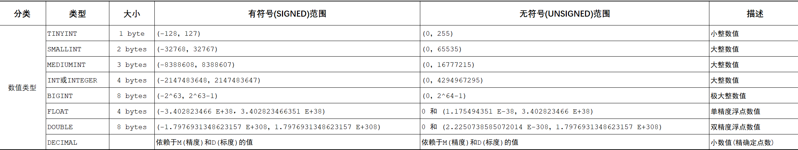
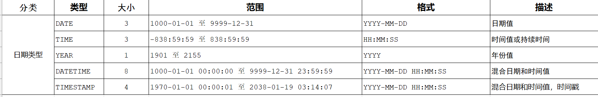

####                                                                    mysql学习

数值类型：



字符串类型：


日期类型：



##### DDL(数据定义语言)data definition language

```sql
-- DDL(数据定义语言) 
 
-- 查询所有数据库
SHOW DATABASES;

-- 使用指定的数据库
USE sqlpractice;

-- 查询当前所使用的数据库
SELECT DATABASE();

-- 创建数据库
CREATE DATABASE if not exists test;

-- 删除数据库
DROP DATABASE test;

-- 注意:utf-8字符集长度占三个字节，推荐使用utf8mb4字符集，占4个字节

-- 查询当前数据库所有表
show tables

CREATE TABLE employee(
    id INT(10) COMMENT '序号',
	name VARCHAR(256) COMMENT '名字',
	sex TINYINT UNSIGNED COMMENT '性别',
	age INT COMMENT '年龄'
) COMMENT '员工信息表'
-- 查询表的结构
desc employee

-- 查询指定表的建表语句
show create table employee

--添加字段
ALTER TABLE employee ADD testname VARCHAR(256)

--修改字段类型和长度
ALTER TABLE employee MODIFY testname int(10)

--修改字段名和字段类型长度
ALTER TABLE employee CHANGE testname practicekey varchar(256)

--删除表中某个字段
ALTER TABLE employee drop practicekey

--修改表名
ALTER TABLE employee RENAME TO emp

--删除表
DROP TABLE emp

--删除表，并重新创建该表
TRUNCATE TABLE emp

desc emp
```

#### DML（数据操作语言）data manipulation language

```sql
-- 添加数据
-- 指定字段
INSERT INTO emp ( id, NAME, sex, age )
VALUES
	(1,'张三','男',25),(2,'李四','男',26);

-- 全部字段
INSERT INTO emp VALUES(3,'王五','男',27)

注意:字符串和日期类型的数据应该包含在引号中。而且插入的数据大小应该在字段规定的范围内。

-- 更新和删除数据
UPDATE emp SET id = 3,name = '小美',sex = '女', age = 18 where id = 3

DELETE from emp WHERE id = 3
```

#### DQL（数据查询语言）data query language

##### (1)创建表：

```sql
CREATE TABLE emp (
  id int COMMENT '编号',
	workno VARCHAR(10) COMMENT '工号',
	name VARCHAR(10) COMMENT '姓名',
	gender char(1) COMMENT '性别',
	age TINYINT UNSIGNED COMMENT '年龄',
	idcard CHAR(18) COMMENT '身份证号',
	workaddress VARCHAR(50) COMMENT '工作地址',
	entrydate date COMMENT '入职时间'
) COMMENT '员工信息表'
```

##### (2)构造测试数据：

```sql
INSERT INTO emp (id, workno, name, gender, age, idcard, workaddress, entrydate)
VALUES 
    (2, '2', '李四', '男', 28, '230103198603010087', '北京市朝阳区YY街22号', '2020-12-15'),
    (3, '3', '王五', '女', 32, '310115198912312345', '北京市朝阳区YY街22号', '2022-01-10'),
    (4, '4', '赵六', '女', 24, '440118199807170090', '深圳市南山区PP街66号', '2021-05-08'),
    (5, '5', '钱七', '男', 29, '330203199512121234', '杭州市西湖区QQ路123号', '2022-02-21'),
    (6, '6', '孙八', '女', 26, '320205199303051234', '南京市鼓楼区WW街9号', '2021-09-01'),
    (7, '7', '周九', '男', 31, '510108198512122345', '成都市青羊区DD路3号', '2022-03-15'),
    (8, '8', '吴十', '女', 27, '350303199407010001', '福州市鼓楼区EE街21号', '2021-11-11'),
    (9, '9', '郑十一', '女', 30, '440305198703060009', '深圳市宝安区男男路22号', '2022-01-02'),
    (10, '10', '王十二', '男', 24, '210114199810082345', '沈阳市和平区GG路6号', '2021-06-30'),
    (11, '11', '李十三', '女', 33, '110108198511112245', '北京市海淀区HH街88号', '2022-03-20'),
    (12, '12', '张十四', '男', 28, '420102199302030001', '上海市浦东区II路55号', '2021-12-25'),
    (13, '13', '赵十五', '女', 26, '320205199511111234', '南京市建邺区JJ街66号', '2022-02-14'),
    (14, '14', '孙十六', '男', 29, '330203199212120001', '杭州市江干区KK路77号', '2021-09-18'),
    (15, '15', '周十七', '女', 27, '510108199407152345', '成都市锦江区LL街4号', '2022-04-01'),
    (16, '16', '吴十八', '男', 25, '350303199612200009', '福州市台江区女女路99号', '2021-11-30'),
    (17, '17', '郑十九', '女', 32, '440305198901230001', '深圳市龙岗区NN路33号', '2022-03-05'),
    (18, '18', '李二十', '女', 31, NULL, '深圳市福田区OO路11号', '2021-08-02')
```

##### (3)使用DQL进行基础查询

```sql
-- 查询id,name,work,age 返回
SELECT id, name,workno,age FROM emp

-- 查询所有字段返回
SELECT * FROM emp
注意:
虽然使用 SELECT * 可以返回表中的所有列，但是它可能会导致一些问题，比如：
性能问题：SELECT * 会返回表中的所有列，即使应用程序只需要其中的一部分数据。这增加了数据传输和处理的负担，并且可能会导致查询速度变慢。
冗余数据：如果表结构发生变化，或者新的列被添加到表中，SELECT * 的结果也会随之改变。这可能会破坏应用程序的逻辑和功能。
安全问题：使用 SELECT * 可能会泄露敏感信息。比如一个包含密码的列可能被无意间SELECT出来并显示在用户界面上。
因此，为了提高查询性能、减少冗余数据、保护敏感信息，我们应该尽量避免使用 SELECT *，而是明确指定需要查询的列。

-- 查询所有员工的工作地址，并起别名
SELECT workaddress as address from emp

-- 查询公司员工的上班地址，并且不能重复

SELECT DISTINCT workaddress  from emp
```

##### (4)使用DQL进行条件查询

语法：

```sql
SELECT 字段列表 FROM 表名 WHERE 条件列表
```


```sql
-- 查询没有身份证号的员工信息
SELECT * FROM emp WHERE idcard IS NULL

-- 查询有身份证号的员工信息
SELECT * FROM emp WHERE idcard IS NOT NULL

-- 查询年龄为26,27,28的员工的信息
SELECT * FROM emp WHERE age = 26 OR age = 27 OR age = 28
或者
SELECT * FROM emp WHERE age in (26,27,28)

-- 查询姓名为两个字的员工信息
SELECT * FROM emp WHERE name LIKE '__'

-- 查询身份证号最后一位是x的员工信息
SELECT * FROM emp WHERE idcard LIKE '%x'
```

##### (5)聚合函数

 将一列数据作为一个整体，进行纵向计算。

常见聚合函数：

| 函数  | 功能     |
| ----- | -------- |
| count | 统计数量 |
| max   | 最大值   |
| min   | 最小值   |
| avg   | 平均值   |
| sum   | 求和     |

```sql
-- 统计该企业员工数量
SELECT COUNT(*) FROM emp

注意：null值不参与所有聚合函数的运算

-- 统计该企业员工的平均年龄
SELECT AVG(age) FROM emp

-- 统计该企业员工的最大年龄
SELECT MAX(age) FROM emp

-- 统计该企业员工的最小年龄
SELECT MIN(age) FROM emp

-- 统计杭州地区的员工年龄之和
SELECT SUM(age) FROM emp WHERE workaddress LIKE '杭州市%'
```


(5)使用DQL进行分组查询

语法：

```sql
SELECT 字段列表 FROM 表名 [WHERE 条件] GROUP BY 分组字段名 [HAVING 分组后过滤条件]
```

##### (6)排序查询

语法：

```sql
SELECT 字段列表 FROM 表名 ORDER BY 字段1，排序方式1，字段2 排序方式2；
```

```sql
注意：如果是多字段排序，当第一个字段值相同时，才会根据第二个字段进行排序。
asc--升序（默认）
desc --降序
-- 根据年龄对公司的员工进行升序排序
SELECT * FROM emp ORDER BY age 

-- 根据入职时间，对员工进行降序排序
SELECT * FROM emp ORDER BY entrydate DESC

-- 根据年龄对公司的员工进行升序排序，年龄相同，再按照入职时间进行降序排序

SELECT * FROM emp ORDER BY age ASC,entrydate DESC
```

