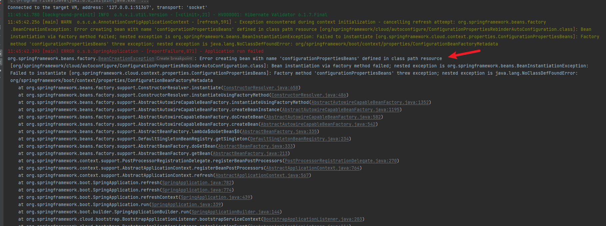
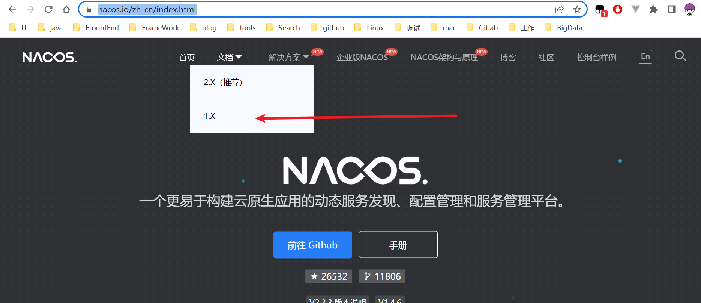
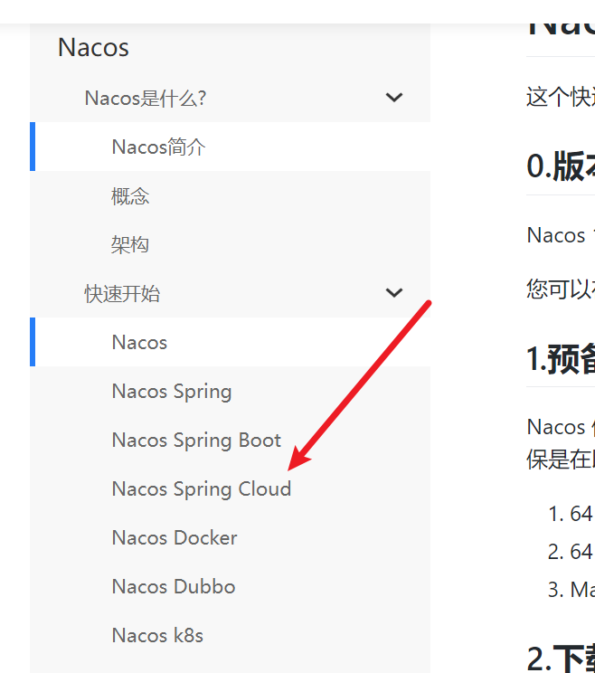
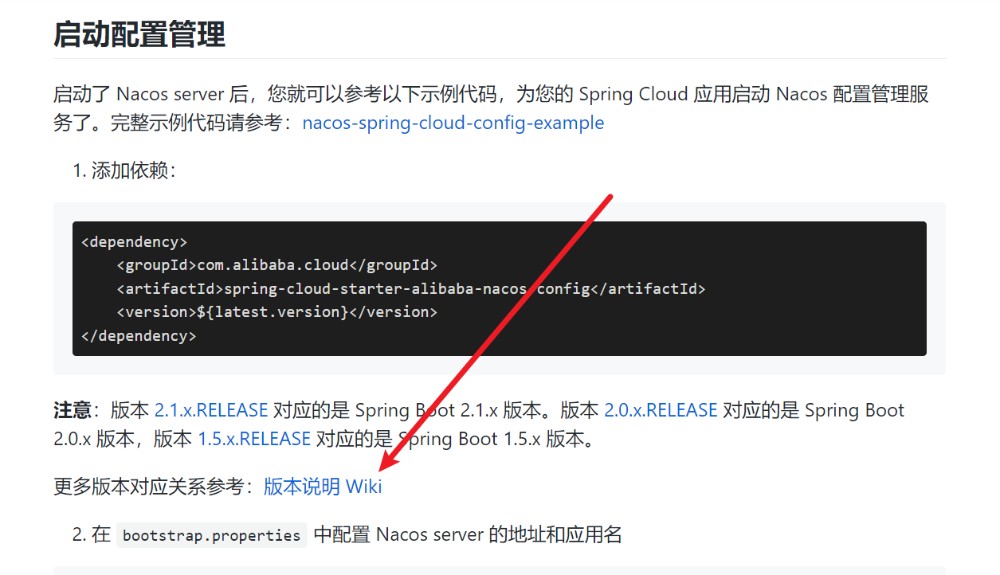
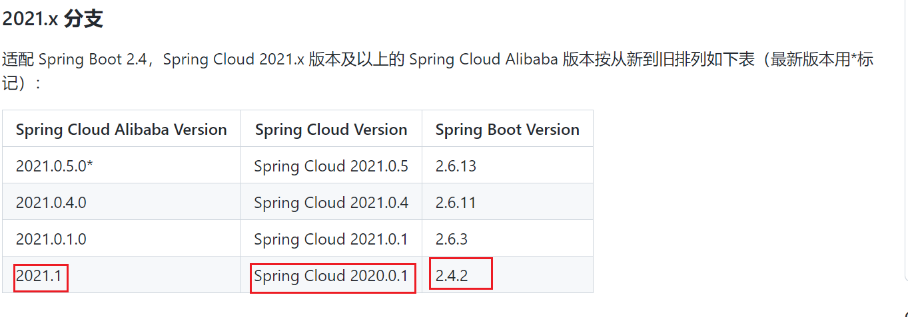
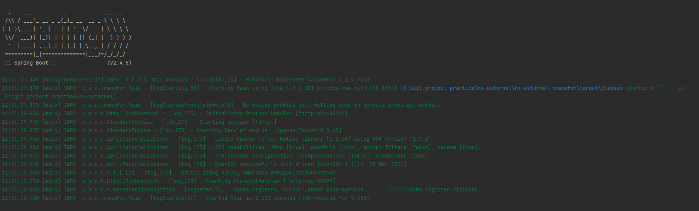

1、Nacos的版本与springboot和spring cloud版本不兼容，导致程序出错。

```
(1)Spring Boot版本:2.4.5
(2)Spring版本: 5.3.26
(3)Spring Cloud版本: 2.1.6
(4)Spring Cloud Alibaba版本: 2.1.6
(5)nacos: 1.1.1
```

```xml
<?xml version="1.0" encoding="UTF-8"?>
<project xmlns="http://maven.apache.org/POM/4.0.0"
         xmlns:xsi="http://www.w3.org/2001/XMLSchema-instance"
         xsi:schemaLocation="http://maven.apache.org/POM/4.0.0 http://maven.apache.org/xsd/maven-4.0.0.xsd">
    <parent>
        <groupId>org.springframework.boot</groupId>
        <artifactId>spring-boot-starter-parent</artifactId>
        <version>2.4.5</version>
        <relativePath/> <!-- lookup parent from repository -->
    </parent>
    <modelVersion>4.0.0</modelVersion>

    <artifactId>nx-external-demo</artifactId>
    <version>1.0.0</version>
    <name>nx-external-demo</name>
    <description>nx-external-demo</description>

    <properties>
        <java.version>1.8</java.version>
        <spring-cloud.version>Greenwich.SR2</spring-cloud.version>
        <fastjson.version>1.2.83</fastjson.version>
        <cn.hutool.version>5.6.7</cn.hutool.version>
        <log4j.version>2.18.0</log4j.version>
        <spring-framework.version>5.3.26</spring-framework.version>
    </properties>

    <dependencies>
        <dependency>
            <groupId>com.alibaba.cloud</groupId>
            <artifactId>spring-cloud-starter-alibaba-nacos-discovery</artifactId>
        </dependency>
        <dependency>
            <groupId>org.springframework.boot</groupId>
            <artifactId>spring-boot-starter-actuator</artifactId>
        </dependency>

        <dependency>
            <groupId>org.springframework.boot</groupId>
            <artifactId>spring-boot-starter-web</artifactId>
        </dependency>
        <dependency>
            <groupId>org.springframework.boot</groupId>
            <artifactId>spring-boot-starter-test</artifactId>
            <scope>test</scope>
        </dependency>
        <dependency>
            <groupId>org.projectlombok</groupId>
            <artifactId>lombok</artifactId>
            <version>1.18.20</version>
        </dependency>


        <dependency>
            <groupId>org.springframework.boot</groupId>
            <artifactId>spring-boot-starter-validation</artifactId>
        </dependency>
        <!-- https://mvnrepository.com/artifact/commons-beanutils/commons-beanutils -->
        <dependency>
            <groupId>commons-beanutils</groupId>
            <artifactId>commons-beanutils</artifactId>
            <version>1.9.4</version>
        </dependency>

        <dependency>
            <groupId>com.alibaba</groupId>
            <artifactId>fastjson</artifactId>
            <version>${fastjson.version}</version>
        </dependency>

        <dependency>
            <groupId>org.apache.logging.log4j</groupId>
            <artifactId>log4j-to-slf4j</artifactId>
            <version>${log4j.version}</version>
        </dependency>
        <dependency>
            <groupId>org.apache.logging.log4j</groupId>
            <artifactId>log4j-api</artifactId>
            <version>${log4j.version}</version>
        </dependency>
        <dependency>
            <groupId>cn.hutool</groupId>
            <artifactId>hutool-all</artifactId>
            <version>${cn.hutool.version}</version>
        </dependency>
        <dependency>
            <groupId>org.apache.commons</groupId>
            <artifactId>commons-lang3</artifactId>
            <version>3.4</version>
        </dependency>

    </dependencies>

    <dependencyManagement>
        <dependencies>
            <dependency>
                <groupId>org.springframework.cloud</groupId>
                <artifactId>spring-cloud-dependencies</artifactId>
                <version>${spring-cloud.version}</version>
                <type>pom</type>
                <scope>import</scope>
            </dependency>
            <dependency>
                <groupId>com.alibaba.cloud</groupId>
                <artifactId>spring-cloud-alibaba-dependencies</artifactId>
                <version>2.1.0.RELEASE</version>
                <type>pom</type>
                <scope>import</scope>
            </dependency>
        </dependencies>
    </dependencyManagement>

    <build>
        <finalName>${project.name}</finalName>
        <plugins>
            <plugin>
                <groupId>org.springframework.boot</groupId>
                <artifactId>spring-boot-maven-plugin</artifactId>
            </plugin>

            <!-- 拷贝依赖jar包到target/lib -->
            <plugin>
                <groupId>org.apache.maven.plugins</groupId>
                <artifactId>maven-dependency-plugin</artifactId>
                <executions>
                    <execution>
                        <id>copy-dependencies</id>
                        <phase>package</phase>
                        <goals>
                            <goal>copy-dependencies</goal>
                        </goals>
                        <configuration>
                            <type>jar</type>
                            <includeTypes>jar</includeTypes>
                            <includeScope>runtime</includeScope>
                            <outputDirectory>
                                ${project.build.directory}/lib
                            </outputDirectory>
                        </configuration>
                    </execution>
                </executions>
            </plugin>
        </plugins>
        <!--资源插件： 处理src/main/java目录中的xml-->
        <resources>
            <resource>
                <directory>src/main/resources</directory><!--所在的目录-->
                <includes><!--包括目录下的.properties,.xml 文件都会扫描到-->
                    <include>**/*.yml</include>
                    <include>**/*.properties</include>
                    <include>**/*.xml</include>
                </includes>
                <filtering>false</filtering>
                <targetPath>${project.build.directory}/config</targetPath>
            </resource>
            <resource>
                <directory>src/main/java</directory><!--所在的目录-->
                <includes><!--包括目录下的.properties,.xml 文件都会扫描到-->
                    <include>**/*.properties</include>
                    <include>**/*.xml</include>
                </includes>
                <filtering>false</filtering>
            </resource>
            <resource>
                <directory>src/main/resources</directory><!--所在的目录-->
                <includes><!--包括目录下的.properties,.xml 文件都会扫描到-->
                    <include>**/*.yml</include>
                    <include>**/*.properties</include>
                    <include>**/*.xml</include>
                </includes>
                <filtering>false</filtering>
            </resource>
        </resources>
    </build>

</project>
```

2、程序运行后报错



报这个错主要是spring boot和nacos的版本不兼容导致。

参考博文：https://blog.csdn.net/qq_40720821/article/details/124707978


3、解决方案：

在nacos官网查找与spring boot 2.4.5相对应的版本。

（1）nacos官网: https://nacos.io/zh-cn/index.html



(2)



(3)查看版本说明,链接直达：https://nacos.io/zh-cn/docs/quick-start-spring-cloud.html



（4）版本说明：

https://github.com/alibaba/spring-cloud-alibaba/wiki/%E7%89%88%E6%9C%AC%E8%AF%B4%E6%98%8E



```xml
<?xml version="1.0" encoding="UTF-8"?>
<project xmlns="http://maven.apache.org/POM/4.0.0"
         xmlns:xsi="http://www.w3.org/2001/XMLSchema-instance"
         xsi:schemaLocation="http://maven.apache.org/POM/4.0.0 http://maven.apache.org/xsd/maven-4.0.0.xsd">
    <parent>
        <groupId>org.springframework.boot</groupId>
        <artifactId>spring-boot-starter-parent</artifactId>
        <version>2.4.5</version>
        <relativePath/> <!-- lookup parent from repository -->
    </parent>
    <modelVersion>4.0.0</modelVersion>

    <artifactId>nx-external-demo</artifactId>
    <version>1.0.0</version>
    <name>nx-external-demo</name>
    <description>nx-external-demo</description>

    <properties>
        <java.version>1.8</java.version>
        <fastjson.version>1.2.83</fastjson.version>
        <cn.hutool.version>5.6.7</cn.hutool.version>
        <log4j.version>2.18.0</log4j.version>
        <spring-framework.version>5.3.26</spring-framework.version>
    </properties>

    <dependencies>
        <!--        <dependency>-->
        <!--            <groupId>com.alibaba.cloud</groupId>-->
        <!--            <artifactId>spring-cloud-starter-alibaba-nacos-discovery</artifactId>-->
        <!--        </dependency>-->
        <dependency>
            <groupId>com.alibaba.cloud</groupId>
            <artifactId>spring-cloud-starter-alibaba-nacos-discovery</artifactId>
            <version>2021.1</version>
        </dependency>

        <dependency>
            <groupId>com.alibaba.cloud</groupId>
            <artifactId>spring-cloud-starter-alibaba-nacos-config</artifactId>
            <version>2021.1</version>
        </dependency>
        <dependency>
            <groupId>org.springframework.boot</groupId>
            <artifactId>spring-boot-starter-actuator</artifactId>
        </dependency>

        <dependency>
            <groupId>org.springframework.boot</groupId>
            <artifactId>spring-boot-starter-web</artifactId>
        </dependency>
        <dependency>
            <groupId>org.springframework.boot</groupId>
            <artifactId>spring-boot-starter-test</artifactId>
            <scope>test</scope>
        </dependency>
        <dependency>
            <groupId>org.projectlombok</groupId>
            <artifactId>lombok</artifactId>
            <version>1.18.20</version>
        </dependency>
        <dependency>
            <groupId>org.springframework.boot</groupId>
            <artifactId>spring-boot-starter-validation</artifactId>
        </dependency>
        <dependency>
            <groupId>commons-beanutils</groupId>
            <artifactId>commons-beanutils</artifactId>
            <version>1.9.4</version>
        </dependency>

        <dependency>
            <groupId>com.alibaba</groupId>
            <artifactId>fastjson</artifactId>
            <version>${fastjson.version}</version>
        </dependency>

        <dependency>
            <groupId>org.apache.logging.log4j</groupId>
            <artifactId>log4j-to-slf4j</artifactId>
            <version>${log4j.version}</version>
        </dependency>
        <dependency>
            <groupId>org.apache.logging.log4j</groupId>
            <artifactId>log4j-api</artifactId>
            <version>${log4j.version}</version>
        </dependency>
        <dependency>
            <groupId>cn.hutool</groupId>
            <artifactId>hutool-all</artifactId>
            <version>${cn.hutool.version}</version>
        </dependency>
        <dependency>
            <groupId>org.apache.commons</groupId>
            <artifactId>commons-lang3</artifactId>
            <version>3.4</version>
        </dependency>

    </dependencies>

    <dependencyManagement>
        <dependencies>
            <dependency>
                <groupId>org.springframework.cloud</groupId>
                <artifactId>spring-cloud-dependencies</artifactId>
                <version>2020.0.1</version>
                <type>pom</type>
                <scope>import</scope>
            </dependency>
            <dependency>
                <groupId>com.alibaba.cloud</groupId>
                <artifactId>spring-cloud-alibaba-dependencies</artifactId>
                <version>2021.1</version>
                <type>pom</type>
                <scope>import</scope>
            </dependency>
        </dependencies>
    </dependencyManagement>

    <build>
        <finalName>${project.name}</finalName>
        <plugins>
            <plugin>
                <groupId>org.springframework.boot</groupId>
                <artifactId>spring-boot-maven-plugin</artifactId>
            </plugin>

            <!-- 拷贝依赖jar包到target/lib -->
            <plugin>
                <groupId>org.apache.maven.plugins</groupId>
                <artifactId>maven-dependency-plugin</artifactId>
                <executions>
                    <execution>
                        <id>copy-dependencies</id>
                        <phase>package</phase>
                        <goals>
                            <goal>copy-dependencies</goal>
                        </goals>
                        <configuration>
                            <type>jar</type>
                            <includeTypes>jar</includeTypes>
                            <includeScope>runtime</includeScope>
                            <outputDirectory>
                                ${project.build.directory}/lib
                            </outputDirectory>
                        </configuration>
                    </execution>
                </executions>
            </plugin>
        </plugins>
        <!--资源插件： 处理src/main/java目录中的xml-->
        <resources>
            <resource>
                <directory>src/main/resources</directory><!--所在的目录-->
                <includes><!--包括目录下的.properties,.xml 文件都会扫描到-->
                    <include>**/*.yml</include>
                    <include>**/*.properties</include>
                    <include>**/*.xml</include>
                </includes>
                <filtering>false</filtering>
                <targetPath>${project.build.directory}/config</targetPath>
            </resource>
            <resource>
                <directory>src/main/java</directory><!--所在的目录-->
                <includes><!--包括目录下的.properties,.xml 文件都会扫描到-->
                    <include>**/*.properties</include>
                    <include>**/*.xml</include>
                </includes>
                <filtering>false</filtering>
            </resource>
            <resource>
                <directory>src/main/resources</directory><!--所在的目录-->
                <includes><!--包括目录下的.properties,.xml 文件都会扫描到-->
                    <include>**/*.yml</include>
                    <include>**/*.properties</include>
                    <include>**/*.xml</include>
                </includes>
                <filtering>false</filtering>
            </resource>
        </resources>
    </build>
</project>
```

运行成功展示：




