#### nacos注册中心

[Nacos](https://nacos.io/)是阿里巴巴的产品，现在已经被集成到[SpringCloud](https://spring.io/projects/spring-cloud)中，成为了springcloud的一个组件。相比[Eureka](https://github.com/Netflix/eureka)功能更加丰富，在国内受欢迎程度较高。Nacos是SpringCloudAlibaba的组件，而SpringCloudAlibaba也遵循SpringCloud中定义的服务注册、服务发现规范。因此使用Nacos和使用Eureka对于微服务来说，并没有太大区别。


##### nacos服务注册与发现

pom.xml

```xml
<!--            nacos管理依赖-->
            <dependency>
                <groupId>com.alibaba.cloud</groupId>
                <artifactId>spring-cloud-alibaba-dependencies</artifactId>
                <version>2.2.6.RELEASE</version>
                <type>pom</type>
                <scope>import</scope>
            </dependency>
            
        <!--        nacos客户端依赖-->
        <dependency>
            <groupId>com.alibaba.cloud</groupId>
            <artifactId>spring-cloud-starter-alibaba-nacos-discovery</artifactId>
        </dependency>
```

nacos连接配置

```yaml
spring:
  #nacos连接配置
  application:
    name: user-service
  cloud:
    nacos:
      server-addr: localhost:8848
```

启动服务,order-service和user-service都注册到了配置中心

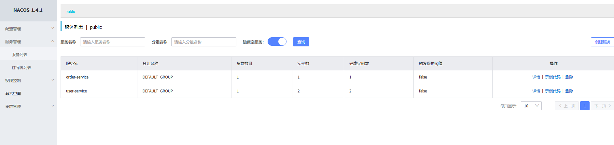

请求order-service接口

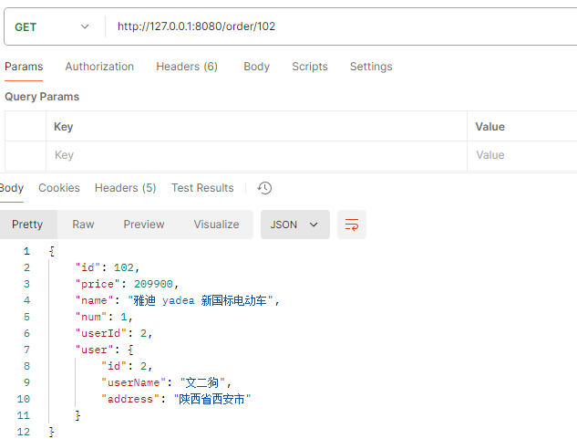

order-service实现中，从nacos的配置中心获取到了user-service的信息。实现与服务的发现功能。

```java
    public Order queryOrderById(Long orderId) {
        Order order = orderMapper.findById(orderId);

        Long userId = order.getUserId();
        String port = "8081";
//        String url = "http://127.0.0.1:" + port + "/user/" + userId;
        //从注册中心里拿
        String url ="http://user-service/user/"+userId;
        //开始远程调用
        User resultUser = restTemplate.getForObject(url, User.class);
        order.setUser(resultUser);

        return order;
    }
```


##### nacos服务分级存储模型

| 级别 | 名称                     |
| ---- | ------------------------ |
| 一级 | 服务(user-service)       |
| 二级 | 集群(HZ、SH......)       |
| 三级 | 实例(部署了服务的服务器) |

nacos将同一机房内的实例划分为一个集群。

1.配置集群

```yaml
spring:
  cloud:
    nacos:
      server-addr: localhost:8848
      discovery:
        cluster-name: HZ # 集群名称
```

启动user-service两次(8081、8082)

可以看到HZ的两个集群实例已经存在。

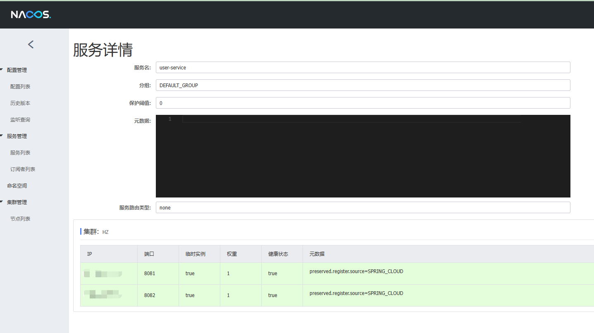

修改user-service的集群配置

```yaml
spring:
  cloud:
    nacos:
      server-addr: localhost:8848
      discovery:
        cluster-name: SH # 集群名称
```

拷贝启动项配置

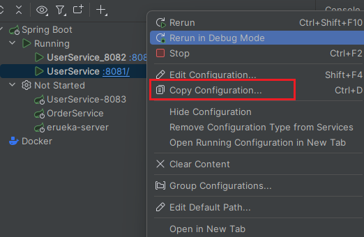

修改启动项名称-->modify options--->add vm options,并添加相关启动配置

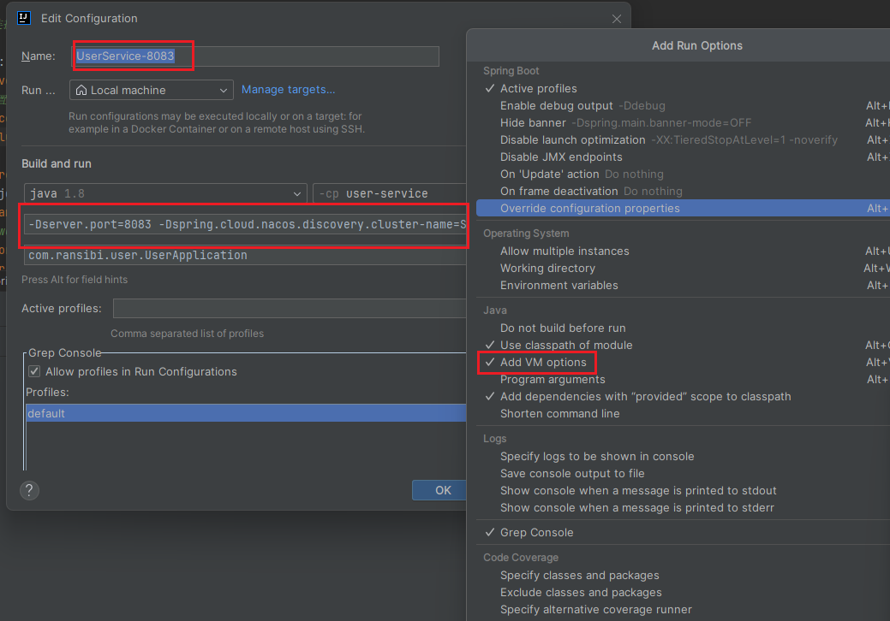

```
-Dserver.port=8083 
-Dspring.cloud.nacos.discovery.cluster-name=SH
```

启动8083

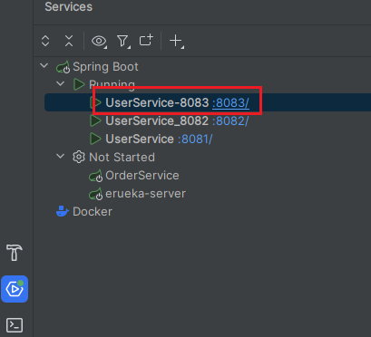

nacos中出现了两个集群HZ和SH

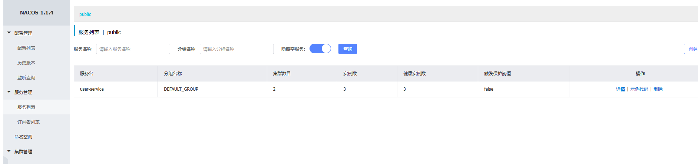

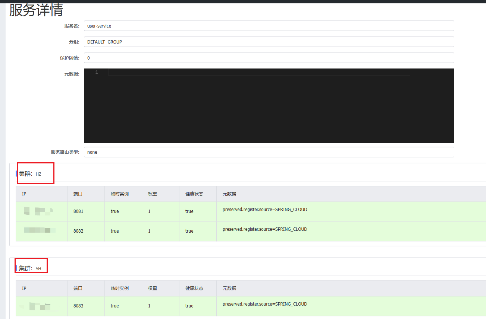

##### nacos相同集群优先的负载均衡

nacos默认是走轮询的负载均衡，如果想实现同集群优先的情况，必须进行负载均衡的配置。

修改order-service的ribbon负载均衡规则，然后启动

```yaml
  #nacos连接配置
  cloud:
    nacos:
      server-addr: localhost:8848
      #配置集群
      discovery:
        cluster-name: HZ # 集群名称
```


```yaml
#ribbon负责均衡规则配置
userservice:
  ribbon:
    NFLoadBalancerRuleClassName: com.alibaba.cloud.nacos.ribbon.NacosRule # 负载均衡规则,同集群优先规则
```

##### nacos权重配置

服务器设备性能有差异，部分实例所在机器性能较好，另一些较差，希望性能好的机器承担更多的用户请求。默认情况下NacosRule是同集群内随机挑选，不会考虑机器的性能问题。因此，Nacos提供了权重配置来控制访问频率，权重越大则访问频率越高。

在nacos控制台，找到user-service的实例列表，点击编辑，即可修改权重，如果权重修改为0，则该实例永远不会被访问。(可以实现程序平滑升级)

在弹出的编辑窗口，修改权重：

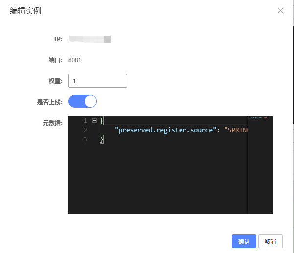

##### nacos环境隔离

每个命名空间相关隔离

新增一个dev命名空间，并修改order-service的nacos连接配置

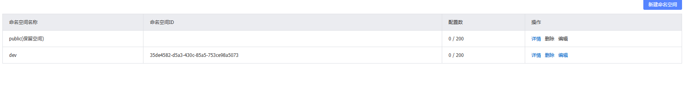

```yaml
spring:
  application:
    name: order-service
    
  #nacos连接配置
  cloud:
    nacos:
      server-addr: localhost:8848
      #配置集群
      discovery:
        cluster-name: HZ # 集群名称
        #nacos命名空间
        namespace: 35de4582-d5a3-430c-85a5-753ce98a5073
```

请求user-service服务会报错，因为user-service服务不在dev命名空间中。

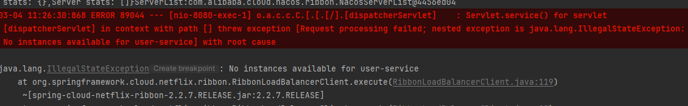


#### Erueka和Nacos的区别

| **特性**       | **Nacos**                                                | **Eureka**                                                  |
| :------------- | :------------------------------------------------------- | :---------------------------------------------------------- |
| **服务发现**   | 支持服务注册与发现，提供健康检查机制。                   | 支持服务注册与发现，提供健康检查机制。                      |
| **配置管理**   | 提供动态配置管理功能，支持配置的发布、更新和监听。       | 不提供配置管理功能，需结合 Spring Cloud Config 等工具使用。 |
| **健康检查**   | 支持多种健康检查方式（如 TCP、HTTP、MySQL 等）。         | 主要依赖客户端心跳机制进行健康检查。                        |
| **多语言支持** | 支持多种语言（如 Java、Go、Python 等），适合异构系统。   | 主要针对 Java 生态，依赖 Spring Cloud 生态。                |
| **一致性协议** | 支持 AP（高可用）和 CP（强一致性）模式，可根据场景切换。 | 仅支持 AP 模式，强调高可用性。                              |
| **服务元数据** | 支持丰富的服务元数据配置。                               | 支持基本的服务元数据配置。                                  |
| **集群模式**   | 支持集群部署，具备较强的扩展性。                         | 支持集群部署，但扩展性较弱。                                |
| **社区生态**   | 由阿里巴巴开源，社区活跃，文档丰富。                     | 由 Netflix 开源，目前已停止维护，社区活跃度较低。           |


nacos配置实例为永久实例

```yaml
spring:
  cloud:
    nacos:
      discovery:
        ephemeral: false # 设置为非临时实例
```

#### nacos配置管理

##### 统一配置管理

Nacos可以将配置集中管理，还可以在配置变更时，及时通知微服务，实现配置的热更新。

1.在nacos中添加配置文件

在配置列表中进行配置的新增(需要进行热更新的配置，交给nacos进行管理，不会变的配置使用本地的配置)

```
data id: user-service-dev.yaml
```

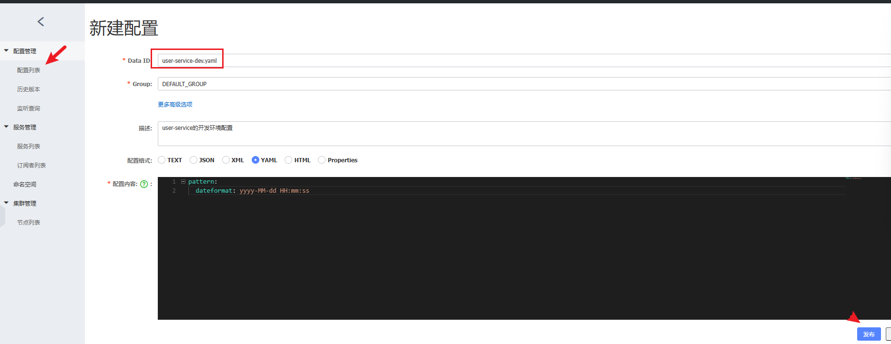

2.从微服务拉取配置

nacos配置管理依赖

```xml
<dependency>
    <groupId>com.alibaba.cloud</groupId>
    <artifactId>spring-cloud-starter-alibaba-nacos-config</artifactId>
</dependency>
```

spring引入了一种新的配置文件：bootstrap.yaml文件，会在application.yml之前被读取。增加bootstrap.yaml配置文件

```yaml
spring:
  application:
    name: user-service # 服务名称
  profiles:
    active: dev #开发环境，这里是dev 
  cloud:
    nacos:
      server-addr: localhost:8848 # Nacos地址
      config:
        file-extension: yaml # 文件后缀名
```

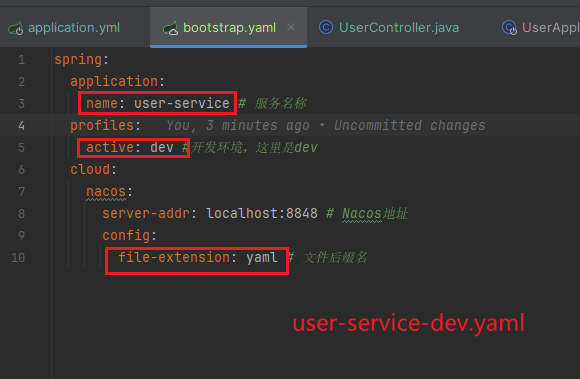

3.读取nacos配置

```java
    @Value("${pattern.dateformat}")
    private String dateFormat;
    
    @GetMapping("/nowTime")
    public String getNowTime() {
        SimpleDateFormat dateFormat1 = new SimpleDateFormat(dateFormat);
        return dateFormat1.format(new Date());
    }
```

请求

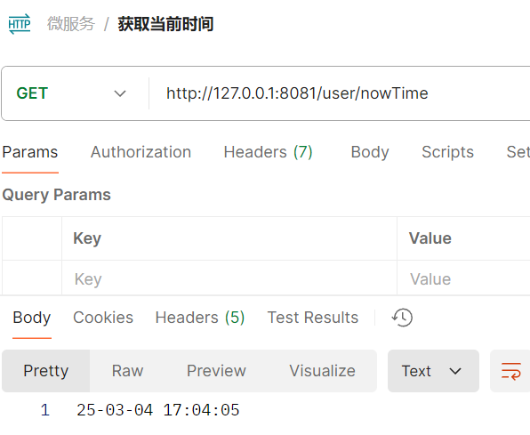

##### 配置热更新

修改nacos中配置后，微服务无需重启即可让配置生效，实现配置的热更新。

（1）方式一

在微服务使用@Value读取配置的类上添加类注解: @RefreshScope 实现配置刷新

```java
@Slf4j
@RestController
@RequestMapping("/user")
@RefreshScope
public class UserController {

    @Value("${pattern.dateformat}")
    private String dateFormat;

    @GetMapping("/nowTime")
    public String getNowTime() {
        SimpleDateFormat dateFormat1 = new SimpleDateFormat(dateFormat);
        return dateFormat1.format(new Date());
    }
}

```

（2）方式二

使用@ConfigurationProperties注解去获取配置

```java
@Component
@Data
@ConfigurationProperties(prefix = "pattern")
public class PatternProperties {
    private String dateFormat;
}
```

```java
    @Autowired
    private PatternProperties patternProperties;

    @GetMapping("/nowTime")
    public String getNowTime() {
        SimpleDateFormat dateFormat1 = new SimpleDateFormat(patternProperties.getDateFormat());
        return dateFormat1.format(new Date());
    }
```


##### 多环境配置共享

微服务启动时，会去nacos读取多个配置文件，例如：

```
[spring.application.name]-[spring.profiles.active].yaml，例如：user-service-dev.yaml

[spring.application.name].yaml，例如：user-service.yaml
```

而`[spring.application.name].yaml`不包含环境，因此可以被多个环境共享。

nacos中新增user-service.yaml配置

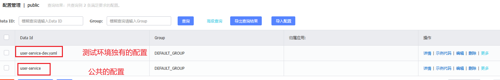

配置优先级

```
nacos中的环境配置优先于本地配置。
nacos中的环境配置，服务名+profile(环境).yaml配置 优先于 服务名称.yaml的配置(共享环境的配置)
```

