## 一、redis学习

### 1、redis官网 : https://redis.io/

Redis诞生于2009年全称是**Remote** **Di**ctionary **S**erver，远程词典服务器，是一个基于内存的键值型NoSQL数据库。

```
特点:
(1)键值（key-value）型，value支持多种不同数据结构，功能丰富
(2)单线程，每个命令具备原子性
(3)低延迟，速度快（基于内存、IO多路复用、良好的编码）。
(4)支持数据持久化
(5)支持主从集群、分片集群
(6)支持多语言客户端

```


### redis安装参考教程:

 https://blog.csdn.net/weixin_46560589/article/details/126691504

### 2、redis通用命令

[https://redis.io/commands ](https://redis.io/commands)


### 3、redis的java客户端

https://redis.io/clients

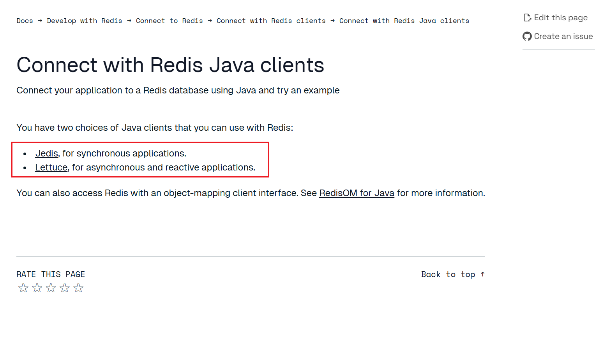

#### Jedis介绍

(1)官网: https://github.com/redis/jedis

(2)实例：

引入jedis依赖

```xml
    <dependencies>
        <!--引入jedis依赖-->
        <dependency>
            <groupId>redis.clients</groupId>
            <artifactId>jedis</artifactId>
            <version>5.0.0</version>
        </dependency>
        <!--引入单元测试依赖-->
        <dependency>
            <groupId>org.junit.jupiter</groupId>
            <artifactId>junit-jupiter</artifactId>
            <version>5.7.0</version>
            <scope>test</scope>
        </dependency>

    </dependencies>
```

创建测试类

```java
package com.ransibi;

import org.junit.jupiter.api.AfterEach;
import org.junit.jupiter.api.BeforeEach;
import org.junit.jupiter.api.Test;

public class Jedis {
   private redis.clients.jedis.Jedis jedis;

    @BeforeEach
    void setUp() {
        //连接信息按实际情况编写
        jedis = new redis.clients.jedis.Jedis("*****",6379);
        jedis.auth("****");
        jedis.select(0);
    }

    @Test
    void testRedis(){
        String name = jedis.set("name", "小冉");
        System.out.println("name: "+name);
        String name1 = jedis.get("name");
        System.out.println("name1: "+name1);
    }

    @AfterEach
    void tearDown(){
        if (jedis != null){
            jedis.close();
        }
    }
}
```

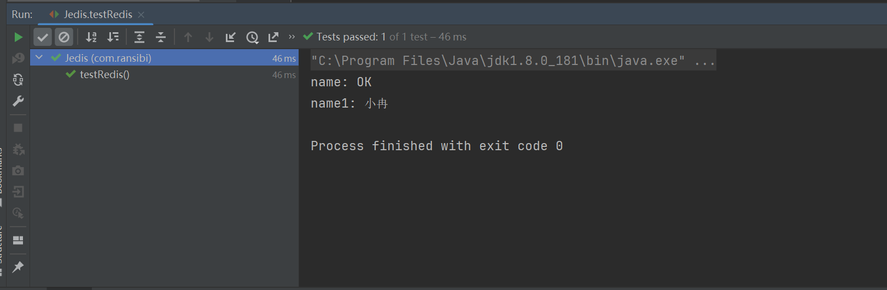

插入hash数据

```java
    @Test
    void operateHash(){
        jedis.hset("mode:data","name","xiaozhang");
        jedis.hset("mode:data","age","26");
        Map<String, String> stringStringMap = jedis.hgetAll("mode:data");
        System.out.println("stringStringMap:"+stringStringMap);

    }
```

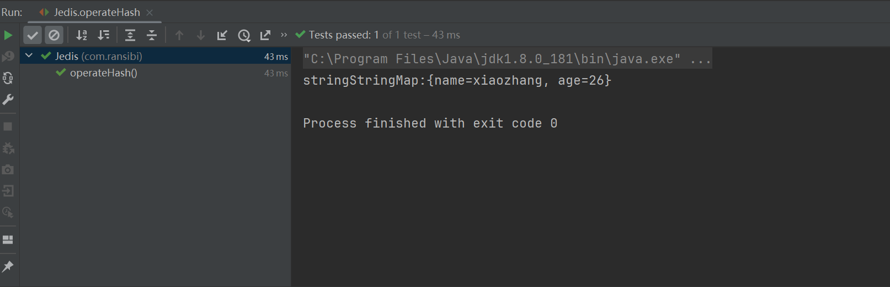

(3)jedis连接池

​        Jedis本身是线程不安全的，并且频繁的创建和销毁连接会有性能损耗，所以需要使用Jedis连接池代替Jedis的直连方式。

创建jedis的连接工厂工具类

```java
package com.ransibi.util;

import redis.clients.jedis.Jedis;
import redis.clients.jedis.JedisPool;
import redis.clients.jedis.JedisPoolConfig;


public class JedisConnectionFactory {
    private static final JedisPool jedisPool;

    static {
        //配置连接池
        JedisPoolConfig jedisPoolConfig = new JedisPoolConfig();
        jedisPoolConfig.setMaxTotal(8);
        jedisPoolConfig.setMaxIdle(8);
        jedisPoolConfig.setMinIdle(0);
        jedisPoolConfig.setMaxWaitMillis(1000);
        //创建连接池对象
        jedisPool = new JedisPool(jedisPoolConfig, "ip***", 6379, 1000, "password****");

    }
    public static Jedis getJedis(){
        return jedisPool.getResource();
    }
}
```

使用

```java
    @BeforeEach
    void setUp() {
        jedis = JedisConnectionFactory.getJedis();

        jedis.auth("rsb0925");

        jedis.select(0);
    }

    @Test
    void testRedis(){
        String name = jedis.set("name", "小冉");
        System.out.println("name: "+name);
        String name1 = jedis.get("name");
        System.out.println("name1: "+name1);
    }
```


### 4、SpringDataRedis

SpringData是Spring中数据操作的模块，包含对各种数据库的集成，其中对Redis的集成模块就叫做SpringDataRedis.

(1)官网: https://spring.io/projects/spring-data-redis

```
特点；
提供了对不同Redis客户端的整合（Lettuce和Jedis）
提供了RedisTemplate统一API来操作Redis
支持Redis的发布订阅模型
支持Redis哨兵和Redis集群
支持基于Lettuce的响应式编程
支持基于JDK、JSON、字符串、Spring对象的数据序列化及反序列化
支持基于Redis的JDKCollection实现

```

(2)SpringDataRedis中提供了RedisTemplate工具类，其中封装了各种对Redis的操作。并且将不同数据类型的操作API封装到了不同的类型中

| **API**                         | **返回值类型**  | **说明**              |
| ------------------------------- | --------------- | --------------------- |
| **redisTemplate**.opsForValue() | ValueOperations | 操作String类型数据    |
| **redisTemplate**.opsForHash()  | HashOperations  | 操作Hash类型数据      |
| **redisTemplate**.opsForList()  | ListOperations  | 操作List类型数据      |
| **redisTemplate**.opsForSet()   | SetOperations   | 操作Set类型数据       |
| **redisTemplate**.opsForZSet()  | ZSetOperations  | 操作SortedSet类型数据 |
| **redisTemplate**               |                 | 通用的命令            |

### 5、SpringBoot集成SpringDataRedis

#### (1)依赖引入

```xml
<?xml version="1.0" encoding="UTF-8"?>
<project xmlns="http://maven.apache.org/POM/4.0.0"
         xmlns:xsi="http://www.w3.org/2001/XMLSchema-instance"
         xsi:schemaLocation="http://maven.apache.org/POM/4.0.0 http://maven.apache.org/xsd/maven-4.0.0.xsd">

    <parent>
        <artifactId>spring-boot-dependencies</artifactId>
        <groupId>org.springframework.boot</groupId>
        <version>2.4.5</version>
    </parent>

    <modelVersion>4.0.0</modelVersion>

    <groupId>com.ransibi</groupId>
    <artifactId>SpringBoot_Redis_Demo</artifactId>
    <version>1.0-SNAPSHOT</version>

    <!--统一编码和JAVA版本-->
    <properties>
        <project.build.sourceEncoding>UTF-8</project.build.sourceEncoding>
        <maven.compiler.source>1.8</maven.compiler.source>
        <maven.compiler.target>1.8</maven.compiler.target>
        <java.version>1.8</java.version>
    </properties>

    <dependencies>
        <!--Spring Boot Web-->
        <dependency>
            <groupId>org.springframework.boot</groupId>
            <artifactId>spring-boot-starter-web</artifactId>
        </dependency>
        <dependency>
            <groupId>org.springframework.boot</groupId>
            <artifactId>spring-boot-starter-data-redis</artifactId>
        </dependency>
        <dependency>
            <groupId>org.apache.commons</groupId>
            <artifactId>commons-pool2</artifactId>
        </dependency>
        <dependency>
            <groupId>com.alibaba</groupId>
            <artifactId>fastjson</artifactId>
            <version>1.2.78</version>
        </dependency>
        <!--LomBok-->
        <dependency>
            <groupId>org.projectlombok</groupId>
            <artifactId>lombok</artifactId>
            <version>1.18.32</version>
        </dependency>
        <dependency>
            <groupId>org.springframework.boot</groupId>
            <artifactId>spring-boot-starter-test</artifactId>
            <scope>test</scope>
        </dependency>

    </dependencies>

</project>
```


SpringBoot默认使用的是lettuce，如果需要使用jedis，需要再单独进行引入

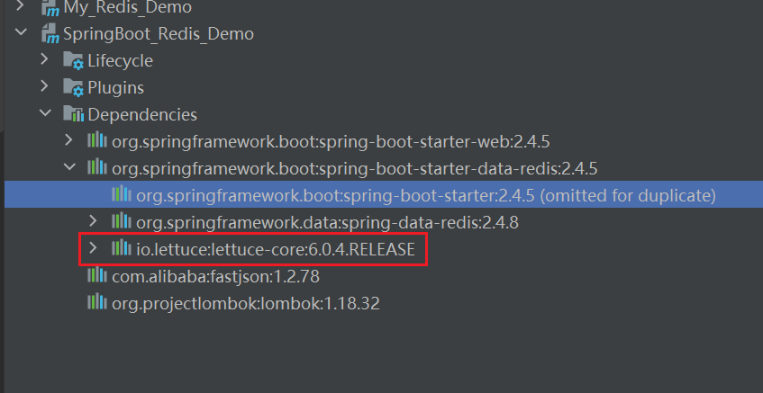


#### (2)application.yml配置

```yaml
spring:
  redis:
    host: 127.0.0.1
    port: 6379
    password: rsb0925
    lettuce:
      pool:
        max-active: 8
        max-idle: 8
        min-idle: 0
        max-wait: 1000ms
```


#### (3)测试类

```java
package com.ransibi;

import org.junit.jupiter.api.Test;
import org.springframework.beans.factory.annotation.Autowired;
import org.springframework.boot.test.context.SpringBootTest;
import org.springframework.data.redis.core.RedisTemplate;

@SpringBootTest
public class RedisDemoApplicationTests {
    @Autowired
    private RedisTemplate redisTemplate;

    @Test
    void testString() {
        //写入一条字符串数据
        redisTemplate.opsForValue().set("name", "xiaoran");
        //获取字符串数据
        Object name = redisTemplate.opsForValue().get("name");
        System.out.println("name: " + name);
    }
}
```

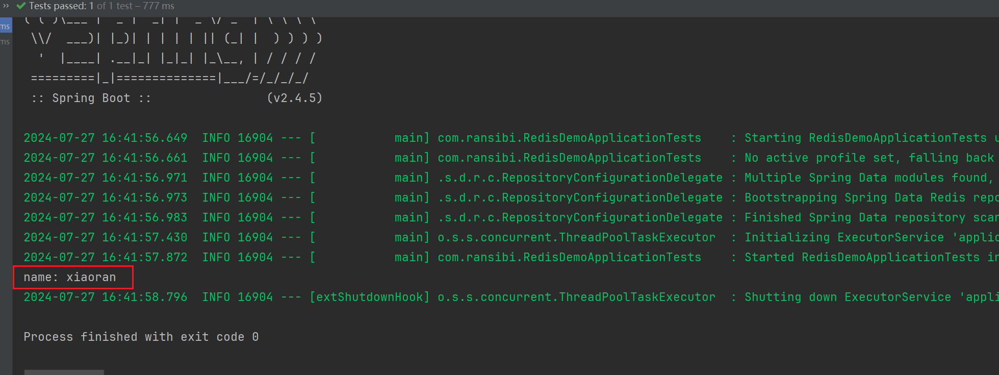

实际redis库里多个

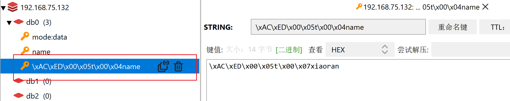

RedisTemplate可以接收任意Object作为值写入Redis，只不过写入前会把Object序列化为字节形式，默认是采用JDK序列化。它的可读性较差，占用内存较大。

#### (4)SpringDataRedis的使用步骤：

1.引入spring-boot-starter-data-redis依赖

2.在application.yml配置Redis信息

3.注入RedisTemplate


#### (5)自定义RedisTemplate的序列化方式

创建配置类RedisConfig

```java
package com.ransibi.config;

import org.springframework.context.annotation.Bean;
import org.springframework.context.annotation.Configuration;
import org.springframework.data.redis.connection.RedisConnectionFactory;
import org.springframework.data.redis.core.RedisTemplate;
import org.springframework.data.redis.serializer.GenericJackson2JsonRedisSerializer;
import org.springframework.data.redis.serializer.RedisSerializer;


@Configuration
public class RedisConfig {

    @Bean
    public RedisTemplate<String, Object> redisTemplate(RedisConnectionFactory redisConnectionFactory) {
        //创建RedisTemplate对象
        RedisTemplate<String, Object> template = new RedisTemplate<>();
        //设置连接工厂
        template.setConnectionFactory(redisConnectionFactory);
        //创建JSON序列化工具
        GenericJackson2JsonRedisSerializer jsonRedisSerializer = new GenericJackson2JsonRedisSerializer();
        //设置key的序列化
        template.setKeySerializer(RedisSerializer.string());
        template.setHashKeySerializer(RedisSerializer.string());
        //设置value的序列化
        template.setValueSerializer(jsonRedisSerializer);
        template.setHashValueSerializer(jsonRedisSerializer);

        return template;
    }
}
```

执行测试类

```java
package com.ransibi;

import org.junit.jupiter.api.Test;
import org.springframework.beans.factory.annotation.Autowired;
import org.springframework.boot.test.context.SpringBootTest;
import org.springframework.data.redis.core.RedisTemplate;

@SpringBootTest
public class RedisDemoApplicationTests {

    @Autowired
    private RedisTemplate<String,Object> redisTemplate;

    @Test
    void testString() {
        //写入一条字符串数据
        redisTemplate.opsForValue().set("name", "xiaoran");
        //获取字符串数据
        Object name = redisTemplate.opsForValue().get("name");
        System.out.println("name: " + name);
    }
}
```

原来的

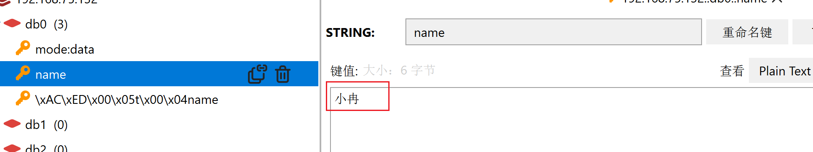

执行后覆盖

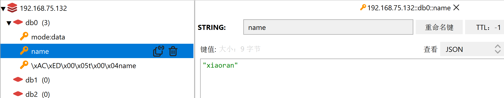


写入对象数据

```java
package com.ransibi.pojo;


import lombok.AllArgsConstructor;
import lombok.Data;
import lombok.NoArgsConstructor;

@Data
@NoArgsConstructor
@AllArgsConstructor
public class User {
    private String name;
    private Integer age;
}
```


```java
    @Test
    void testObject() {
        //自动对象序列化成json字符串
        redisTemplate.opsForValue().set("model:user", new User("zhangsan", 24));
        //自动反序列成User对象
        System.out.println("model:user====" + redisTemplate.opsForValue().get("model:user"));
    }
```

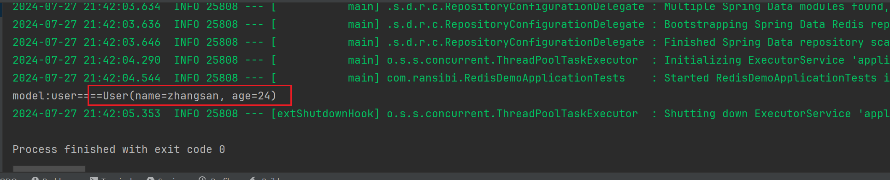

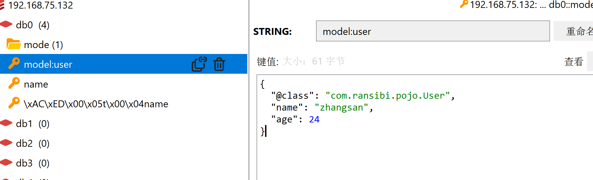

注意: 为了在反序列化时知道对象的类型，JSON序列化器会将类的class类型写入json结果中，存入Redis，会带来额外的内存开销。为了节省内存空间，我们并不会使用JSON序列化器来处理value，而是统一使用String序列化器，要求只能存储String类型的key和value。当需要存储Java对象时，手动完成对象的序列化和反序列化。

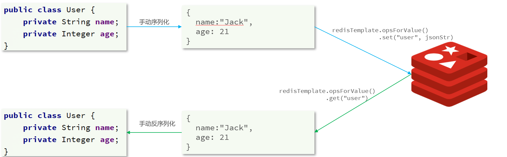

Spring默认提供了一个StringRedisTemplate类，它的key和value的序列化方式默认就是String方式:

```java
package com.ransibi;

import com.fasterxml.jackson.core.JsonProcessingException;
import com.fasterxml.jackson.databind.ObjectMapper;
import com.ransibi.pojo.User;
import org.junit.jupiter.api.Test;
import org.springframework.beans.factory.annotation.Autowired;
import org.springframework.boot.test.context.SpringBootTest;
import org.springframework.data.redis.core.StringRedisTemplate;

@SpringBootTest
public class RedisStringTest {
    @Autowired
    private StringRedisTemplate stringRedisTemplate;


    @Test
    void testString() {
        //写入一条字符串数据
        stringRedisTemplate.opsForValue().set("name", "xiaoran");
        //获取字符串数据
        Object name = stringRedisTemplate.opsForValue().get("name");
        System.out.println("name: " + name);
    }

    private static final ObjectMapper mapper = new ObjectMapper();

    @Test
    void testObject() throws JsonProcessingException {
        User user = new User("zhangsan", 24);
        //手动序列化
        String json = mapper.writeValueAsString(user);
        //自动对象序列化成json字符串
        stringRedisTemplate.opsForValue().set("model:user", json);
        //获取数据
        String jsonUser = stringRedisTemplate.opsForValue().get("model:user");
        //手动反序列成User对象
        User user1 = mapper.readValue(jsonUser, User.class);
        System.out.println("model:user====" + user1);
    }
}
```

存入redis结构

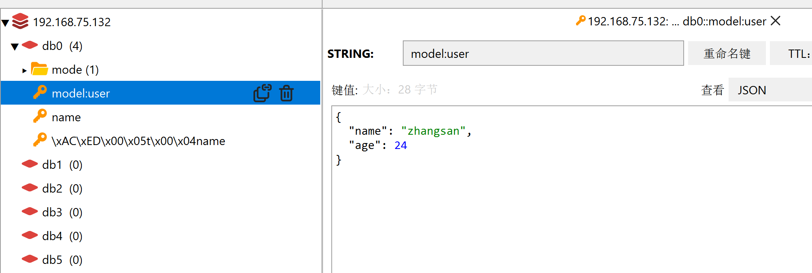

存入hash结构数据

```java
    @Test
    void testHash() {
        stringRedisTemplate.opsForHash().put("model:data1", "name", "xiaoli");
        stringRedisTemplate.opsForHash().put("model:data1", "age", "22");
        //获取key下所有的数据
        Map<Object, Object> entries = stringRedisTemplate.opsForHash().entries("model:data1");
        System.out.println("===entries===" + entries);
    }
```

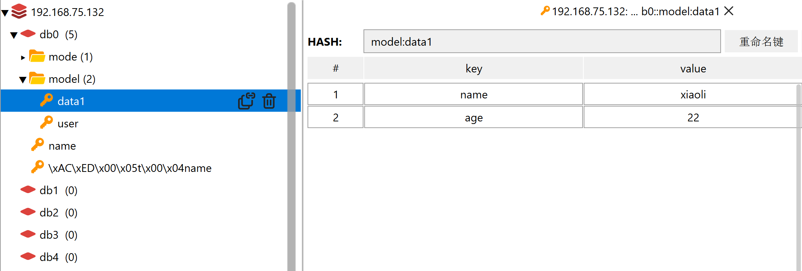


#### (6)RedisTemplate的两种序列化实践方案：

方案一：

1.自定义RedisTemplate

2.修改RedisTemplate的序列化器为GenericJackson2JsonRedisSerializer

方案二：

1.使用StringRedisTemplate

2.写入Redis时，手动把对象序列化为JSON

3.读取Redis时，手动把读取到的JSON反序列化为对象


#### 6、业务场景实战
