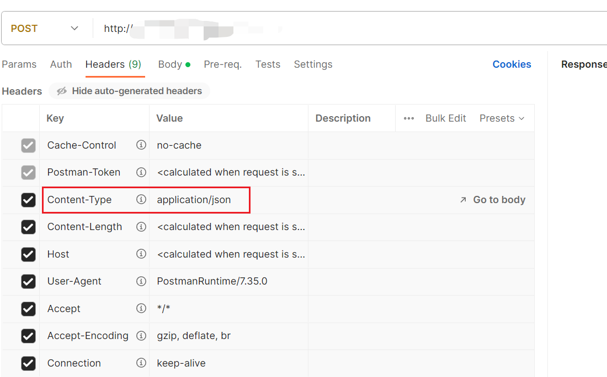
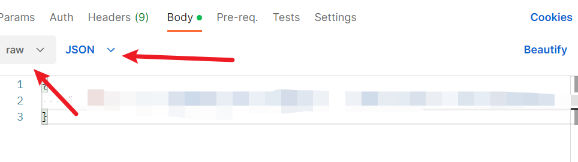
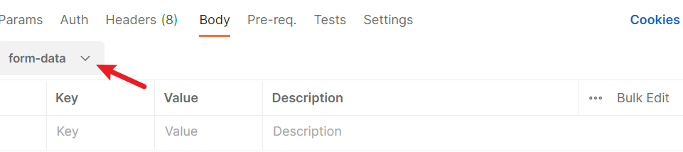

### 1、springboot拦截器概念

​       拦截器（[Interceptor](https://so.csdn.net/so/search?q=Interceptor&spm=1001.2101.3001.7020)）是一种特殊的组件，它可以在请求处理的过程中对请求和响应进行拦截和处理。拦截器可以在请求到达目标处理器之前、处理器处理请求之后以及视图渲染之前执行特定的操作。拦截器的主要目的是在不修改原有代码的情况下，实现对请求和响应的统一处理。

### 2、拦截器的应用场景

- 权限控制

  拦截器可以在请求到达处理器之前进行权限验证，从而实现对不同用户的访问控制

- 日志记录

  拦截器可以在请求处理过程中记录请求和响应的详细信息，便于后期分析和调试

- 接口幂等性校验

  拦截器可以在请求到达处理器之前进行幂等性校验，防止重复提交

- 数据校验

  拦截器可以在请求到达处理器之前对请求数据进行校验，确保数据的合法性

- 缓存处理

​       拦截器可以在请求处理之后对响应数据进行缓存，提高系统性能

### springboot中拦截器的实现

(1)实现HandlerInterceptor接口

```
preHandle：在请求到达处理器之前执行，可以用于权限验证、数据校验等操作。如果返回true，则继续执行后续操作；如果返回false，则中断请求处理。
postHandle：在处理器处理请求之后执行，可以用于日志记录、缓存处理等操作。
afterCompletion：在视图渲染之前执行，可以用于资源清理等操作。
```

```java
public class MyInterceptor implements HandlerInterceptor {

    @Override
    public boolean preHandle(HttpServletRequest request, HttpServletResponse response, Object handler) {
        System.out.println("preHandle: " + request.getRequestURI());
        return true;
    }

    @Override
    public void postHandle(HttpServletRequest request, HttpServletResponse response, Object handler, ModelAndView modelAndView) {
        System.out.println("postHandle: " + request.getRequestURI());
    }

    @Override
    public void afterCompletion(HttpServletRequest request, HttpServletResponse response, Object handler, Exception ex) {
        System.out.println("afterCompletion: " + request.getRequestURI());
    }
}
```

(2)注册拦截器到InterceptorRegistry

要让拦截器生效，需要将其注册到InterceptorRegistry中。这可以通过实现WebMvcConfigurer接口并重写addInterceptors方法来实现

```java
@Configuration
public class WebMvcConfig implements WebMvcConfigurer {

    @Override
    public void addInterceptors(InterceptorRegistry registry) {
        registry.addInterceptor(new MyInterceptor());
    }
}
```

(3)配置拦截器的拦截规则

在注册拦截器时，可以通过addPathPatterns和excludePathPatterns方法来配置拦截器的拦截规则。addPathPatterns方法用于指定需要拦截的请求路径，excludePathPatterns方法用于指定不需要拦截的请求路径。以下是一个配置示例：

```java
@Configuration
public class WebMvcConfig implements WebMvcConfigurer {

    @Override
    public void addInterceptors(InterceptorRegistry registry) {
        registry.addInterceptor(new MyInterceptor())
                .addPathPatterns("/**")
                .excludePathPatterns("/login", "/register");
    }
}
```

### 拦截器的执行顺序

```
当有多个拦截器时，它们的执行顺序取决于注册顺序。先注册的拦截器先执行，后注册的拦截器后执行。在请求处理过程中，拦截器的preHandle方法按注册顺序执行，而postHandle和afterCompletion方法按注册顺序的逆序执行。
```

### 拦截器的生命周期

```
拦截器的生命周期由Spring容器管理。当Spring容器启动时，拦截器会被实例化并初始化；当Spring容器关闭时，拦截器会被销毁
```

### 多个拦截器执行流程

```
执行所有拦截器的preHandle方法，按注册顺序执行。如果某个拦截器的preHandle方法返回false，则中断请求处理，直接执行已执行拦截器的afterCompletion方法。
执行处理器的处理方法。
执行所有拦截器的postHandle方法，按注册顺序的逆序执行。
渲染视图。
执行所有拦截器的afterCompletion方法，按注册顺序的逆序执行。
```

### 实例

通过拦截器实现接口的幂等性校验，客户端组装摘要信息，服务端接收摘要信息之后进行摘要信息的校验。选择是否放行接口。

pom.xml配置

```xml
<?xml version="1.0" encoding="UTF-8"?>
<project xmlns="http://maven.apache.org/POM/4.0.0"
         xmlns:xsi="http://www.w3.org/2001/XMLSchema-instance"
         xsi:schemaLocation="http://maven.apache.org/POM/4.0.0 http://maven.apache.org/xsd/maven-4.0.0.xsd">
    <parent>
        <artifactId>spring-boot-dependencies</artifactId>
        <groupId>org.springframework.boot</groupId>
        <version>2.4.5</version>
    </parent>

    <modelVersion>4.0.0</modelVersion>

    <groupId>org.ransibi</groupId>
    <artifactId>authby_interceptor</artifactId>
    <version>1.0-SNAPSHOT</version>

    <!--统一编码和JAVA版本-->
    <properties>
        <project.build.sourceEncoding>UTF-8</project.build.sourceEncoding>
        <maven.compiler.source>1.8</maven.compiler.source>
        <maven.compiler.target>1.8</maven.compiler.target>
        <java.version>1.8</java.version>
    </properties>

    <dependencies>
        <!--Spring Boot Web-->
        <dependency>
            <groupId>org.springframework.boot</groupId>
            <artifactId>spring-boot-starter-web</artifactId>
            <version>2.4.5</version>
        </dependency>
        <dependency>
            <groupId>com.alibaba</groupId>
            <artifactId>fastjson</artifactId>
            <version>1.2.83</version>
        </dependency>
        <!--Hutool-->
        <dependency>
            <groupId>cn.hutool</groupId>
            <artifactId>hutool-all</artifactId>
            <version>5.6.7</version>
        </dependency>
        <dependency>
            <groupId>org.projectlombok</groupId>
            <artifactId>lombok</artifactId>
            <version>1.18.20</version>
        </dependency>
        <dependency>
            <groupId>org.apache.commons</groupId>
            <artifactId>commons-lang3</artifactId>
            <version>3.4</version>
        </dependency>
    </dependencies>
    <build>
        <plugins>
            <plugin>
                <groupId>org.springframework.boot</groupId>
                <artifactId>spring-boot-maven-plugin</artifactId>
                <executions>
                    <execution>
                        <goals>
                            <goal>repackage</goal>
                        </goals>
                    </execution>
                </executions>
            </plugin>
        </plugins>
    </build>
</project>
```

application.yml配置

```properties
server:
  port: 8099
#auth.way: 0，接口授权方式: 0-不鉴权 ,1-摘要信息从header中获取 , 2-摘要信息从url中获取 ,3-摘要信息从body中获取;默认为0
#授权对接的公司,阿里巴巴-alibaba,百度-baidu
auth:
  way: 1
  flag: headerFlag
  company: alibaba
  maxinterval: 5
```


 实现HandlerInterceptor接口

```java
package com.ransibi.config;


import cn.hutool.core.date.DateTime;
import cn.hutool.core.date.DateUtil;
import cn.hutool.crypto.digest.DigestUtil;
import com.alibaba.fastjson.JSON;
import com.alibaba.fastjson.JSONObject;
import org.apache.commons.lang3.StringUtils;
import org.springframework.beans.factory.annotation.Autowired;
import org.springframework.stereotype.Component;
import org.springframework.web.servlet.HandlerInterceptor;

import javax.servlet.ServletInputStream;
import javax.servlet.http.HttpServletRequest;
import javax.servlet.http.HttpServletResponse;
import java.util.Date;

/**
 * @description:
 * @author: rsb
 * @description: 2023-11-15-11-22
 * @description: 访问拦截器类，实现HandlerInterceptor接口，重写preHandle(HttpServletRequest request, HttpServletResponse response, Object handler)方法，实现相关拦截规则
 * @Version: 1.0.0
 */
@Component
public class AccessInterceptor implements HandlerInterceptor {
    //注入授权配置对象
    @Autowired
    private MyAuthProperties myAuthProperties;

    @Override
    public boolean preHandle(HttpServletRequest request, HttpServletResponse response, Object handler) throws Exception {
        String manufacturer = myAuthProperties.getCompany();
        //默认不鉴权
        if (myAuthProperties.getWay() == 0) {
            return true;
        }
        if (StringUtils.isEmpty(manufacturer)) {
            //开放机构没配，默认不鉴权
            return true;
        }
        //授权规则为，以当前时间为准，前后不相差所配置最大时间间隔max_num
        int max_num = myAuthProperties.getMaxinterval();
        System.out.println("鉴权误差范围(分钟):" + max_num);
        //使用请求头的摘要信息鉴权
        if (myAuthProperties.getWay() == 1) {
            //获取请求头中的摘要信息
            String abstractInfo = request.getHeader(myAuthProperties.getFlag());
            System.out.println("请求header中获取的摘要信息:{}" + abstractInfo);
            if (StringUtils.isNotEmpty(abstractInfo)) {
                if (authRule(max_num, manufacturer, abstractInfo)) {
                    return true;
                }
            }
            //不满足授权规则，重定向到认证失败接口，返回相应的异常信息
            response.sendRedirect(request.getContextPath() + "/user/error");
        }
        //使用url中摘要参数鉴权,针对get请求
        if (myAuthProperties.getWay() == 2) {
            //获取url中的摘要信息
            String abstractInfo = request.getParameter(myAuthProperties.getFlag());
            System.out.println("请求url中获取的摘要信息:" + abstractInfo);
            if (StringUtils.isNotEmpty(abstractInfo)) {
                if (authRule(max_num, manufacturer, abstractInfo)) {
                    return true;
                }
            }
            //不满足授权规则，重定向到认证失败接口，返回相应的异常信息
            response.sendRedirect(request.getContextPath() + "/user/error");
        }
        //使用body中摘要参数授权,针对post请求，适用于请求方通过post进行请求，并且body中的数据格式是以raw中的application/json传参
        if (myAuthProperties.getWay() == 3) {
            ServletInputStream inputStream = request.getInputStream();
            byte[] bytes = new byte[request.getContentLength()];
            inputStream.read(bytes);
            String s = new String(bytes, "utf-8");
            JSONObject jsonObject = JSON.parseObject(s);
            String abstractInfo = jsonObject.get(myAuthProperties.getFlag()).toString();
            System.out.println("post请求body中获取的摘要信息:" + abstractInfo);
            if (StringUtils.isNotEmpty(abstractInfo)) {
                if (authRule(max_num, manufacturer, abstractInfo)) {
                    return true;
                }
            }
            //不满足授权规则，重定向到认证失败接口，返回相应的异常信息
            response.sendRedirect(request.getContextPath() + "/user/error");
        }
        //默认拦截
        return false;
    }

    private static boolean authRule(int max_num, String manufacturer, String abstractInfo) {
        Date nowDate = new Date();
        //当前时间比对
        if (checkAbstractInfo(manufacturer, nowDate, abstractInfo)) {
            return true;
        }
        for (int i = 0; i < max_num; i++) {
            Date nextDate = DateUtil.offsetMinute(nowDate, i + 1);
            //向后伸缩比对
            if (checkAbstractInfo(manufacturer, nextDate, abstractInfo)) {
                return true;
            }
            //对于向前伸缩时间，需要排除当前时间，避免与向后伸缩时间重复
            Date lastDate = DateUtil.offsetMinute(nowDate, -i - 1);
            //向前伸缩比对
            if (checkAbstractInfo(manufacturer, lastDate, abstractInfo)) {
                return true;
            }
        }
        return false;
    }

    private static boolean checkAbstractInfo(String manufacturer, Date date, String abstractInfo) {
        DateTime changeTime = DateUtil.date(date);
        System.out.println("伸缩时间后:" + changeTime.toString());
        String dateStr = changeTime.toString("yyyyMMddHHmm");
        System.out.println("伸缩时间后格式化后:" + dateStr);
        //拼接机构标记和当前时间组成摘要并加密
        String abstractInfoTmp = manufacturer + dateStr;
        System.out.println("加密前的摘要信息:" + abstractInfoTmp);
        String abstractBySha256 = DigestUtil.sha256Hex(abstractInfoTmp);
        System.out.println("加密后的摘要信息:" + abstractBySha256);
        return abstractBySha256.equals(abstractInfo);
    }
}

```

注意鉴权方式3: 使用body中摘要参数授权,针对post请求，适用于请求方通过post进行请求，并且body中的数据格式是以raw中的application/json传参





如果是采样form表单的形式，可以通过getParameter获取参数的值



```java

//post通过body传参（配和post_text.html）
@WebServlet("/postparameter")
public class PostParameter extends HttpServlet {
    @Override
    protected void doPost(HttpServletRequest req, HttpServletResponse resp) throws ServletException, IOException {
        //防止返回的结果乱码
        resp.setContentType("text/html;charSet=utf-8");
        //得到请求参数的值
        String post = req.getParameter("s");
        //返回结果
        resp.getWriter().println("post传参结果:" + post);
    }
}
```

注册拦截器到InterceptorRegistry

```java
package com.ransibi.config;

import org.springframework.context.annotation.Bean;
import org.springframework.context.annotation.Configuration;
import org.springframework.web.servlet.config.annotation.InterceptorRegistry;
import org.springframework.web.servlet.config.annotation.WebMvcConfigurer;

/**
 * @description:
 * @author: rsb
 * @description: 2023-11-15-11-29
 * @description:
 * @Version: 1.0.0
 */
@Configuration
public class InterceptorConfig implements WebMvcConfigurer {
    //springboot在自定义拦截器中使用@Value获取值失败,原因是拦截器对象并没有交给容器，可以在实现WebMvcConfig中将AccessInterceptor拦截器对象注入到容器中
    //在项目中定义了多个bean,加载时会造成bean冲突，需要给bean加上唯一的标识，或者在yml中添加配置: spring.main.allow-bean-definition-overriding=true
    //将自定义拦截器对象交给spring管理
    @Bean(value = "accessInterceptorBean")
    public AccessInterceptor accessInterceptor() {
        return new AccessInterceptor();
    }

    @Override
    public void addInterceptors(InterceptorRegistry registry) {
        //拦截的接口路径
        String[] addPathPatterns = {
                "/rsb/**"
        };
//        //排除的路径
        String[] excludePathPatterns = {"/user/error"};
//        String[] excludePathPatterns = {
//                "/user/login","/user/noLg","/user/error"
//        };
//      registry.addInterceptor(new AccessInterceptor()).addPathPatterns(addPathPatterns).excludePathPatterns(excludePathPatterns);
        //创建用户拦截器对象并指定其拦截的路径和排除的路径
        //将AccessInterceptor拦截器添加到拦截器链中，不要重新new拦截器对象
//        registry.addInterceptor(accessInterceptor()).addPathPatterns(addPathPatterns);
        registry.addInterceptor(accessInterceptor()).addPathPatterns(addPathPatterns).excludePathPatterns(excludePathPatterns);
        WebMvcConfigurer.super.addInterceptors(registry);
    }
}
```

测试接口

```java
package com.ransibi.controller;

import org.springframework.web.bind.annotation.GetMapping;
import org.springframework.web.bind.annotation.RequestMapping;
import org.springframework.web.bind.annotation.RestController;

@RestController
@RequestMapping("rsb")
public class IntercetorController {
    @GetMapping({"/auth/test"})
    public String getHeaderInfo() {
        System.out.println("getHeaderInfo");
        return "getHeaderInfo";
    }

    @GetMapping({"/auth/test/list"})
    public String getHeaderInfoLst() {
        System.out.println("getHeaderInfoLst");
        return "getHeaderInfoLst";
    }
}
```

```java
package com.ransibi.controller;

import org.springframework.web.bind.annotation.GetMapping;
import org.springframework.web.bind.annotation.RequestMapping;
import org.springframework.web.bind.annotation.RestController;

/**
 * @description:
 * @author: rsb
 * @description: 2023-11-15-14-04
 * @description:
 * @Version: 1.0.0
 */
@RestController
@RequestMapping("user")
public class ErrorController {
    @GetMapping({"/error"})
    public String getLoginPage() {
        return "认证失败，无法访问系统资源!";
    }
}
```

参考:https://blog.csdn.net/heihaozi/article/details/131428958

实例源码: https://gitee.com/code-ran/authorization_-interceptor.git
