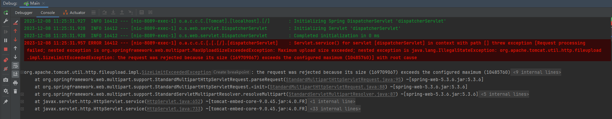

## 一、文件上传

1、application.yml

```yaml
server:
  port: 8089
#文件上传路径
upload:
  path: D:\stdown\upload\
```

2、pom核心

```xml
<?xml version="1.0" encoding="UTF-8"?>
<project xmlns="http://maven.apache.org/POM/4.0.0"
         xmlns:xsi="http://www.w3.org/2001/XMLSchema-instance"
         xsi:schemaLocation="http://maven.apache.org/POM/4.0.0 http://maven.apache.org/xsd/maven-4.0.0.xsd">
    <parent>
        <artifactId>spring-boot-dependencies</artifactId>
        <groupId>org.springframework.boot</groupId>
        <version>2.4.5</version>
    </parent>

    <modelVersion>4.0.0</modelVersion>
    <groupId>com.ransibi</groupId>
    <artifactId>rsb-file-upload</artifactId>
    <version>1.0-SNAPSHOT</version>

    <!--统一编码和JAVA版本-->
    <properties>
        <project.build.sourceEncoding>UTF-8</project.build.sourceEncoding>
        <maven.compiler.source>1.8</maven.compiler.source>
        <maven.compiler.target>1.8</maven.compiler.target>
        <java.version>1.8</java.version>
        <commons.io.version>2.13.0</commons.io.version>
        <commons.fileupload.version>1.3.3</commons.fileupload.version>
    </properties>

    <dependencies>
        <!--Spring Boot Web-->
        <dependency>
            <groupId>org.springframework.boot</groupId>
            <artifactId>spring-boot-starter-web</artifactId>
            <version>2.4.5</version>
        </dependency>
        <!--LomBok-->
        <dependency>
            <groupId>org.projectlombok</groupId>
            <artifactId>lombok</artifactId>
            <version>1.18.20</version>
        </dependency>
        <!--Hutool-->
        <dependency>
            <groupId>cn.hutool</groupId>
            <artifactId>hutool-all</artifactId>
            <version>5.6.7</version>
        </dependency>

        <dependency>
            <groupId>org.apache.commons</groupId>
            <artifactId>commons-lang3</artifactId>
            <version>3.4</version>
        </dependency>

        <dependency>
            <groupId>com.alibaba</groupId>
            <artifactId>fastjson</artifactId>
            <version>1.2.83</version>
        </dependency>

        <!--io常用工具类 -->
        <dependency>
            <groupId>commons-io</groupId>
            <artifactId>commons-io</artifactId>
            <version>${commons.io.version}</version>
        </dependency>

        <!--文件上传工具类 -->
        <dependency>
            <groupId>commons-fileupload</groupId>
            <artifactId>commons-fileupload</artifactId>
            <version>${commons.fileupload.version}</version>
            <exclusions>
                <exclusion>
                    <artifactId>commons-io</artifactId>
                    <groupId>commons-io</groupId>
                </exclusion>
            </exclusions>
        </dependency>
    </dependencies>

    <build>
        <plugins>
            <plugin>
                <groupId>org.springframework.boot</groupId>
                <artifactId>spring-boot-maven-plugin</artifactId>
                <executions>
                    <execution>
                        <goals>
                            <goal>repackage</goal>
                        </goals>
                    </execution>
                </executions>
            </plugin>
        </plugins>
    </build>
</project>
```

3、单文件上传

```java
package com.ransibi.controller;

import com.alibaba.fastjson.JSONObject;
import lombok.extern.slf4j.Slf4j;
import org.springframework.beans.factory.annotation.Value;
import org.springframework.web.bind.annotation.PostMapping;
import org.springframework.web.bind.annotation.RequestMapping;
import org.springframework.web.bind.annotation.RequestParam;
import org.springframework.web.bind.annotation.RestController;
import org.springframework.web.multipart.MultipartFile;
import java.io.File;
import java.io.IOException;
import java.util.List;
import java.util.UUID;

@RestController 
@RequestMapping(value = "rsb/common")
@Slf4j
public class CommonController {

    @Value("${upload.path}")
    private String basePath;
    
    @PostMapping(value = "/upload")
    public void upload(@RequestParam("file") MultipartFile file) {
        //如果是多文件上传，把接收参数改成List<MultipartFile> fils或者MultipartFile[] files即可
        log.info("开始上传");
        /**
         * 避免多人上传文件，文件重名导致文件被替换的解决方案:
         * 截掉文件名后缀,然后通过UUID随机生成的一串字母，然后把这串随机生成的字母再拼接上原始文件后缀，那么这个文件名就随机生成了，
         */
        // 1、先获取前端上传的照片的原始名
        String filename = file.getOriginalFilename();
        if (StringUtils.isEmpty(filename)) {
            return;
        }
        // 2、截取原始文件的后缀名 .
        String s = filename.substring(filename.lastIndexOf("."));
        // 3、通过UUID随机生成文件名 （其实就是随机生成的一串字母，我们把生成的字母再加上上面截取的后缀名，那么不就是一个新的原始照片的名字了嘛~）
        // 随机生成文件名
        String s1 = UUID.randomUUID().toString();
        // 为第三步通过UUID随机生成的文件名拼接加上截取到的原始照片名的后缀名
        String fileName = s1 + s;
        File file1 = new File(basePath);
        if (!file1.exists()) {
            file1.mkdirs();
        }
        try {
            // 指定照片上传路径
            file.transferTo(new File(basePath + fileName));   // 直接路径+生成的文件名即可。
            log.info("上传成功");
        } catch (IOException e) {
            e.printStackTrace();
            log.info("上传失败!");
        }
    }
}
```

4、多文件上传

```java
package com.ransibi.controller;

import com.alibaba.fastjson.JSONObject;
import lombok.extern.slf4j.Slf4j;
import org.springframework.beans.factory.annotation.Value;
import org.springframework.web.bind.annotation.PostMapping;
import org.springframework.web.bind.annotation.RequestMapping;
import org.springframework.web.bind.annotation.RequestParam;
import org.springframework.web.bind.annotation.RestController;
import org.springframework.web.multipart.MultipartFile;
import java.io.File;
import java.io.IOException;
import java.util.List;
import java.util.UUID;

@RestController
@RequestMapping(value = "rsb/common")
@Slf4j
public class CommonController {

    @Value("${upload.path}")
    private String basePath;
    
    @PostMapping(value = "/upload/more")
    public JSONObject uploadMore(@RequestParam("files") List<MultipartFile> files) {

        JSONObject ajax = new JSONObject();
        for (MultipartFile file : files) {
            String filename = file.getOriginalFilename();
            if (StringUtils.isEmpty(filename)) {
                continue;
            }
            log.info(filename + "开始上传");
            String s = filename.substring(filename.lastIndexOf("."));
            String s1 = UUID.randomUUID().toString();
            String fileName = s1 + s;
            File file1 = new File(basePath);
            if (!file1.exists()) {
                file1.mkdirs();
            }
            try {
                log.info("新的文件名称:{}", fileName);
                file.transferTo(new File(basePath + fileName));
                log.info(filename + "文件上传成功");
            } catch (IOException e) {
                e.printStackTrace();
                log.info("上传失败!");
                ajax.put("code", 500);
                ajax.put("msg", "文件上传失败!");
            }
        }
        ajax.put("code", 200);
        ajax.put("msg", "文件上传成功!");
        return ajax;
    }
}
```

注意:springboot的默认上传文件大小是1M，如果上传的文件超过了1M就会报错，如下所示:



所以需要再配置文件中自定义上传文件的大小，application.yml增加如下配置

```yaml
spring:
  servlet:
    multipart:
      max-file-size: 10MB  #单个文件最大
      max-request-size: 50MB #单个请求文件总和最大
```

```
如果还是不行需要增加tomcat的吞吐量
server:
  tomcat:
    max-swallow-size: 200MB #重要的一行，修改tomcat的吞吐量
```


## 二、文件下载

```java
    /**
     * @param path     想要下载的文件的路径
     * @param response
     * @功能描述: 下载文件----将文件以流的形式一次性读取到内存，通过响应输出流输出到前端
     */
    @GetMapping("/dl")
    public void download(String path, HttpServletResponse response) {
        try {
            String rooPath = "D:\\stdown\\";
            String filePath = rooPath + path;
            File file = new File(filePath);
            if (!file.exists()) {
                log.info("文件不存在:{}", file.getPath());
            }
            String filename = file.getName();
            if (StringUtils.isEmpty(filename)) {
                return;
            }
            String ext = filename.substring(filename.lastIndexOf(".") + 1).toLowerCase();
            log.info("文件后缀名：" + ext);
            FileInputStream fileInputStream = new FileInputStream(file);
            InputStream fis = new BufferedInputStream(fileInputStream);
            byte[] buffer = new byte[fis.available()];
            fis.read(buffer);
            fis.close();
            response.reset();
            response.setCharacterEncoding("UTF-8");
            //Content-Disposition的作用：告知浏览器以何种方式显示响应返回的文件，用浏览器打开还是以附件的形式下载到本地保存
            //attachment表示以附件方式下载 inline表示在线打开 "Content-Disposition: inline;
            // filename表示文件的默认名称，因为网络传输只支持URL编码的相关传输，因此需要将文件名URL编码后进行传输,前端收到后需要反编码才能获取到真正的名称
            response.addHeader("Content-Disposition", "attachment;filename=" + URLEncoder.encode(filename, "UTF-8"));
            // 告知浏览器文件的大小
            response.addHeader("Content-Length", "" + file.length());
            OutputStream outputStream = new BufferedOutputStream(response.getOutputStream());
            response.setContentType("application/octet-stream");
            outputStream.write(buffer);
            outputStream.flush();
            log.info("文件下载成功!");
        } catch (IOException ex) {
            ex.printStackTrace();
        }
    }
```

