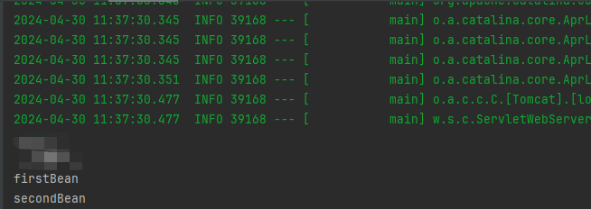

###   @PostConstruct

如果想在生成对象时完成某些初始化操作，而偏偏这些初始化操作又依赖于依赖注入，那么就无法在构造函数中实现。为此，可以使用@PostConstruct注解一个方法来完成初始化，@PostConstruct注解的方法将会在依赖注入完成后被自动调用。

执行顺序: 构造方法 -> @Autowireed -> @PostConstruct

```java
package com.ransibi.annotation;

import org.springframework.beans.factory.annotation.Autowired;
import org.springframework.stereotype.Component;
import javax.annotation.PostConstruct;

@Component
public class MockData {

    @Autowired
    private TestService testService;

    public MockData(){
        System.out.println("构造方法");
    }

    @PostConstruct
    public void init(){
        System.out.println("初始化操作");
    }
}
```

### @DependsOn

​     在 Spring Boot 中，您可以使用@DependsOn注解来定义 bean 之间的依赖关系。该注释指定一个 Bean 的初始化取决于一个或多个其他 Bean 的初始化。

```java
package com.ransibi.annotation;

import org.springframework.context.annotation.Bean;
import org.springframework.context.annotation.Configuration;
import org.springframework.context.annotation.DependsOn;

@Configuration
public class MyTestConfig {

    @Bean(name = "firstBean")
    public void firstBean() {
        System.out.println("firstBean");
    }

    @Bean(name = "secondBean")
    @DependsOn("firstBean")
    public void secondBean() {
        System.out.println("secondBean");
    }
}
```



### @Value

  https://blog.csdn.net/leslij/article/details/126851534?utm_medium=distribute.pc_relevant.none-task-blog-2~default~baidujs_baidulandingword~default-5-126851534-blog-132679766.235^v43^pc_blog_bottom_relevance_base4&spm=1001.2101.3001.4242.4&utm_relevant_index=6
