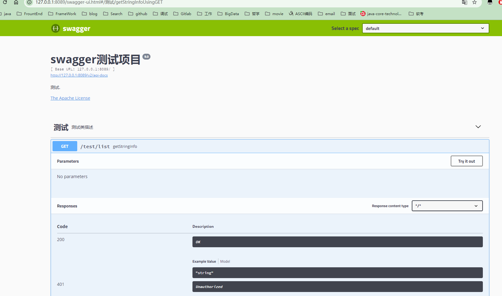
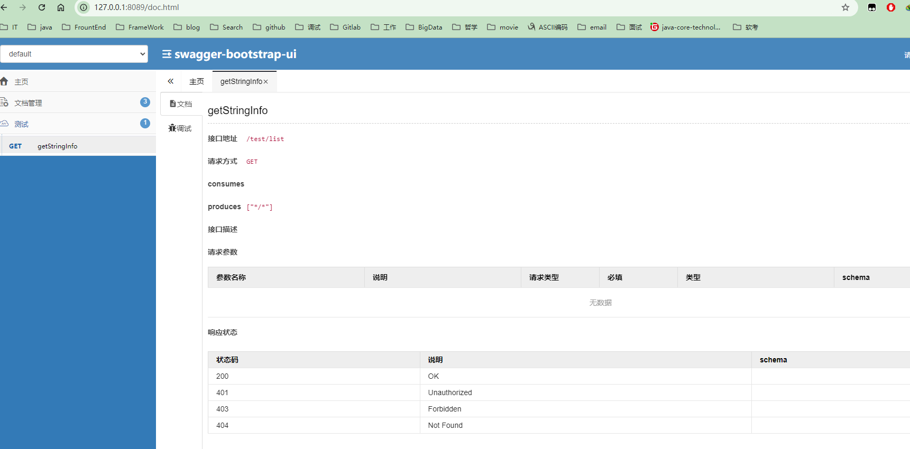

#### 引入坐标依赖

```xml
    <dependencies>
        <!--Spring Boot Web-->
        <dependency>
            <groupId>org.springframework.boot</groupId>
            <artifactId>spring-boot-starter-web</artifactId>
        </dependency>
        <!--        集成swagger-->
        <!-- swagger2  -->
        <dependency>
            <groupId>io.springfox</groupId>
            <artifactId>springfox-swagger2</artifactId>
            <version>2.8.0</version>
        </dependency>
        <dependency>
            <groupId>io.springfox</groupId>
            <artifactId>springfox-swagger-ui</artifactId>
            <version>2.8.0</version>
        </dependency>
        <!-- 引入swagger-bootstrap-ui包 -->
        <dependency>
            <groupId>com.github.xiaoymin</groupId>
            <artifactId>swagger-bootstrap-ui</artifactId>
            <version>1.8.5</version>
        </dependency>
    </dependencies>
```

#### 编写配置类

```java
package com.ransibi.config;

import org.springframework.context.annotation.Bean;
import org.springframework.context.annotation.Configuration;
import springfox.documentation.builders.ApiInfoBuilder;
import springfox.documentation.builders.PathSelectors;
import springfox.documentation.builders.RequestHandlerSelectors;
import springfox.documentation.service.ApiInfo;
import springfox.documentation.spi.DocumentationType;
import springfox.documentation.spring.web.plugins.Docket;
import springfox.documentation.swagger2.annotations.EnableSwagger2;

@Configuration
@EnableSwagger2
public class SwaggerConfig {
    @Bean
    public Docket createRestApi() {
        //http://ip地址:端口/项目名/swagger-ui.html#/
        ApiInfo apiInfo = new ApiInfoBuilder()
                //网站标题
                .title("swagger测试项目")
                //网站描述
                .description("测试.")
                //版本
                .version("9.0")
                //友链
//                .contact(new Contact("测试","http:www.baidu.com","https://code-ran.github.io/"))
                //协议
                .license("The Apache License")
                //协议url
                .licenseUrl("http://www.baidu.com")
                .build();

        return new Docket(DocumentationType.SWAGGER_2) //swagger版本
                .pathMapping("/")
                .select()
                //扫描那些controller
                .apis(RequestHandlerSelectors.basePackage("com.ransibi.controller"))
                .paths(PathSelectors.any())
                .build()
                .apiInfo(apiInfo);
    }
}
```


#### 测试

```java
@RestController
@RequestMapping("test")
@Api(value="测试类",tags = "测试",description = "测试类描述")
public class TestController {

    @GetMapping("list")
    public String getStringInfo() {
        return "hello world";
    }
}
```

访问: http://127.0.0.1:8089/swagger-ui.html



访问: http://127.0.0.1:8089/doc.html



#### 常用注解

@Api：修饰整个类，描述Controller的作用
@ApiOperation：描述一个类的一个方法，或者说一个接口
@ApiParam：单个参数描述
@ApiModel：用对象来接收参数
@ApiModelProperty：用对象接收参数时，描述对象的一个字段
@ApiImplicitParam：一个请求参数
@ApiImplicitParams：多个请求参数
