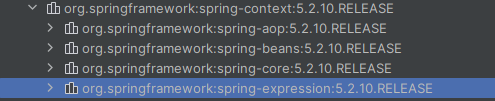
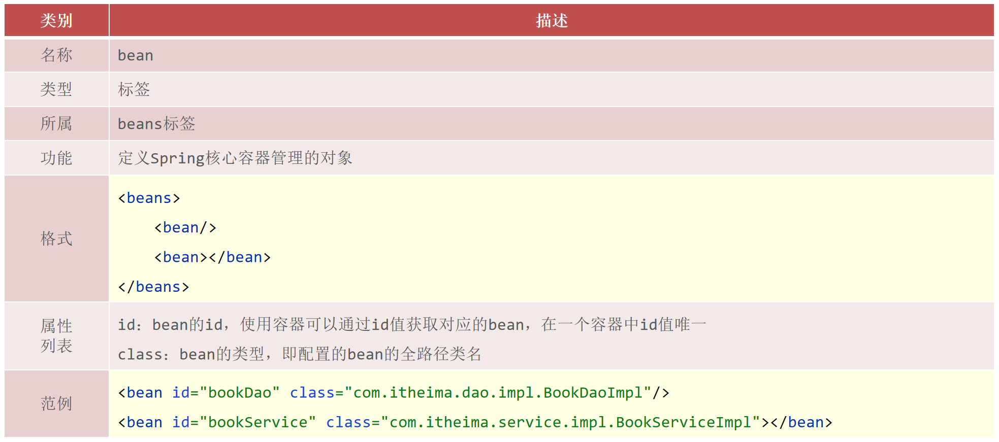
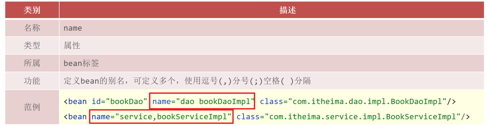
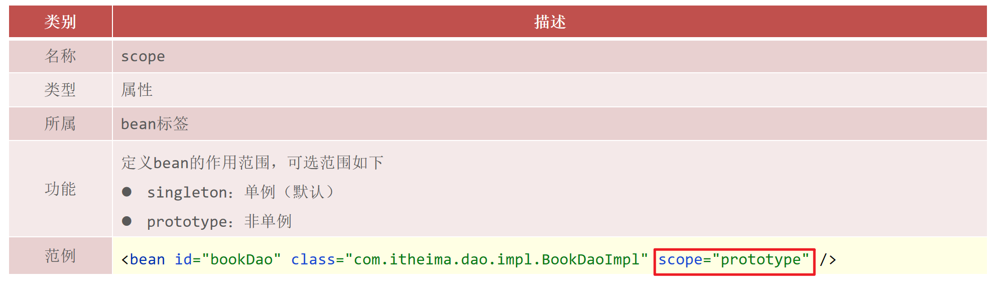
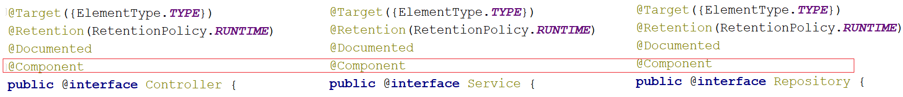
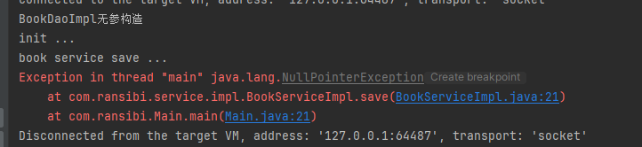
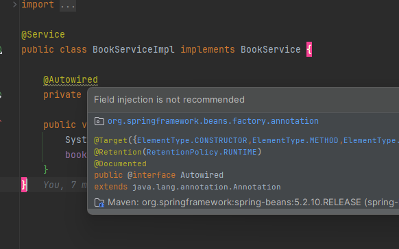
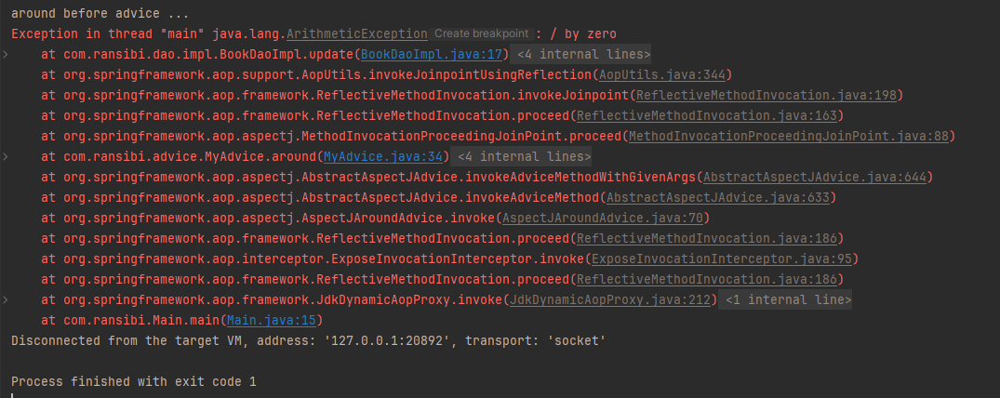

### 1、Spring概述

官网: https://spring.io/

Spring 是于 2003 年兴起的一个轻量级的 Java 开发框架，它是为了解决企业应用开发的复杂性而创建的。spring的核心是控制反转(ioc)和面向切面编程(aop)。Ioc 可以降低业务对象之间耦合度。IoC 使得主业务在相互调用过程中，不用再自己维护关系了，即不用再自己创建要使用的对象了。而是由 Spring 容器统一管理，自动“注入”,注入即赋值。 而 AOP 使得系统级服务得到了最大复用，且不用再由程序员手工将系统级服务“混杂”到主业务逻辑中了，而是由 Spring 容器统一完成“织入”。

### 2、IOC-控制反转

控制反转IoC(Inversion of Control） 是一个概念，是一种思想。指将传统上由程序代码直接操控的对象调用权交给容器，通过容器来实现对象的装配和管理。控制反转就是对象控制权的转移，从程序代码本身反转到了外部容器。通过容器实现对象的创建，属性赋值， 依赖的管理。IoC 是一个概念，是一种思想，其实现方式多种多样。当前比较流行的实现方式是依赖注入。Spring对IOC思想进行了实现。

(1)spring ioc容器的作用: 

* IOC容器负责对象的创建、初始化等一系列工作，其中包含了数据层和业务层的类对象
* 被创建或被管理的对象在IOC容器中统称为==Bean==
* IOC容器中放的就是一个个的Bean对象

### 3、DI-依赖注入

在容器中建立bean与bean之间的依赖关系的整个过程，称为依赖注入。

#### 依赖注入的三种方式

##### setter注入

在bean中定义引用类型属性，并提供可访问的==set==方法。

(1)引用类型注入

```java
public class BookServiceImpl implements BookService{
    private BookDao bookDao;
    private UserDao userDao;
    
    public void setUserDao(UserDao userDao) {
        this.userDao = userDao;
    }
    public void setBookDao(BookDao bookDao) {
        this.bookDao = bookDao;
    }

    public void save() {
        System.out.println("book service save ...");
        bookDao.save();
        userDao.save();
    }
}
```

```xml
<?xml version="1.0" encoding="UTF-8"?>
<beans xmlns="http://www.springframework.org/schema/beans"
       xmlns:xsi="http://www.w3.org/2001/XMLSchema-instance"
       xsi:schemaLocation="http://www.springframework.org/schema/beans http://www.springframework.org/schema/beans/spring-beans.xsd">

    <bean id="bookDao" class="com.ransibi.dao.impl.BookDaoImpl"/>
    <bean id="userDao" class="com.ransibi.dao.impl.UserDaoImpl"/>
    <bean id="bookService" class="com.ransibi.service.impl.BookServiceImpl">
        <property name="bookDao" ref="bookDao"/>
        <property name="userDao" ref="userDao"/>
    </bean>
</beans>
```

(2)基本数据类型注入

```java
public class BookDaoImpl implements BookDao {

    private String databaseName;
    private int connectionNum;

    public void setConnectionNum(int connectionNum) {
        this.connectionNum = connectionNum;
    }

    public void setDatabaseName(String databaseName) {
        this.databaseName = databaseName;
    }

    public void save() {
        System.out.println("book dao save ..."+databaseName+","+connectionNum);
    }
}
```

```xml
<?xml version="1.0" encoding="UTF-8"?>
<beans xmlns="http://www.springframework.org/schema/beans"
       xmlns:xsi="http://www.w3.org/2001/XMLSchema-instance"
       xsi:schemaLocation="http://www.springframework.org/schema/beans http://www.springframework.org/schema/beans/spring-beans.xsd">

    <bean id="bookDao" class="com.ransibi.dao.impl.BookDaoImpl">
        <property name="databaseName" value="mysql"/>
     	<property name="connectionNum" value="10"/>
    </bean>
</beans>
```

总结:

* 对于引用数据类型使用的是`<property name="" ref=""/>`
* 对于简单数据类型使用的是`<property name="" value=""/>`

##### 构造器注入

(1)引用类型构造器注入

```java
public class BookServiceImpl implements BookService{
    private BookDao bookDao;
    private UserDao userDao;

    public BookServiceImpl(BookDao bookDao,UserDao userDao) {
        this.bookDao = bookDao;
        this.userDao = userDao;
    }
    public void save() {
        System.out.println("book service save ...");
        bookDao.save();
        userDao.save();
    }
}
```

```java
<?xml version="1.0" encoding="UTF-8"?>
<beans xmlns="http://www.springframework.org/schema/beans"
       xmlns:xsi="http://www.w3.org/2001/XMLSchema-instance"
       xsi:schemaLocation="http://www.springframework.org/schema/beans http://www.springframework.org/schema/beans/spring-beans.xsd">

    <bean id="bookDao" class="com.ransibi.dao.impl.BookDaoImpl"/>
    <bean id="bookService" class="com.ransibi.service.impl.BookServiceImpl">
        <constructor-arg name="bookDao" ref="bookDao"/>
        <constructor-arg name="userDao" ref="userDao"/>
    </bean>
</beans>
```

```
<constructor-arg>标签:
name属性对应的值为构造函数中方法形参的参数名，必须要保持一致。
ref属性指向的是spring的IOC容器中其他bean对象。
```

(2)基本数据类型构造器注入

```java
public class BookDaoImpl implements BookDao {
    private String databaseName;
    private int connectionNum;

    public BookDaoImpl(String databaseName, int connectionNum) {
        this.databaseName = databaseName;
        this.connectionNum = connectionNum;
    }
    public void save() {
        System.out.println("book dao save ..."+databaseName+","+connectionNum);
    }
}
```

```xml
<?xml version="1.0" encoding="UTF-8"?>
<beans xmlns="http://www.springframework.org/schema/beans"
       xmlns:xsi="http://www.w3.org/2001/XMLSchema-instance"
       xsi:schemaLocation="http://www.springframework.org/schema/beans http://www.springframework.org/schema/beans/spring-beans.xsd">

    <bean id="bookDao" class="com.ransibi.dao.impl.BookDaoImpl">
        <constructor-arg name="databaseName" value="mysql"/>
        <constructor-arg name="connectionNum" value="666"/>
    </bean>
    <bean id="userDao" class="com.ransibi.dao.impl.UserDaoImpl"/>
</beans>
```


##### 自动配置

自动装配只需要修改xml配置即可。只能用于引用类型依赖注入，不能对简单类型进行操作。自动装配优先级低于setter注入与构造器注入，同时出现时自动装配配置失效

(1)将`<property>`标签删除

(2)在`<bean>`标签中添加autowire属性

* ==按类型（常用）==

```xml
<?xml version="1.0" encoding="UTF-8"?>
<beans xmlns="http://www.springframework.org/schema/beans"
       xmlns:xsi="http://www.w3.org/2001/XMLSchema-instance"
       xsi:schemaLocation="http://www.springframework.org/schema/beans http://www.springframework.org/schema/beans/spring-beans.xsd">
    <bean class="com.ransibi.dao.impl.BookDaoImpl"/>
    <!--autowire属性：开启自动装配，通常使用按类型装配-->
    <bean id="bookService" class="com.ransibi.service.impl.BookServiceImpl" autowire="byType"/>
</beans>
```

* 按名称

```xml
<?xml version="1.0" encoding="UTF-8"?>
<beans xmlns="http://www.springframework.org/schema/beans"
       xmlns:xsi="http://www.w3.org/2001/XMLSchema-instance"
       xsi:schemaLocation="http://www.springframework.org/schema/beans http://www.springframework.org/schema/beans/spring-beans.xsd">

    <bean class="com.ransibi.dao.impl.BookDaoImpl"/>
    <!--autowire属性：开启自动装配，通常使用按类型装配-->
    <bean id="bookService" class="com.ransibi.service.impl.BookServiceImpl" autowire="byName"/>
</beans>
```

##### 特殊情况：集合的注入

```java
package com.ransibi.dao.impl;

import com.ransibi.dao.BookDao;

import java.util.*;

public class BookDaoImpl implements BookDao {

    private int[] array;

    private List<String> list;

    private Set<String> set;

    private Map<String, String> map;

    private Properties properties;

    public void save() {
        System.out.println("book dao save ...");

        System.out.println("遍历数组:" + Arrays.toString(array));

        System.out.println("遍历List" + list);

        System.out.println("遍历Set" + set);

        System.out.println("遍历Map" + map);

        System.out.println("遍历Properties" + properties);
    }

    public void setArray(int[] array) {
        this.array = array;
    }

    public void setList(List<String> list) {
        this.list = list;
    }

    public void setSet(Set<String> set) {
        this.set = set;
    }

    public void setMap(Map<String, String> map) {
        this.map = map;
    }

    public void setProperties(Properties properties) {
        this.properties = properties;
    }
}
```

(1)array数组

```xml
<?xml version="1.0" encoding="UTF-8"?>
<beans xmlns="http://www.springframework.org/schema/beans"
       xmlns:xsi="http://www.w3.org/2001/XMLSchema-instance"
       xsi:schemaLocation="http://www.springframework.org/schema/beans http://www.springframework.org/schema/beans/spring-beans.xsd">
    <bean id="bookDao" class="com.ransibi.dao.impl.BookDaoImpl">
        <property name="array">
            <array>
                <value>100</value>
                <value>200</value>
                <value>300</value>
            </array>
        </property>
    </bean>
</beans>
```

(2)list集合

集合中要添加引用类型，只需要把`<value>`标签改成`<ref>`标签，这种方式用的比较少

```xml
<?xml version="1.0" encoding="UTF-8"?>
<beans xmlns="http://www.springframework.org/schema/beans"
       xmlns:xsi="http://www.w3.org/2001/XMLSchema-instance"
       xsi:schemaLocation="http://www.springframework.org/schema/beans http://www.springframework.org/schema/beans/spring-beans.xsd">

    <bean id="bookDao" class="com.ransibi.dao.impl.BookDaoImpl">
        <property name="list">
            <list>
                <value>itcast</value>
                <value>itheima</value>
                <value>boxuegu</value>
                <value>chuanzhihui</value>
            </list>
        </property>
    </bean>
</beans>
```

(3)set集合

```xml
<?xml version="1.0" encoding="UTF-8"?>
<beans xmlns="http://www.springframework.org/schema/beans"
       xmlns:xsi="http://www.w3.org/2001/XMLSchema-instance"
       xsi:schemaLocation="http://www.springframework.org/schema/beans http://www.springframework.org/schema/beans/spring-beans.xsd">

    <bean id="bookDao" class="com.ransibi.dao.impl.BookDaoImpl">
        <property name="set">
            <set>
                <value>itcast</value>
                <value>itheima</value>
                <value>boxuegu</value>
                <value>boxuegu</value>
            </set>
        </property>
    </bean>
</beans>
```

(4)map集合

```xml
<?xml version="1.0" encoding="UTF-8"?>
<beans xmlns="http://www.springframework.org/schema/beans"
       xmlns:xsi="http://www.w3.org/2001/XMLSchema-instance"
       xsi:schemaLocation="http://www.springframework.org/schema/beans http://www.springframework.org/schema/beans/spring-beans.xsd">

    <bean id="bookDao" class="com.ransibi.dao.impl.BookDaoImpl">
        <property name="map">
            <map>
                <entry key="country" value="china"/>
                <entry key="province" value="henan"/>
                <entry key="city" value="kaifeng"/>
            </map>
        </property>
    </bean>
</beans>
```

(5)Properties类型

```xml
<?xml version="1.0" encoding="UTF-8"?>
<beans xmlns="http://www.springframework.org/schema/beans"
       xmlns:xsi="http://www.w3.org/2001/XMLSchema-instance"
       xsi:schemaLocation="http://www.springframework.org/schema/beans http://www.springframework.org/schema/beans/spring-beans.xsd">

    <bean id="bookDao" class="com.ransibi.dao.impl.BookDaoImpl">
        <property name="properties">
            <props>
                <prop key="country">china</prop>
                <prop key="province">henan</prop>
                <prop key="city">kaifeng</prop>
            </props>
        </property>
    </bean>
</beans>
```

property标签表示setter方式注入，构造方式注入constructor-arg标签内部也可以写`<array>`、`<list>`、`<set>`、`<map>`、`<props>`标签

### 4、ioc、di案例

依赖:

```xml
        <dependency>
            <groupId>org.springframework</groupId>
            <artifactId>spring-context</artifactId>
            <version>5.2.10.RELEASE</version>
        </dependency>
```



```java
package com.ransibi.dao;
public interface BookDao {
    public void save();
}
```

```java
package com.ransibi.dao.impl;
import com.ransibi.dao.BookDao;
public class BookDaoImpl implements BookDao {
    public void save() {
        System.out.println("book dao save ...");
    }
}
```

```java
package com.ransibi.service;

public interface BookService {
    public void save();
}
```

```java
package com.ransibi.service.impl;
import com.ransibi.dao.BookDao;
import com.ransibi.service.BookService;
public class BookServiceImpl implements BookService {
    //属性对象依赖注入
    private BookDao bookDao;
    
    //通过setter的方式注入bean
    public void setBookDao(BookDao bookDao) {
        this.bookDao = bookDao;
    }
    public void save() {
        System.out.println("book service save ...");
        bookDao.save();
    }
}
```

resources下增加xml配置

applicationContext.xml，建立bean与bean之间的依赖关系，将bean交给spring的ioc

bean定义时id属性在同一个上下文中(配置文件)不能重复。

```xml
<?xml version="1.0" encoding="UTF-8"?>
<beans xmlns="http://www.springframework.org/schema/beans"
       xmlns:xsi="http://www.w3.org/2001/XMLSchema-instance"
       xsi:schemaLocation="http://www.springframework.org/schema/beans http://www.springframework.org/schema/beans/spring-beans.xsd">
    <!--2.配置bean-->
    <!--bean标签标示配置bean
    id属性标示给bean起名字
    class属性表示给bean定义类型-->
    <!--注意事项：bean定义时id属性在同一个上下文中(配置文件)不能重复==-->
    <bean id="bookDao" class="com.ransibi.dao.impl.BookDaoImpl"/>

    <bean id="bookService" class="com.ransibi.service.impl.BookServiceImpl">
        <!--7.配置server与dao的关系-->
        <!--property标签表示配置当前bean的属性
        name属性表示配置哪一个具体的属性
        ref属性表示参照哪一个bean-->
        <property name="bookDao" ref="bookDao"/>
    </bean>
</beans>
```

* name="bookDao"中`bookDao`的作用是让Spring的IOC容器在获取到名称后，将首字母大写，前面加set找对应的`setBookDao()`方法进行对象注入
* ref="bookDao"中`bookDao`的作用是让Spring能在IOC容器中找到id为`bookDao`的Bean对象给`bookService`进行注入

```java
package com.ransibi;

import com.ransibi.service.BookService;
import org.springframework.context.ApplicationContext;
import org.springframework.context.support.ClassPathXmlApplicationContext;

public class App2 {
    public static void main(String[] args) {
        //3.获取IoC容器
        ApplicationContext ctx = new ClassPathXmlApplicationContext("applicationContext.xml");
        //4.获取bean（根据bean配置id获取）
        BookService bookService = (BookService) ctx.getBean("bookService");
        bookService.save();
    }
}
```

```
book service save ...
book dao save ...
```

### 5、ioc中bean的相关内容-基于xml方式

#### bean的基础配置-基于xml方式

(1)id与class属性



(2)name属性,可以通过别名获取bean对象



(3)scope属性



#### bean的实例化

(1)构造方法

spring创建bean用的是类默认创建的无参构造方法。

(2)静态工厂

(3)实例工厂

(4)FactoryBean

通过实现FactoryBean,重写getObject和getObjectType方法

```java
public class UserDaoFactoryBean implements FactoryBean<UserDao> {
    public UserDao getObject() throws Exception {
        //被重写后，在方法中进行对象的创建并返回
        return new UserDaoImpl();
    }
    //返回所创建类的Class对象
    public Class<?> getObjectType() {
        return UserDao.class;
    }
}
```

```
<bean id="userDao" class="com.itheima.factory.UserDaoFactoryBean"/>
```

#### bean的生命周期+基于xml方式

* 初始化容器
  * 1.创建对象(内存分配)
  * 2.执行构造方法
  * 3.执行属性注入(set操作)
  * ==4.执行bean初始化方法==
* 使用bean
  * 1.执行业务操作
* 关闭/销毁容器
  * ==1.执行bean销毁方法==

生命周期设置: 添加初始化和销毁方法

实现InitializingBean、DisposableBean中的afterPropertiesSet和destroy方法

```java
public class BookServiceImpl implements BookService, InitializingBean, DisposableBean {
    private BookDao bookDao;
    public void setBookDao(BookDao bookDao) {
        this.bookDao = bookDao;
    }
    public void save() {
        System.out.println("book service save ...");
        bookDao.save(); 
    }
    public void destroy() throws Exception {
        System.out.println("service destroy");
    }
    public void afterPropertiesSet() throws Exception {
        System.out.println("service init");
    }
}
```

### 6、注解+xml开发

```xml
<?xml version="1.0" encoding="UTF-8"?>
<beans xmlns="http://www.springframework.org/schema/beans"
       xmlns:xsi="http://www.w3.org/2001/XMLSchema-instance"
       xmlns:context="http://www.springframework.org/schema/context"
       xsi:schemaLocation="
            http://www.springframework.org/schema/beans http://www.springframework.org/schema/beans/spring-beans.xsd
            http://www.springframework.org/schema/context http://www.springframework.org/schema/context/spring-context.xsd">
    <context:component-scan base-package="com.ransibi"/>
</beans>
```

```java
package com.ransibi.dao;

public interface BookDao {
    public void save();
}
```

使用@Component注解，将bean交给spring去管理

@Component注解如果不起名称，会有一个默认值就是`当前类名并且首字母小写`

```java
package com.ransibi.dao.impl;

import com.ransibi.dao.BookDao;
import org.springframework.stereotype.Component;
//@Component("bookDao")
@Component
public class BookDaoImpl implements BookDao {
    public void save() {
        System.out.println("book dao save ..." );
    }
}
```

测试

```java
package com.ransibi;
import com.ransibi.dao.BookDao;
import org.springframework.context.ApplicationContext;
import org.springframework.context.support.ClassPathXmlApplicationContext;

public class Main {
    public static void main(String[] args) {
        ApplicationContext ctx = new ClassPathXmlApplicationContext("applicationContext.xml");
        //按名字
        //BookDao bookDao = (BookDao) ctx.getBean("bookDao");
        //按类型
        BookDao bookDao = (BookDao) ctx.getBean(BookDao.class);
        bookDao.save();
    }
}
```

```
book dao save ...
```

对于@Component注解，还衍生出了其他三个注解`@Controller`、`@Service`、`@Repository`



三个注解的作用都是一样的，将bean交给spring去管理，主要作用就是区分这个类属于控制表现层(@Controller)还是业务处理层(@Service)还是数据层(@Repository)

### 7、纯注解开发模式（ver > = spring3.0） 

```java
package com.ransibi.config;
import org.springframework.context.annotation.ComponentScan;
import org.springframework.context.annotation.Configuration;

//在配置类上添加@Configuration注解，将其标识为一个配置类,替换applicationContext.xml
//在配置类上添加包扫描注解@ComponentScan替换<context:component-scan base-package=""/>
//@ComponentScan注解用于设定扫描路径，此注解只能添加一次，多个数据请用数组格式
//@ComponentScan({com.ransibi.service","com.ransibi.dao"})
@Configuration
@ComponentScan("com.ransibi")
public class SpringConfig {
}
```

```java
package com.ransibi.dao.impl;
import com.ransibi.dao.BookDao;
import org.springframework.stereotype.Component;

@Component("bookDao")
public class BookDaoImpl implements BookDao {
    public void save() {
        System.out.println("book dao save ..." );
    }
}
```

```java
package com.ransibi.dao;
public interface BookDao {
    public void save();
}
```

```java
package com.ransibi;
import com.ransibi.config.SpringConfig;
import com.ransibi.dao.BookDao;
import com.ransibi.service.BookService;
import org.springframework.context.ApplicationContext;
import org.springframework.context.annotation.AnnotationConfigApplicationContext;
import org.springframework.context.support.ClassPathXmlApplicationContext;

public class Main {
    public static void main(String[] args) {
        ApplicationContext ctx = new AnnotationConfigApplicationContext(SpringConfig.class);
        BookDao bookDao = (BookDao) ctx.getBean(BookDao.class);
        bookDao.save();
    }
}
```

```
book dao save ...
```

### 8、纯注解开发bean相关内容

#### bean作用范围

```java
package com.ransibi;

import com.ransibi.config.SpringConfig;
import com.ransibi.dao.BookDao;
import com.ransibi.service.BookService;
import org.springframework.context.ApplicationContext;
import org.springframework.context.annotation.AnnotationConfigApplicationContext;
import org.springframework.context.support.ClassPathXmlApplicationContext;

public class Main {
    public static void main(String[] args) {
        ApplicationContext ctx = new AnnotationConfigApplicationContext(SpringConfig.class);
        BookDao bookDao = (BookDao) ctx.getBean(BookDao.class);
        BookDao bookDao1 = (BookDao) ctx.getBean(BookDao.class);
//        bookDao.save();
        System.out.println(bookDao);
        System.out.println(bookDao1);
    }
}
```

```
com.ransibi.dao.impl.BookDaoImpl@18d87d80
com.ransibi.dao.impl.BookDaoImpl@18d87d80
```

可以看出地址是一样的，说明bean的创建默认是单例的。

使用@Scope("prototype")变成非单例的

```java
package com.ransibi.dao.impl;

import com.ransibi.dao.BookDao;
import org.springframework.context.annotation.Scope;
import org.springframework.stereotype.Service;

//@Scope设置bean的作用范围
//默认值singleton（单例），可选值prototype（非单例）
@Service
@Scope("prototype")
public class BookDaoImpl implements BookDao {
    public void save() {
        System.out.println("book dao save ..." );
    }
}
```

```
com.ransibi.dao.impl.BookDaoImpl@43dac38f
com.ransibi.dao.impl.BookDaoImpl@342c38f8
```

#### bean生命周期

```java
package com.ransibi.dao.impl;

import com.ransibi.dao.BookDao;
import org.springframework.stereotype.Service;
import javax.annotation.PostConstruct;
import javax.annotation.PreDestroy;

@Service
public class BookDaoImpl implements BookDao {
    public BookDaoImpl(){
        System.out.println("BookDaoImpl无参构造");
    }
    public void save() {
        System.out.println("book dao save ..." );
    }

    //在构造方法之后执行，替换 init-method
    //设置该方法为初始化方法
    @PostConstruct
    public void init() {
        System.out.println("init ...");
    }

    //在销毁方法之前执行,替换 destroy-method
    //设置该方法为销毁方法
    @PreDestroy
    public void destroy() {
        System.out.println("destroy ...");
    }
}
```

注册关闭的钩子

```java
package com.ransibi;

import com.ransibi.config.SpringConfig;
import com.ransibi.dao.BookDao;
import com.ransibi.service.BookService;
import org.springframework.context.ApplicationContext;
import org.springframework.context.annotation.AnnotationConfigApplicationContext;
import org.springframework.context.support.ClassPathXmlApplicationContext;

public class Main {
    public static void main(String[] args) {
//       ApplicationContext ctx = new AnnotationConfigApplicationContext(SpringConfig.class);
        AnnotationConfigApplicationContext ctx = new AnnotationConfigApplicationContext(SpringConfig.class);
        BookDao bookDao = (BookDao) ctx.getBean(BookDao.class);
        BookDao bookDao1 = (BookDao) ctx.getBean(BookDao.class);
        System.out.println(bookDao);
        System.out.println(bookDao1);
        //注册关闭的钩子
        ctx.close();
    }
}
```

```
BookDaoImpl无参构造
init ...
com.ransibi.dao.impl.BookDaoImpl@593aaf41
com.ransibi.dao.impl.BookDaoImpl@593aaf41
destroy ...
```

### 9、纯注解开发依赖注入

#### (1)setter注入-无效

```java
package com.ransibi.service.impl;

import com.ransibi.dao.BookDao;
import com.ransibi.service.BookService;
import org.springframework.stereotype.Component;
import org.springframework.stereotype.Service;

@Service
public class BookServiceImpl implements BookService {
    private BookDao bookDao;

    public void setBookDao(BookDao bookDao) {
        this.bookDao = bookDao;
    }

    public void save() {
        System.out.println("book service save ...");
        bookDao.save();
    }
}
```



#### (2)构造方法注入-有效

```java
package com.ransibi.service.impl;

import com.ransibi.dao.BookDao;
import com.ransibi.service.BookService;
import org.springframework.stereotype.Component;
import org.springframework.stereotype.Service;

@Service
public class BookServiceImpl implements BookService {
    private BookDao bookDao;
    //构造函数注入
    public BookServiceImpl(BookDao bookDao) {
        this.bookDao = bookDao;
    }

    public void save() {
        System.out.println("book service save ...");
        bookDao.save();
    }
}
```

```
BookDaoImpl无参构造
init ...
book service save ...
book dao save ...
destroy ...
```

#### (3)自动装配注解

spring提供了@Autowired来自动装配bean

```java
package com.ransibi.service.impl;

import com.ransibi.dao.BookDao;
import com.ransibi.service.BookService;
import org.springframework.beans.factory.annotation.Autowired;
import org.springframework.stereotype.Component;
import org.springframework.stereotype.Service;

@Service
public class BookServiceImpl implements BookService {

    @Autowired
    private BookDao bookDao;

    public void save() {
        System.out.println("book service save ...");
        bookDao.save();
    }
}
```

```
BookDaoImpl无参构造
init ...
book service save ...
book dao save ...
destroy ...
```

使用自动装配，基于字段的注入，idea会有提示，这是因为spring 4.0开始就不推荐使用属性注入，改为推荐构造器注入和setter注入。



```
基于字段的注入缺点:
基于字段的依赖注入在声明为 final / immutable 的字段上不起作用.
容易违反单一职责设计原则.
与依赖注入容器紧密耦合.
隐藏依赖关系.
```

### 10、拓展注解了解

#### @Qualifier

| 名称 | @Qualifier                                           |
| ---- | ---------------------------------------------------- |
| 类型 | 属性注解  或  方法注解（了解）                       |
| 位置 | 属性定义上方  或  标准set方法上方  或  类set方法上方 |
| 作用 | 为引用类型属性指定注入的beanId                       |
| 属性 | value（默认）：设置注入的beanId                      |

当根据类型在容器中找到多个bean,注入参数的属性名又和容器中bean的名称不一致，这个时候该如何解决，就需要使用到`@Qualifier`来指定注入哪个名称的bean对象。@Qualifier不能独立使用，必须和@Autowired一起使用。

```java
@Service
public class BookServiceImpl implements BookService {
    @Autowired
    @Qualifier("bookDao1")
    private BookDao bookDao;
    
    public void save() {
        System.out.println("book service save ...");
        bookDao.save();
    }
}
```

#### @Value

| 名称 | @Value                                               |
| ---- | ---------------------------------------------------- |
| 类型 | 属性注解  或  方法注解（了解）                       |
| 位置 | 属性定义上方  或  标准set方法上方  或  类set方法上方 |
| 作用 | 为  基本数据类型  或  字符串类型  属性设置值         |
| 属性 | value（默认）：要注入的属性值                        |

`@Value`一般会被用在从properties配置文件中读取内容。

```java
@Repository("bookDao")
public class BookDaoImpl implements BookDao {
    @Value("${name}")
    private String name;
    public void save() {
        System.out.println("book dao save ..." + name);
    }
}
```

#### @PropertySource

| 名称 | @PropertySource                                              |
| ---- | ------------------------------------------------------------ |
| 类型 | 类注解                                                       |
| 位置 | 类定义上方                                                   |
| 作用 | 加载properties文件中的属性值                                 |
| 属性 | value（默认）：设置加载的properties文件对应的文件名或文件名组成的数组 |

```java
@Configuration
@ComponentScan("com.itheima")
@PropertySource("jdbc.properties")
public class SpringConfig {
}
```

`@PropertySource`注解属性中可以把`classpath:`加上,代表从当前项目的根路径找文件;`@PropertySource`注解属性中不支持使用通配符`*`,运行会报错;如果读取的properties配置文件有多个，可以使用`@PropertySource`的属性来指定多个

#### @Bean

| 名称 | @Bean                                  |
| ---- | -------------------------------------- |
| 类型 | 方法注解                               |
| 位置 | 方法定义上方                           |
| 作用 | 设置该方法的返回值作为spring管理的bean |
| 属性 | value（默认）：定义bean的id            |

#### @Import

| 名称 | @Import                                                      |
| ---- | ------------------------------------------------------------ |
| 类型 | 类注解                                                       |
| 位置 | 类定义上方                                                   |
| 作用 | 导入配置类                                                   |
| 属性 | value（默认）：定义导入的配置类类名，<br/>当配置类有多个时使用数组格式一次性导入多个配置类 |

### 11、spring整合mybatis

建表

```sql
CREATE TABLE `tbl_account` (
  `id` int DEFAULT NULL,
  `name` varchar(256) DEFAULT NULL,
  `money` double DEFAULT NULL
);
```

#### (1)pom.xml

```xml
<?xml version="1.0" encoding="UTF-8"?>
<project xmlns="http://maven.apache.org/POM/4.0.0"
         xmlns:xsi="http://www.w3.org/2001/XMLSchema-instance"
         xsi:schemaLocation="http://maven.apache.org/POM/4.0.0 http://maven.apache.org/xsd/maven-4.0.0.xsd">
    <modelVersion>4.0.0</modelVersion>

    <groupId>com.ransibi</groupId>
    <artifactId>spring_mybatis</artifactId>
    <version>1.0-SNAPSHOT</version>

    <properties>
        <maven.compiler.source>8</maven.compiler.source>
        <maven.compiler.target>8</maven.compiler.target>
        <project.build.sourceEncoding>UTF-8</project.build.sourceEncoding>
    </properties>

    <dependencies>
        <dependency>
            <groupId>org.springframework</groupId>
            <artifactId>spring-context</artifactId>
            <version>5.2.10.RELEASE</version>
        </dependency>
        <dependency>
            <groupId>com.alibaba</groupId>
            <artifactId>druid</artifactId>
            <version>1.1.16</version>
        </dependency>
        <dependency>
            <groupId>org.mybatis</groupId>
            <artifactId>mybatis</artifactId>
            <version>3.5.6</version>
        </dependency>
        <!-- https://mvnrepository.com/artifact/mysql/mysql-connector-java -->
        <dependency>
            <groupId>mysql</groupId>
            <artifactId>mysql-connector-java</artifactId>
            <version>8.0.26</version>
        </dependency>
        <dependency>
            <groupId>org.springframework</groupId>
            <artifactId>spring-jdbc</artifactId>
            <version>5.2.10.RELEASE</version>
        </dependency>
        <dependency>
            <groupId>org.mybatis</groupId>
            <artifactId>mybatis-spring</artifactId>
            <version>1.3.0</version>
        </dependency>
         <!-- https://mvnrepository.com/artifact/org.projectlombok/lombok -->
        <dependency>
            <groupId>org.projectlombok</groupId>
            <artifactId>lombok</artifactId>
            <version>1.18.24</version>
            <scope>provided</scope>
        </dependency>
    </dependencies>
</project>
```

#### (2)连接配置类

```java
package com.ransibi.config;

import com.alibaba.druid.pool.DruidDataSource;
import org.springframework.beans.factory.annotation.Value;
import org.springframework.context.annotation.Bean;

import javax.sql.DataSource;


public class JdbcConfig {
    @Value("${jdbc.driver}")
    private String driver;
    @Value("${jdbc.url}")
    private String url;
    @Value("${jdbc.username}")
    private String userName;
    @Value("${jdbc.password}")
    private String password;

    @Bean
    public DataSource dataSource(){
        DruidDataSource ds = new DruidDataSource();
        ds.setDriverClassName(driver);
        ds.setUrl(url);
        ds.setUsername(userName);
        ds.setPassword(password);
        return ds;
    }
}
```

```java
package com.ransibi.config;

import org.mybatis.spring.SqlSessionFactoryBean;
import org.mybatis.spring.mapper.MapperScannerConfigurer;
import org.springframework.context.annotation.Bean;

import javax.sql.DataSource;

public class MybatisConfig {
    //定义bean，SqlSessionFactoryBean，用于产生SqlSessionFactory对象
    @Bean
    public SqlSessionFactoryBean sqlSessionFactory(DataSource dataSource){
        SqlSessionFactoryBean ssfb = new SqlSessionFactoryBean();
        ssfb.setTypeAliasesPackage("com.ransibi.domain");
        ssfb.setDataSource(dataSource);
        return ssfb;
    }
    //定义bean，返回MapperScannerConfigurer对象
    @Bean
    public MapperScannerConfigurer mapperScannerConfigurer(){
        MapperScannerConfigurer msc = new MapperScannerConfigurer();
        msc.setBasePackage("com.ransibi.dao");
        return msc;
    }
}
```

```java
package com.ransibi.config;

import org.springframework.context.annotation.ComponentScan;
import org.springframework.context.annotation.Configuration;
import org.springframework.context.annotation.Import;
import org.springframework.context.annotation.PropertySource;

@Configuration
@ComponentScan("com.ransibi")
@PropertySource("classpath:jdbc.properties")
@Import({JdbcConfig.class, MybatisConfig.class})
public class SpringConfig {
}

```

#### (3)实体类

```java
package com.ransibi.domain;
import lombok.Data;

@Data
public class Account {
    private Integer id;
    private String name;
    private Double money;
}
```

#### (4)jdbc配置文件

#### jdbc.properties

```properties
jdbc.driver=com.mysql.cj.jdbc.Driver
jdbc.url=jdbc:mysql://localhost:3306/spring_db?useSSL=false&serverTimezone=UTC
jdbc.username=root
jdbc.password=mysql0925
```

#### (5)操作mapper

```java
package com.ransibi.dao;
import com.ransibi.domain.Account;
import org.apache.ibatis.annotations.*;

import java.util.List;

@Mapper
public interface AccountDao {

    @Insert("insert into tbl_account(name,money)values(#{name},#{money})")
    void save(Account account);

    @Delete("delete from tbl_account where id = #{id} ")
    void delete(Integer id);

    @Update("update tbl_account set name = #{name} , money = #{money} where id = #{id} ")
    void update(Account account);

    @Select("select * from tbl_account")
    List<Account> findAll();

    @Select("select * from tbl_account where id = #{id} ")
    Account findById(Integer id);
}
```

#### (6)service接口

```java
package com.ransibi.service;

import com.ransibi.domain.Account;

import java.util.List;

public interface AccountService {

    void save(Account account);

    void delete(Integer id);

    void update(Account account);

    List<Account> findAll();

    Account findById(Integer id);

}
```

#### (7)实现类

```java
package com.ransibi.service.impl;
import com.ransibi.dao.AccountDao;
import com.ransibi.domain.Account;
import com.ransibi.service.AccountService;
import org.springframework.beans.factory.annotation.Autowired;
import org.springframework.stereotype.Service;
import java.util.List;

@Service
public class AccountServiceImpl implements AccountService {

    @Autowired
    private AccountDao accountDao;


    public void save(Account account) {
        accountDao.save(account);
    }

    public void update(Account account) {
        accountDao.update(account);
    }

    public void delete(Integer id) {
        accountDao.delete(id);
    }

    public Account findById(Integer id) {
        return accountDao.findById(id);
    }

    public List<Account> findAll() {
        return accountDao.findAll();
    }
}
```

#### (8)main方法

```java
package com.ransibi;

import com.ransibi.config.SpringConfig;
import com.ransibi.domain.Account;
import com.ransibi.service.AccountService;
import org.springframework.context.ApplicationContext;
import org.springframework.context.annotation.AnnotationConfigApplicationContext;

public class App2 {
    public static void main(String[] args) {
        ApplicationContext ctx = new AnnotationConfigApplicationContext(SpringConfig.class);
        AccountService accountService = ctx.getBean(AccountService.class);
        Account ac = accountService.findById(1);
        System.out.println(ac);
    }
}
```

```
Account{id=1, name='zhangsan ', money=100.0}
```

### AOP

#### 1、概述

AOP 为 Aspect Oriented Programming 的缩写，意为：面向切面编程，可通过运行期动态代理实现程序功能的统一维护的一种技术。AOP 是 Spring 框架中的一个重要内容。利用 AOP 可以对业务逻辑的各个部分进行隔离，从而使得业务逻辑各部分之间的耦合度降低，提高程序的可重用性，同时提高了开发的效率。面向切面编程是从动态角度考虑程序运行过程。AOP 底层，就是采用动态代理模式实现的。采用了两种代理：JDK 的动态代理，与 CGLIB的动态代理。（AOP是在不改原有代码的前提下对其进行增强）

#### 2、核心概念

- 连接点

  程序执行过程中的任意位置，粒度为执行方法、抛出异常、设置变量等。

- 切入点

  匹配连接点的式子。

- 通知

  在切入点处执行的操作，也就是共性功能。

- 通知类

​       定义通知的类。

- 切面

  描述通知与切入点的对应关系。

- 代理

  SpringAOP是在不改变原有设计(代码)的前提下对其进行增强的，它的底层采用的是代理模式实现的，所以要对原始对象进行增强，就需要对原始对象创建代理对象，在代理对象中的方法把通知内容加进去，就实现了增强,这就是我们所说的代理(Proxy)。

  

#### 3、入门例子

```xml
    <dependencies>
        <dependency>
            <groupId>org.springframework</groupId>
            <artifactId>spring-context</artifactId>
            <version>5.2.10.RELEASE</version>
        </dependency>
        <dependency>
            <groupId>junit</groupId>
            <artifactId>junit</artifactId>
            <version>4.12</version>
            <scope>test</scope>
        </dependency>
        <dependency>
            <groupId>org.aspectj</groupId>
            <artifactId>aspectjweaver</artifactId>
            <version>1.9.6</version>
        </dependency>
    </dependencies>
```

```java
package com.ransibi.config;

import org.springframework.context.annotation.ComponentScan;
import org.springframework.context.annotation.Configuration;
import org.springframework.context.annotation.EnableAspectJAutoProxy;

@Configuration
@ComponentScan("com.ransibi")
public class SpringConfig {
}

```

```java
package com.ransibi.dao;

public interface BookDao {
    public void save();
    public void update();
}
```

```java
package com.ransibi.dao.impl;

import com.ransibi.dao.BookDao;
import org.springframework.stereotype.Service;

import javax.annotation.PostConstruct;
import javax.annotation.PreDestroy;

@Service
public class BookDaoImpl implements BookDao {

    @Override
    public void save() {
        System.out.println(System.currentTimeMillis());
        System.out.println("book dao save ...");
    }

    @Override
    public void update() {
        System.out.println("book dao update ...");
    }
}
```

```java
package com.ransibi;


import com.ransibi.config.SpringConfig;
import com.ransibi.dao.BookDao;
import org.springframework.context.ApplicationContext;
import org.springframework.context.annotation.AnnotationConfigApplicationContext;

public class Main {
    public static void main(String[] args) {
        ApplicationContext context = new AnnotationConfigApplicationContext(SpringConfig.class);
        BookDao bookDao = context.getBean(BookDao.class);
        bookDao.save();
        System.out.println("=====================");
        bookDao.update();
    }
}
```

```
1724816934325
book dao save ...
=====================
book dao update ...
```

如果想不改变原有接口实现的基础上，对update方法进行增强，执行update方法前也输出下当前时间。那么就需要通过aop进行实现；具体实现如下:

通知类

```java
package com.ransibi.aop;


import org.aspectj.lang.annotation.Aspect;
import org.aspectj.lang.annotation.Before;
import org.aspectj.lang.annotation.Pointcut;
import org.springframework.stereotype.Component;

@Component
//告诉spring这个类是用作aop的
@Aspect
public class Advice {

    //定义通知
    @Pointcut("execution(void com.ransibi.dao.BookDao.update())")
    private void pointCut() {}

    //通知和切入点绑定
    @Before("pointCut()")
    public void method() {
        System.out.println(System.currentTimeMillis());
    }
}
```

配置类增加@EnableAspectJAutoProxy注解

```java
package com.ransibi.config;

import org.springframework.context.annotation.ComponentScan;
import org.springframework.context.annotation.Configuration;
import org.springframework.context.annotation.EnableAspectJAutoProxy;

@Configuration
@ComponentScan("com.ransibi")
//开启注解版AOP的功能
@EnableAspectJAutoProxy
public class SpringConfig {
}
```

运行main方法，update也打印了时间

```
1724816934325
book dao save ...
=====================
1724816934331
book dao update ...
```

总结: 

| 名称 | @EnableAspectJAutoProxy |
| ---- | ----------------------- |
| 类型 | 配置类注解              |
| 位置 | 配置类定义上方          |
| 作用 | 开启注解格式AOP功能     |

| 名称 | @Aspect               |
| ---- | --------------------- |
| 类型 | 类注解                |
| 位置 | 切面类定义上方        |
| 作用 | 设置当前类为AOP切面类 |

| 名称 | @Pointcut                   |
| ---- | --------------------------- |
| 类型 | 方法注解                    |
| 位置 | 切入点方法定义上方          |
| 作用 | 设置切入点方法              |
| 属性 | value（默认）：切入点表达式 |

| 名称 | @Before                                                      |
| ---- | ------------------------------------------------------------ |
| 类型 | 方法注解                                                     |
| 位置 | 通知方法定义上方                                             |
| 作用 | 设置当前通知方法与切入点之间的绑定关系，当前通知方法在原始切入点方法前运行 |

#### 4、AOP工作流程

- spring容器启动

- 读取所有切面配置中的切入点

- 初始化bean

  匹配成功创建的就是原始对象的代理对象。匹配失败就创建原始对象。

  ```java
  System.out.println(bookDao.getClass());
  ```

  ```java
  //原始对象
  class com.ransibi.dao.impl.BookDaoImpl
  //代理对象
  class com.sun.proxy.$Proxy19
  ```

- 获取bean执行方法

  获取的bean是原始对象时，调用方法并执行，完成操作。

  获取的bean是代理对象时，根据代理对象的运行模式运行原始方法与增强的内容，完成操作。

- 验证容器中是否为代理对象

  如果目标对象中的方法会被增强，那么容器中将存入的是目标对象的代理对象。

  如果目标对象中的方法不被增强，那么容器中将存入的是目标对象本身。

#### 5、AOP配置管理

##### aop切入点表达式

(1)语法:

```
动作关键字(访问修饰符  返回值  包名.类/接口名.方法名(参数) 异常名）
```

```
execution(public User com.ransibi.service.UserService.findById(int))
execution(void com.ransibi.dao.BookDao.update())
```

(2)通配符

使用通配符描述切入点，主要的目的就是简化之前的配置。

```java
*:单个独立的任意符号，可以独立出现，也可以作为前缀或者后缀的匹配符出现(常用)
execution（public * com.ransibi.*.UserService.find*(*))
匹配com.ransibi包下的任意包中的UserService类或接口中所有find开头的带有一个参数的方法
    
..：多个连续的任意符号，可以独立出现，常用于简化包名与参数的书写(常用)
execution（public User com..UserService.findById(..))
匹配com包下的任意包中的UserService类或接口中所有名称为findById的方法
    
    
+：专用于匹配子类类型
execution(* *..*Service+.*(..))
*Service+，表示所有以Service结尾的接口的子类。
```

##### aop通知类型

接入点

```java
    @Pointcut("execution(void com.ransibi.dao.BookDao.update())")
    private void pt(){}

    @Pointcut("execution(int com.ransibi.dao.BookDao.select())")
    private void pt1(){}
```

(1)前置通知: 追加功能到方法执行前。

```java
    //前置通知
    @Before("pt()")
    public void before() {
        System.out.println("前置通知");
    }
```

(2)后置通知: 追加功能到方法执行后,不管方法执行的过程中有没有抛出异常都会执行。

| 名称 | @After                                                       |
| ---- | ------------------------------------------------------------ |
| 类型 | 方法注解                                                     |
| 位置 | 通知方法定义上方                                             |
| 作用 | 设置当前通知方法与切入点之间的绑定关系，当前通知方法在原始切入点方法后运行 |

```java
    //后置通知
    @After("pt()")
    public void after() {
        System.out.println("后置通知");
    }
```

(3)**环绕通知(重点)**

​    包含两部分,⼀个"前置逻辑",⼀个"后置逻辑"。"前置逻辑"会先于 @Before 标识的通知方法执行,"后置逻辑"会晚于 @After 标识的通知方法执行。如果原始方法有异常，那么环绕通知后置逻辑不会执行，前置逻辑可以执行。

| 名称 | @Around                                                      |
| ---- | ------------------------------------------------------------ |
| 类型 | 方法注解                                                     |
| 位置 | 通知方法定义上方                                             |
| 作用 | 设置当前通知方法与切入点之间的绑定关系，当前通知方法在原始切入点方法前后运行 |




==**环绕通知注意事项**==

1. 环绕通知必须依赖形参ProceedingJoinPoint才能实现对原始方法的调用，进而实现原始方法调用前后同时添加通知
2. 通知中如果未使用ProceedingJoinPoint对原始方法进行调用将跳过原始方法的执行
3. 对原始方法的调用可以不接收返回值，通知方法设置成void即可，如果接收返回值，最好设定为Object类型
4. 原始方法的返回值如果是void类型，通知方法的返回值类型可以设置成void,也可以设置成Object
5. 由于无法预知原始方法运行后是否会抛出异常，因此环绕通知方法必须要处理Throwable异常

```java
    //环绕通知
    @Around("pt()")
    public Object around(ProceedingJoinPoint pjp) throws Throwable {
        //环绕通知需要在原始方法的前后进行增强，所以环绕通知就必须要能对原始操作进行调用
        System.out.println("around before advice ...");
        //表示对原始操作的调用
        Object ret = pjp.proceed();
        System.out.println("around after advice ...");
        return ret;
    }
```

(4)返回后通知: 追加功能到方法执行后，只有方法正常执行结束后才进行。方法执行的过程中如果出现了异常，那么返回后通知是不会被执行。后置通知是不管原始方法有没有抛出异常都会被执行。

| 名称 | @AfterReturning                                              |
| ---- | ------------------------------------------------------------ |
| 类型 | 方法注解                                                     |
| 位置 | 通知方法定义上方                                             |
| 作用 | 设置当前通知方法与切入点之间绑定关系，当前通知方法在原始切入点方法正常执行完毕后执行 |

```java
   //返回后通知
    @AfterReturning("pt1()")
    public void afterReturning() {
        System.out.println("返回后通知");
    }
```

(5)异常后通知: 追加功能到方法抛出异常后，只有方法执行出异常才进行

| 名称 | @AfterThrowing                                               |
| ---- | ------------------------------------------------------------ |
| 类型 | 方法注解                                                     |
| 位置 | 通知方法定义上方                                             |
| 作用 | 设置当前通知方法与切入点之间绑定关系，当前通知方法在原始切入点方法运行抛出异常后执行 |

```java
    @AfterThrowing("pt1()")
    public void afterThrowing() {
        System.out.println("异常后通知");
    }
```

##### aop通知获取数据

(1)获取参数

- 非环绕通知(前置、后置、返回后、抛出异常后通知)获取参数：使用JoinPoint来获取参数值

```java
    @Before("pt()")
    public void before(JoinPoint jp) {
        Object[] args = jp.getArgs();
        System.out.println(Arrays.toString(args));
        System.out.println("哈哈哈");
    }
```

- 环绕通知获取参数：使用ProceedingJoinPoint来获取参数值

  ```java
      @Around("pt()")
      public void around(ProceedingJoinPoint pjp) throws Throwable {
          System.out.println("around before");
          Object[] args = pjp.getArgs();
          System.out.println("接收到的参数"+Arrays.toString(args));
          //表示对原始操作的调用
  //        pjp.proceed();
          //对参数进行处理，修改原始方法的参数,一般用于对原始方法的参数进行拦截过滤或者其它处理
          args[0] = 999;
          pjp.proceed(args);
          System.out.println("around after");
      }
  ```

(2)获取返回值

只有返回后通知和环绕通知可以获取返回值。

- 返回后通知

  ```java
      @AfterReturning(value = "pt()",returning = "ret")
      public void afterReturning(Object ret) {
          System.out.println("afterReturning advice ..."+ret);
      }
  ```

- 环绕通知

  ```java
      @Around("pt()")
      public Object around1(ProceedingJoinPoint pjp) throws Throwable{
          Object[] args = pjp.getArgs();
          System.out.println(Arrays.toString(args));
          args[0] = 666;
          Object ret = pjp.proceed(args);
          return ret;
      }
  ```

(3)获取异常

- 环绕通知-获取异常

  ```java
      @Around("pt()")
      public Object around(ProceedingJoinPoint pjp) {
          Object[] args = pjp.getArgs();
          System.out.println(Arrays.toString(args));
          args[0] = 666;
          Object ret = null;
          try {
              ret = pjp.proceed(args);
          } catch (Throwable e) {
              System.out.println("有异常需要处理");
              throw new RuntimeException(e);
          }
          return ret;
      }
  ```

- 抛出异常后通知获取异常

  ```java
      @AfterThrowing(value = "pt()", throwing = "t")
      public void afterThrowing(Throwable t) {
          System.out.println("afterThrowing advice ..." + t);
      }
  ```

  

### Spring事务

#### 1、jdbc配置类中配置事务管理器

```java
package com.ransibi.config;

import com.alibaba.druid.pool.DruidDataSource;
import org.springframework.beans.factory.annotation.Value;
import org.springframework.context.annotation.Bean;
import org.springframework.jdbc.datasource.DataSourceTransactionManager;
import org.springframework.transaction.PlatformTransactionManager;

import javax.sql.DataSource;


public class JdbcConfig {
    @Value("${jdbc.driver}")
    private String driver;
    @Value("${jdbc.url}")
    private String url;
    @Value("${jdbc.username}")
    private String userName;
    @Value("${jdbc.password}")
    private String password;

    @Bean
    public DataSource dataSource(){
        DruidDataSource ds = new DruidDataSource();
        ds.setDriverClassName(driver);
        ds.setUrl(url);
        ds.setUsername(userName);
        ds.setPassword(password);
        return ds;
    }

    //配置事务管理器，mybatis使用的是jdbc事务
    @Bean
    public PlatformTransactionManager transactionManager(DataSource dataSource){
        DataSourceTransactionManager transactionManager = new DataSourceTransactionManager();
        transactionManager.setDataSource(dataSource);
        return transactionManager;
    }
}
```

#### 2、spring配置类中开启注解式事务驱动

```java
package com.ransibi.config;

import org.springframework.context.annotation.ComponentScan;
import org.springframework.context.annotation.Configuration;
import org.springframework.context.annotation.Import;
import org.springframework.context.annotation.PropertySource;
import org.springframework.transaction.annotation.EnableTransactionManagement;

@Configuration
@ComponentScan("com.ransibi")
@PropertySource("classpath:jdbc.properties")
@Import({JdbcConfig.class, MybatisConfig.class})
//开启注解式事务驱动
@EnableTransactionManagement
public class SpringConfig {
}

```

#### 3、接口中开启事务

 @Transactional

```java
public interface AccountService {
    //配置当前接口方法具有事务
    @Transactional
    public void transfer(Double out, Double in) ;
}
```

#### 4、事务配置


**rollbackFor介绍**

Spring的事务只会对`Error异常`和`RuntimeException异常`及其子类进行事务回顾

比如抛出io异常

```
@Transactional(rollbackFor = {IOException.class})
```

**propagation介绍**

```
	//propagation设置事务属性：传播行为设置为当前操作需要新事务
    @Transactional(propagation = Propagation.REQUIRES_NEW)
```

开启一个新的事物，这样如果另一个事物用异常回滚了，我们开启的这个新事物也可以正常执行。
