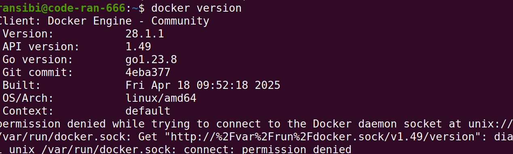
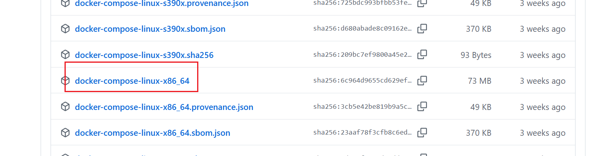
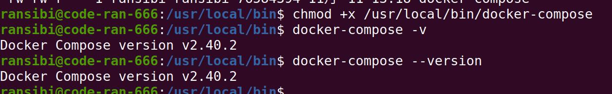

```
环境ubuntu24.0
```

#### 更新软件源

```
sudo apt update
```

#### 安装基本软件

```
sudo apt-get install apt-transport-https ca-certificates curl software-properties-common lrzsz -y
```

#### 指定使用阿里云镜像

```
sudo curl -fsSL https://mirrors.aliyun.com/docker-ce/linux/ubuntu/gpg | sudo apt-key add -
```

```
sudo add-apt-repository "deb [arch=amd64] https://mirrors.aliyun.com/docker-ce/linux/ubuntu $(lsb_release -cs) stable"
```

```
sudo apt update
```

#### 安装docker社区版

```
sudo apt-get install docker-ce -y
```

#### 查看是否安装

```
docker version
```



#### 配置可用镜像源

（1）进入/etc/docker目录，创建daemon.json文件

```
cd /etc/docker

sudo touch daemon.json

sudo vim daemon.json
```

在daemon.json文件中增加如下内容

```json
{
    "registry-mirrors": [
        "https://docker.1panel.live",
        "https://hub.rat.dev"
    ]
}
```

#### 启动docker

```
systemctl start docker  # 启动docker服务

systemctl stop docker  # 停止docker服务

systemctl restart docker  # 重启docker服务
```

#### 安装docker-compose

##### 离线安装方式

（1）下载指定linux版本的docker-compose

https://github.com/docker/compose/releases



上传文件到服务器并移到到指定位置

```
sudo mv docker-compose-linux-x86_64 /usr/local/bin/docker-compose
```

赋予权限

```
chmod +x /usr/local/bin/docker-compose
```

验证是否安装成功

```
docker-compose -v
```


