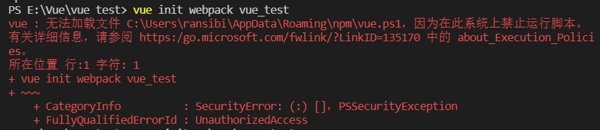

1、当我们在构建vue 项目时：会报禁止在该系统上运行脚本的错误与。

```
vue init webpack vue_test
```

<!--more -->



解决方法：

   在小娜搜索框搜索：powerShell，然后以管理员身份打开，输入如下命令进行执行：

```
set-ExecutionPolicy RemoteSigned
```

之后输入yes回车即可。然后去vscode里执行vue初始化程序，就能成功了。
