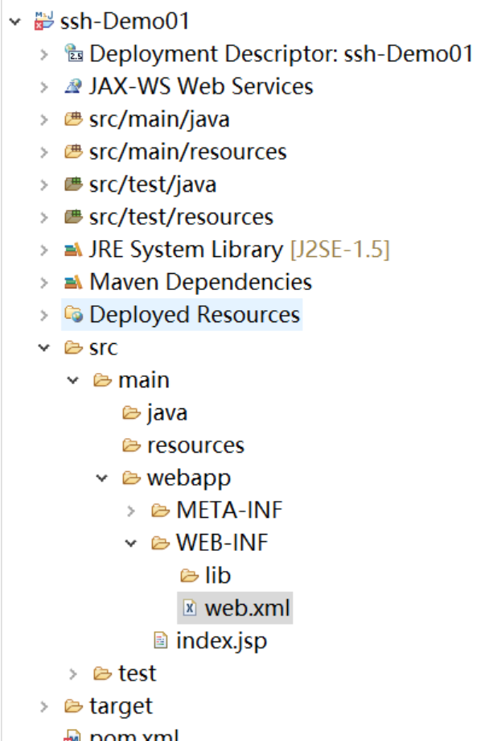
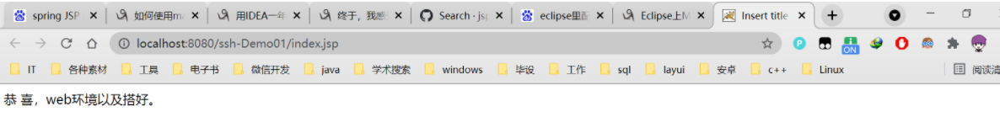

####             使用eclipse中的maven搭建web环境

首先需要将maven配置到eclipse中。

​           在eclipse中：window——>preferences——>maven——>global setting里选择本地maven仓库的settings.xml，之后update settings一下。然后点击OK。

<!--more -->


​            之后需要开启maven的视图：检查是否以及配置了镜像库：

window——>show view——>other——maven repositories


​          之后就可以创建maven项目了。new——>maven project——>勾选create a simple project——>下一步.group id:输入包名。 artifact id：输入项目名。打包形式选择war。


项目结构图：

​      

​             配置pom.xml文件，添加web依赖

```xml
<project xmlns="http://maven.apache.org/POM/4.0.0" xmlns:xsi="http://www.w3.org/2001/XMLSchema-instance"
    xsi:schemaLocation="http://maven.apache.org/POM/4.0.0 http://maven.apache.org/xsd/maven-4.0.0.xsd">
    <modelVersion>4.0.0</modelVersion>
    <groupId>com.ssh</groupId>
    <artifactId>mvn-ssh</artifactId>
    <version>0.0.1-SNAPSHOT</version>
    <packaging>war</packaging>

    <dependencies>
        <!-- servlet 基础 -->
        <dependency>
            <groupId>javax.servlet</groupId>
            <artifactId>servlet-api</artifactId>
            <version>3.0-alpha-1</version>
            <scope>provided</scope>
        </dependency>

        <dependency>
            <groupId>javax.servlet</groupId>
            <artifactId>jstl</artifactId>
            <version>1.2</version>
        </dependency>
    </dependencies>

</project>
```


在webapp目录下创建index.jsp

```jsp 
<%@ page language="java" contentType="text/html; charset=UTF-8"
    pageEncoding="UTF-8"%>
<!DOCTYPE html>
<html>
<head>
<meta charset="ISO-8859-1">
<title>Insert title here</title>
</head>
<body>
       恭 喜，web环境已经搭好。
</body>
</html>
```


注意编码格式。


最后配置web.xml

```xml
<?xml version="1.0" encoding="UTF-8"?>
<web-app id="WebApp_ID" version="2.5" xmlns="http://java.sun.com/xml/ns/javaee" xmlns:xsi="http://www.w3.org/2001/XMLSchema-instance" xsi:schemaLocation="http://java.sun.com/xml/ns/javaee http://java.sun.com/xml/ns/javaee/web-app_2_5.xsd">


 <welcome-file-list>
   <welcome-file>index.jsp</welcome-file>
 </welcome-file-list>


</web-app>
```


前期要配置好tomcat 


运行结果 ：



