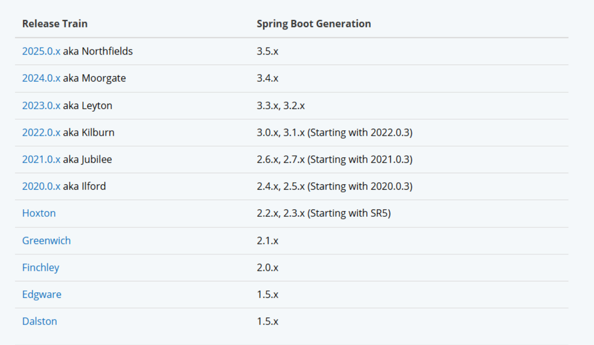

#### 概述

微服务（Micro services）是一种软件架构风格(**分布式架构)**，它将一个大型的应用程序拆分为多个小型、独立的服务。每个服务都运行在自己的进程中，并通过轻量级的通信机制（如HTTP、gRPC）与其他服务进行交互。每个微服务通常围绕特定的业务功能构建，并且可以独立开发、部署和扩展。

#### 特点

- 单一职责：微服务拆分粒度更小，每一个服务都对应唯一的业务能力，做到单一职责

- 自治：团队独立、技术独立、数据独立，独立部署和交付

- 面向服务：服务提供统一标准的接口，与语言和技术无关

- 隔离性强：服务调用做好隔离、容错、降级，避免出现级联问题

  

#### 单体架构与分布式架构的区别

单体架构:

```
架构比较简单，部署成本低，但是代码耦合度高，维护困难，程序升级麻烦。
```

分布式架构:

```
根据业务功能对系统做拆分，每个业务功能模块作为独立项目开发，称为一个服务。可以降低服务之间的耦合，便于程序升级和拓展，但是部署麻烦，调用关系错综复杂。
```

注意: **微服务架构**是一种经过良好架构设计的**分布式架构方案**

#### 架构方案落地

在Java领域最多人使用的就是SpringCloud提供的方案。（SpringCloud是微服务架构的一站式解决方案，集成了各种优秀的微服务功能组件）


#### SpringCloud

官网: https://spring.io/projects/spring-cloud

SpringCloud集成了各种微服务功能组件，并基于SpringBoot实现了这些组件的自动装配，从而提供了良好的开箱即用体验。

##### 常用组件

| 功能                 | 技术                     |
| -------------------- | ------------------------ |
| 服务注册发现         | Eureka、Nacos、Consul    |
| 服务远程调用         | OpenFeign、Dubbo         |
| 服务链路监控         | Zipkin、Sleuth           |
| 统一配置管理         | SpringCloudConfig、Nacos |
| 统一网关路由         | SpringClouGateway、Zuul  |
| 流量控制、降级、保护 | Hystix、Sentinel         |


注意: Spring Boot 和 Spring Cloud 的版本对应关系非常重要，因为不同版本的 Spring Cloud 需要特定版本的 Spring Boot 来支持。官网可进行查看版本对应关系。



#### 服务拆分与远程调用

##### 拆分原则

1、不同微服务，不要重复开发相同业务。

2、微服务数据独立，不要访问其它微服务的数据库。

3、微服务可以将自己的业务暴露为接口，供其它微服务调用。

##### 例子

商品订单的管理： 拆分订单微服务和用户微服务

(1)订单微服务，负责订单相关业务，有独立的数据库，单独的项目，对外暴露Restful的接口

(2)用户微服务，负责用户相关业务，有独立的数据库，单独的项目，对外暴露Restful的接口


用户相关接口:

```java
@Slf4j
@RestController
@RequestMapping("/user")
public class UserController {

    @Autowired
    private UserService userService;
    
    @GetMapping("/{id}")
    public User queryById(@PathVariable("id") Long id) {
        return userService.queryById(id);
    }
}
```

用户接口的实现

```java
@Service
public class UserService {

    @Autowired
    private UserMapper userMapper;

    public User queryById(Long id) {
        return userMapper.findById(id);
    }
}
```

订单相关接口

```java
@RestController
@RequestMapping("order")
public class OrderController {

   @Autowired
   private OrderService orderService;

    @GetMapping("{orderId}")
    public Order queryOrderByUserId(@PathVariable("orderId") Long orderId) {
        return orderService.queryOrderById(orderId);
    }
}
```

订单接口实现

```java
@Service
public class OrderService {

    @Autowired
    private OrderMapper orderMapper;

    public Order queryOrderById(Long orderId) {
        Order order = orderMapper.findById(orderId);
        return order;
    }
}
```

##### 远程调用

订单接口通过订单表的用户id去远程调用用户信息服务，对外暴露的接口，获取对应用户的信息。

（1）使用RestTemplate去实现服务的远程调用

在订单启动类中注入RestTemplate

```java
@MapperScan("com.ransibi.order.mapper")
@SpringBootApplication
public class OrderApplication {

    public static void main(String[] args) {
        SpringApplication.run(OrderApplication.class, args);
    }

    @Bean
    public RestTemplate restTemplate() {
        return new RestTemplate();
    }

}
```

实现类中进行远程调用

```java
@Service
public class OrderService {

    @Autowired
    private OrderMapper orderMapper;

    @Autowired
    private RestTemplate restTemplate;

    public Order queryOrderById(Long orderId) {
        Order order = orderMapper.findById(orderId);

        Long userId = order.getUserId();
        String port = "8081";
        String url = "http://127.0.0.1:" + port + "/user/" + userId;

        //开始远程调用
        User resultUser = restTemplate.getForObject(url, User.class);
        order.setUser(resultUser);

        return order;
    }
}
```

#### 
