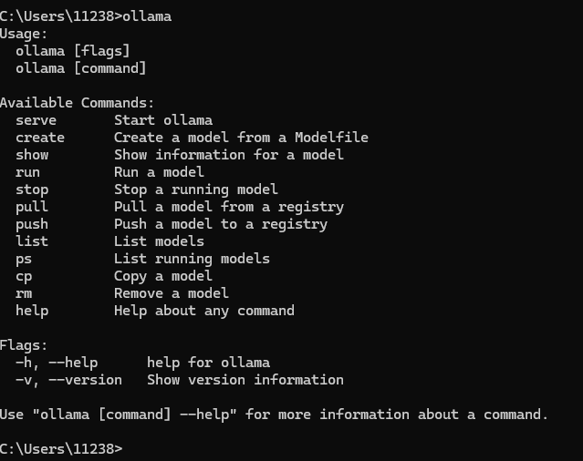
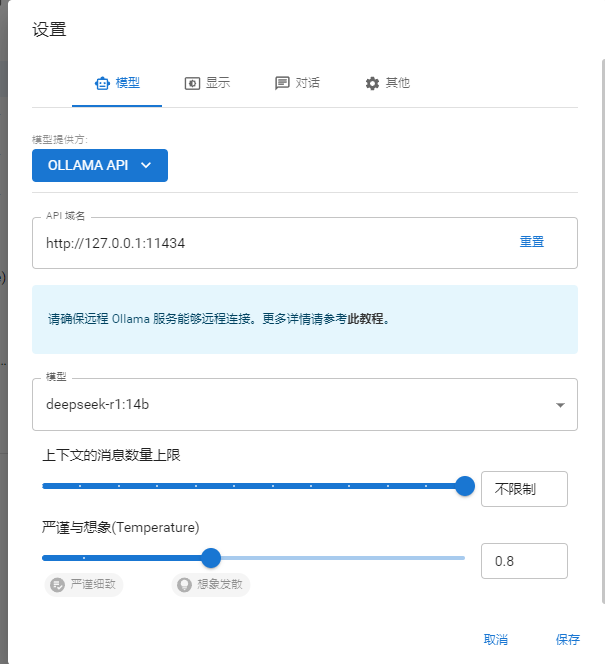

#### deepseek本地部署

1、下载安装Ollama

https://ollama.com/



2、在ollama官网搜索deepseek r1

安装deepseek

在命令行窗口输入如下指令进行安装

```
ollama run deepseek-r1:14b
```

3、模型删除

```
ollama list
ollama rm 模型名称
```


4、安装chatbox,并进行相关设置


